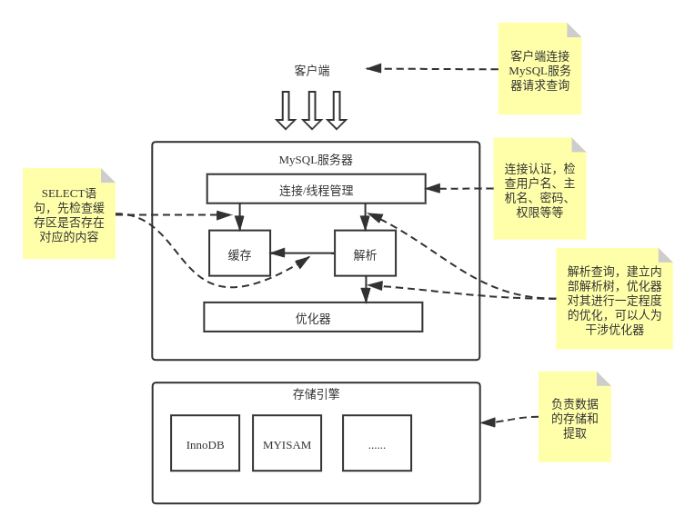

# 高性能MySQL

## 简介

《高性能MySQL》第一部分的学习笔记和总结，包括其基础部分，即**第一章到第七章**。

[书籍链接](https://book.douban.com/subject/23008813/)

[电子书提取码: 待更新](.)

## MySQL架构与历史

MySQL并不完美，却足够灵活，能够适应高要求的环境。MySQL既可以嵌入到应用程序中，也可以支持数据仓库、内容索引和部署软件、高可用的冗余系统、在线事务处理系统(OLTP)等各种应用类型。

### MySQL逻辑架构

MySQL服务器逻辑架构图：

## MySQL基准测试

## 服务器性能剖析

## Schema与数据类型优化

## 创建高性能的索引

## 查询性能优化

## MySQL高级特性
