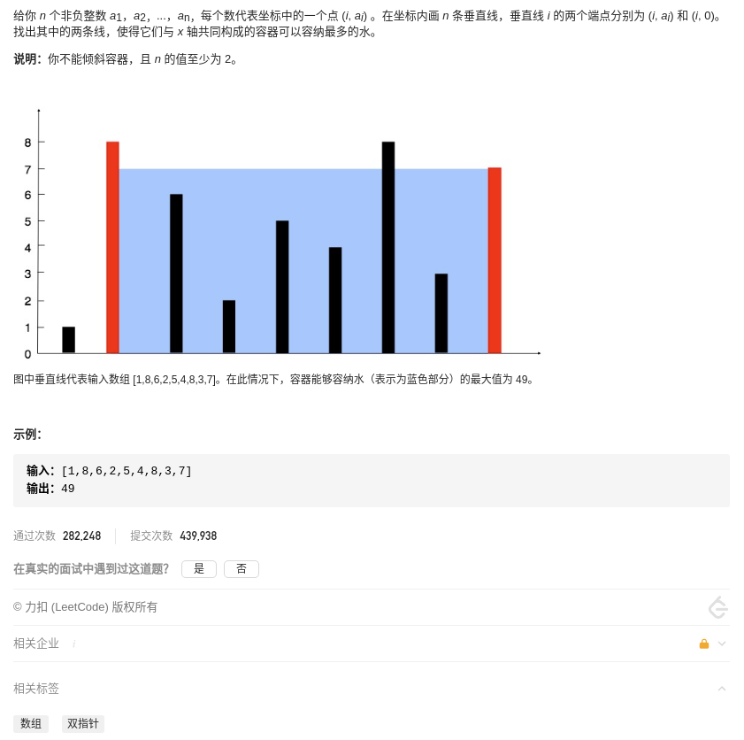
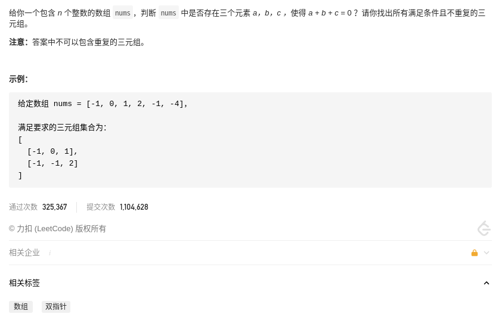
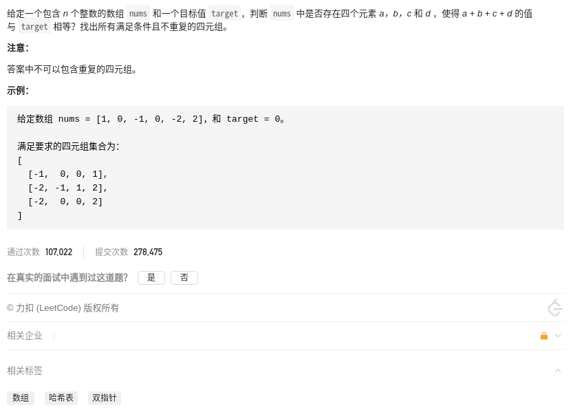
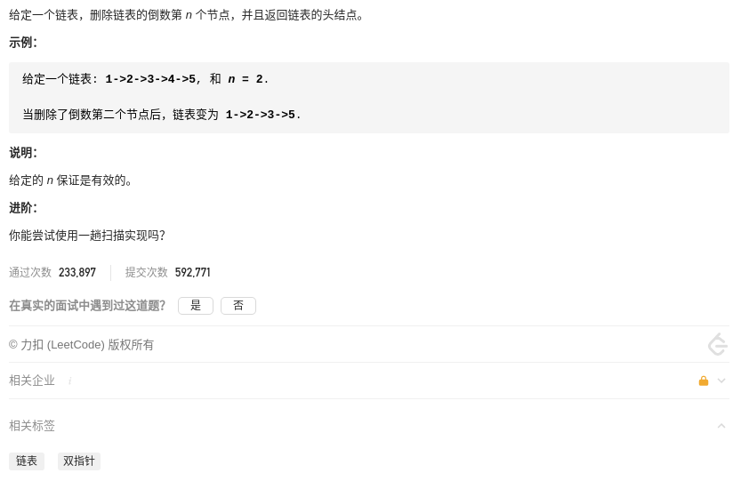
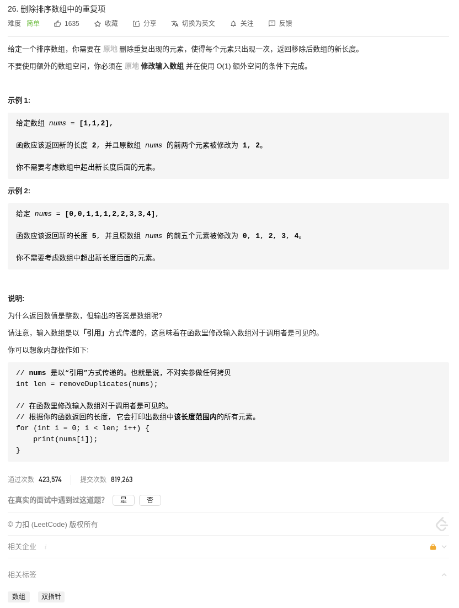
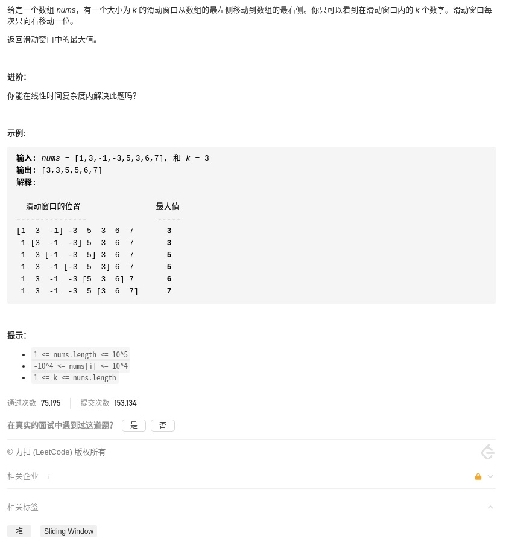
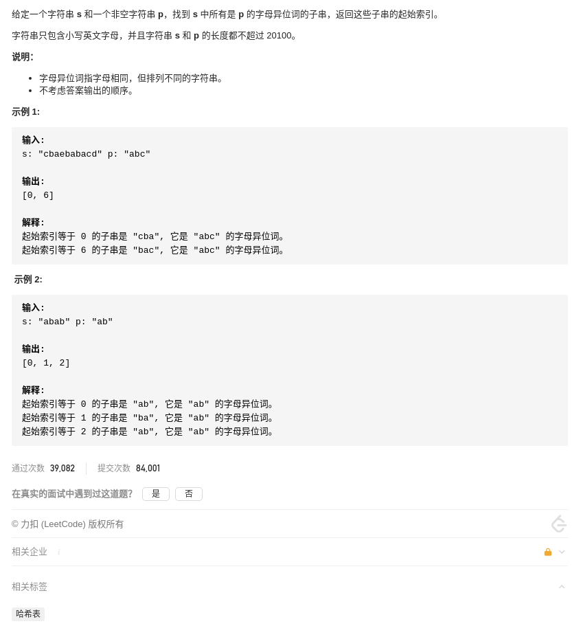
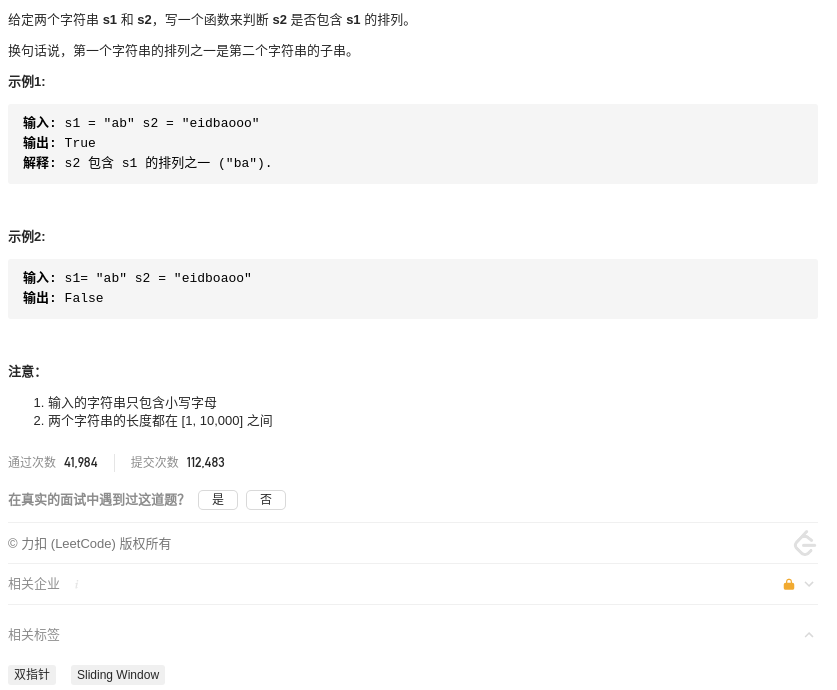

# LeetCode 精选 TOP 面试题

## 总览

* [x] [1.两数之和](#1.两数之和)
* [x] [2.两数相加](#2.两数相加)
* [x] [3.无重复字符的最长子串](#3.无重复字符的最长子串)
* [ ] [4.寻找两个正序数组的中位数](#4.寻找两个正序数组的中位数)
* [ ] [5.最长回文子串](#5.最长回文子串)
* [x] [11.盛最多水的容器](#11.盛最多水的容器)
* [x] [15.三数之和](#15.三数之和)
* [x] [18.四数之和](#18.四数之和)
* [x] [19.删除链表的倒数第N个节点](#19.删除链表的倒数第N个节点)
* [x] [26.删除排序数组中的重复项](#26.删除排序数组中的重复项)
* [ ] [28.实现strStr()](#28.实现strStr())
* [ ] [42.接雨水](#42.接雨水)
* [ ] [75.颜色分类](#75.颜色分类)
* [x] [76.最小覆盖子串](#76.最小覆盖子串)
* [ ] [88.合并两个有序数组](#88.合并两个有序数组)
* [ ] [125.验证回文串](#125.验证回文串)
* [x] [141.环形链表](#141.环形链表)
* [x] [142.环形链表II](#142.环形链表II)
* [x] [167.两数之和II-输入有序数组](#167.两数之和II-输入有序数组)
* [ ] [234.回文链表](#234.回文链表)
* [x] [239.滑动窗口最大值](#239.滑动窗口最大值)
* [ ] [283.移动零](#283.移动零)
* [ ] [287.寻找重复数](#387.寻找重复数)
* [ ] [344.反转字符串](#344.反转字符串)
* [ ] [350.两个数组的交集II](#350.两个数组的交集II)
* [x] [438.找到字符串中所有字母异位词](#438.找到字符串中所有字母异位词)
* [x] [567.字符串的排列](#567.字符串的排列)

## 归类

### 贪心

### 回溯

### 动态规划

### 双指针

双指针技巧再分为两类，一类是「**快慢指针**」，一类是「**左右指针**」。前者解决主要解决链表中的问题，比如判定链表中是否包含环并判断环的位置、寻找链表中点、寻找链表的倒数第 k 个元素等典型场景；后者主要解决数组（或者字符串）中的问题，比如二分查找，子串问题，求和问题。

相关题目：

* [3.无重复字符的最长子串](#3.无重复字符的最长子串)
* [11.盛最多水的容器](#11.盛最多水的容器)
* [15.三数之和](#15.三数之和)
* [18.四数之和](#18.四数之和)
* [19.删除链表的倒数第N个节点](#19.删除链表的倒数第N个节点)
* [26.删除排序数组中的重复项](#26.删除排序数组中的重复项)
* [28.实现strStr()](#28.实现strStr())
* [42.接雨水](#42.接雨水)
* [75.颜色分类](#75.颜色分类)
* [76.最小覆盖子串](#76.最小覆盖子串)
* [88.合并两个有序数组](#88.合并两个有序数组)
* [125.验证回文串](#125.验证回文串)
* [141.环形链表](#141环形链表)
* [142.环形链表II](#142.环形链表II)
* [167.两数之和II-输入有序数组](#167.两数之和II-输入有序数组)
* [234.回文链表](#234.回文链表)
* [283.移动零](#283.移动零)
* [287.寻找重复数](#387.寻找重复数)
* [344.反转字符串](#344.反转字符串)
* [350.两个数组的交集II](#350.两个数组的交集II)

### 滑动窗口

其实滑动窗口也是双指针的一种，是不过是最难的一种。

算法思想：就是维护一个窗口，不断滑动，然后更新结果。

应用场景：

算法实现：

```cpp
string need, window;
int left = 0, right = 0;

while (right < _len) {
    // 增大窗口
    window.add(x);  // 更新数据
    ++right;    // 窗口右端右移

    // 满足窗口缩小的条件
    while (condition) {
        // 缩小窗口
        window.remove(x);   // 更新数据
        ++left;     // 窗口左端右移
    }
}
```

需要思考：

* 当移动 right 扩大窗口时，应该更新哪些数据？
* 什么条件下，窗口应该暂停扩大，开始移动 left 缩小窗口？
* 当移动 left 缩小窗口时，应该更新哪些数据？
* 题目要求的结果应该在扩大窗口时还是缩小窗口时进行更新？

相关题目：

* [3.无重复字符的最长子串](#3.无重复字符的最长子串)
* [76.最小覆盖子串](#76.最小覆盖子串)
* [239.滑动窗口最大值](#239.滑动窗口最大值)
* [438.找到字符串中所有字母异位词](#438.找到字符串中所有字母异位词)
* [567.字符串的排列](#567.字符串的排列)

### 深度优先

### 广度优先

## 1.两数之和


### 解法一「无」暴力

直接遍历每个元素 x ，并查找是否存在一个值与 target - x 的值。

时间复杂度`O(n²)`，空间复杂度`O(1)`。

<!-- tabs:start -->

#### **Cpp**

```cpp
class Solution {
public:
    vector<int> twoSum(vector<int>& nums, int target) {
        vector<int> res;
        int len = nums.size();

        for(int i = 0; i < len; ++i) {
            for(int j = i + 1; j < len; ++j) {
                if(nums[i] + nums[j] == target) {
                    res.push_back(i);
                    res.push_back(j);

                    return res;
                }
            }
        }

        return res;
    }
};
```

#### **Python**

```python
class Solution:
    def twoSum(self, nums: List[int], target: int) -> List[int]:
        _len = len(nums)

        for i in range(_len):
            for j in range(i + 1, _len):
                if nums[i] + nums[j] == target:
                    return [i, j]
        return []
```

<!-- tabs:end -->

### 解法二「双指针」排序后双指针

根据题意，每种输入只会对应一个答案。所以可以先排序，然后分别从前后遍历得到 x 和 y，如果两者之和大于 target，则尾指针向前走；如果两者之和大于 target，则头指针向后走；如果两者之和等于 target，则记录 i, j，然后在数组寻找元素的下标。

时间复杂度`O(nlogn)`，空间复杂度`O(n)`。

<!-- tabs:start -->

#### **Cpp**

```cpp
class Solution {
public:
    vector<int> twoSum(vector<int>& nums, int target) {
        vector<int> res;
        int len = nums.size();
        int i = 0, j = len - 1;
        vector<int> temp = nums;

        sort(temp.begin(), temp.end());

        while(i < j) {
            if(temp[i] + temp[j] > target) {
                --j;
            } else if (temp[i] + temp[j] < target) {
                ++i;
            } else {
                break;
            }
        }

        if(i < j) {
            for(int k = 0; k < len; ++k) {
                if(i < len && nums[k] == temp[i]) {
                    res.push_back(k);
                    i = len;
                } else if (j < len && nums[k] == temp[j]) {
                    res.push_back(k);
                    j = len;
                }

                if(i == j) {
                    return res;
                }
            }
        }

        return res;
    }
};
```

#### **Python**

```python
class Solution:
    def twoSum(self, nums: List[int], target: int) -> List[int]:
        i, j = 0, len(nums) - 1
        temp = nums.copy()

        temp.sort()

        while i < j:
            if (temp[i] + temp[j]) > target:
                j = j - 1
            elif (temp[i] + temp[j]) < target:
                i = i + 1
            else:
                break

        return [nums.index(temp[i]), nums.index(temp[j])]
```

<!-- tabs:end -->

### 解法三「数据结构」哈希

遍历得到 x 的同时判断哈希表中是否存在值 y，使得 x + y = target，如如果不存在则把 x 作为 key， x 的下标作为 value 存入哈希表。

时间复杂度`O(n)`，空间复杂度`O(n)`。

<!-- tabs:start -->

#### **Cpp**

```cpp
class Solution {
public:
    vector<int> twoSum(vector<int>& nums, int target) {
        unordered_map<int, int> um;
        vector<int> res;
        int len = nums.size();

        for(int i = 0; i < len; ++i) {
            if (um.count(target - nums[i]) > 0) {
                res.push_back(um[target-nums[i]]);
                res.push_back(i);
            }
            um[nums[i]] = i;
        }

        return res;
    }
};
```

#### **Python**

```python
class Solution:
    def twoSum(self, nums: List[int], target: int) -> List[int]:
        _hash = {}
        for i in range(len(nums)):
            j = _hash.get(target - nums[i])
            if j is not None:
                return [j, i]
            _hash[nums[i]] = i
        return []
```

<!-- tabs:end -->

## 2.两数相加


### 解法一「无」不对齐补零相加进位

注意到各自的位数是按照逆序的方式存储的，所以可以遍历两个链表直接相加，如果有进位的话，保留进位到下一次相加的结果。

<!-- tabs:start -->

#### **Cpp**

```cpp
/**
 * Definition for singly-linked list.
 * struct ListNode {
 *     int val;
 *     ListNode *next;
 *     ListNode(int x) : val(x), next(NULL) {}
 * };
 */
class Solution {
public:
    ListNode* addTwoNumbers(ListNode* l1, ListNode* l2) {
        ListNode* res = new ListNode(-1);   // 结果链表，最后返回其 next
        ListNode* op = res; // 操作链表
        int sum = 0;    // 相加结果
        bool carry = false; // 是否进位

        while(l1 != nullptr || l2 != nullptr) {
            sum = 0;
            if(l1 != nullptr) {
                sum += l1->val;
                l1 = l1->next;
            }
            if(l1 != nullptr) {
                sum += l2->val;
                l2 = l2->next;
            }
            if(carry) {
                ++sum;
            }
            op->next = new ListNode(sum % 10);
            op = op->next;
            carry = sum >= 10 ? true : false;
        }

        if(carry) {
            op->next = new ListNode(1);
        }

        return res->next;
    }
};
```

#### **Python**

```python
# Definition for singly-linked list.
# class ListNode:
#     def __init__(self, x):
#         self.val = x
#         self.next = None

class Solution:
    def addTwoNumbers(self, l1: ListNode, l2: ListNode) -> ListNode:
        res = ListNode(-1)
        op = res
        carry = False

        while l1 or l2:
            sum = 0
            if l1:
                sum = sum + l1.val
                l1 = l1.next
            if l2:
                sum = sum + l2.val
                l2 = l2.next
            if carry:
                sum = sum + 1

            op.next = ListNode(sum % 10)
            op = op.next
            carry = True if sum >= 10 else False

        if carry:
                op.next = ListNode(1)

        return res.next
```

<!-- tabs:end -->

## 3.无重复字符的最长子串


### 解法一「滑动窗口」字符移入移出

在 s 上滑动窗口，通过向右移动窗口的右端不断扩大窗口，当窗口内数据存在重复时，不满足条件，通过向右移动窗口的左端不断缩小窗口，然后更新结果。

<!-- tabs:start -->

#### **Cpp**

```cpp
class Solution {
public:
    int lengthOfLongestSubstring(string s) {
        unordered_map<char, int> window;
        int left = 0, right = 0;
        int s_len = s.size();
        int res = 0;    // 记录结果

        while (right < s_len) {
            char c = s[right];
            ++right;
            ++window[c];    // 字符串 c 移入窗口，对应的个数增加

            // 存在重复值，缩小窗口
            while (window[c] > 1) {
                char d = s[left];
                ++left;
                --window[d];    // 字符串 d 移出窗口，对应的个数减少
            }

            // 更新结果
            res = max(res, right - left);
        }

        return res;
    }
};
```

#### **Python**

```python
class Solution:
    def lengthOfLongestSubstring(self, s: str) -> int:
        window = collections.defaultdict(int)
        left, right, _len, res = 0, 0, len(s), 0

        while right < _len:
            c = s[right]
            right += 1
            window[c] += 1

            while window[c] > 1:
                d = s[left]
                left += 1
                window[d] -=1

            res = max(res, right - left)

        return res
```

<!-- tabs:end -->

## 11.盛最多水的容器



### 解法一「双指针」判断移动

定义指针 left 指向最左边，right 指向最右边，当 left 对应的高度小于等于 right 对应的高度时，left 右移， 否则 right 左移。

<!-- tabs:start -->

#### **Cpp**

```cpp
class Solution {
public:
    int maxArea(vector<int>& height) {
        int h_len = height.size();
        int left = 0, right = h_len - 1;
        int w, h, res = 0;

        while (left < right) {
            w = right - left;
            if (height[left] <= height[right]) {
                h = height[left];
                ++left;
            } else {
                h = height[right];
                --right;
            }

            res = max(w * h, res);
        }

        return res;
    }
};
```

#### **Python**

```python
class Solution:
    def maxArea(self, height: List[int]) -> int:
        h_len = len(height)
        left, right, res = 0, h_len - 1, 0

        while left < right:
            w = right - left
            if height[left] <= height[right]:
                h = height[left]
                left += 1
            else:
                h = height[right]
                right -= 1

            res = max(w * h, res)

        return res
```

<!-- tabs:end -->

## 15.三数之和



### 解法一「双指针」排序后双指针

先将数组升序排序，然后固定一个数 nums[i]，再使用左右指针分别指向数 nums[i]后面的两端，得到 nums[l] 和 nums[r]，此时计算这三个数之和 sum，分为如下情况：

* 情况1：nums[i] 大于 0，则 sum 一定大于 0，结束循环。
* 情况2：nums[i] 等于 nums[i - 1]，此时结果重复，固定下一个数跳过。
* 情况3：sum 等于 0，且 nums[l] 等于 nums[l + 1]，此时结果重复，左指针右移跳过。
* 情况4：sum 等于 0，且 nums[r] 等于 nums[r - 1]，此时结果重复，右指针左移跳过。

<!-- tabs:start -->

#### **Cpp**

```cpp
class Solution {
public:
    vector<vector<int>> threeSum(vector<int>& nums) {
        vector<vector<int> > res;
        int nums_len = nums.size();
        if (nums_len < 3) {
            return res;
        }
        sort(nums.begin(), nums.end());
        int sum = 0, l = 0, r = 0;

        for (int i = 0; i < nums_len; ++i) {
            if (nums[i] > 0) {  // 情况1
                break;
            }
            if (i > 0 && nums[i] == nums[i - 1]) {  // 情况2
                continue;
            }

            l = i + 1;
            r = nums_len - 1;

            while (l < r) {
                sum = nums[i] + nums[l] + nums[r];
                if (sum == 0) {
                    res.push_back(vector<int> {nums[i], nums[l], nums[r]});
                    while (l < r && nums[l] == nums[l + 1]) {   // 情况3
                        ++l;
                    }
                    while (l < r && nums[r] == nums[r -1]) {    // 情况4
                        --r;
                    }
                    ++l;
                    --r;
                } else if (sum > 0) {
                    --r;
                } else {
                    ++l;
                }
            }
        }

        return res;
    }
};
```

#### **Python**

```python
class Solution:
    def threeSum(self, nums: List[int]) -> List[List[int]]:
        res = []
        nums.sort()
        nums_len = len(nums)
        _sum, l, r = 0, 0, 0

        for i in range(nums_len):
            l = i + 1
            r = nums_len -1

            if nums[i] > 0:
                break

            if i > 0 and nums[i] == nums[i - 1]:
                continue

            while l < r:
                _sum = nums[i] + nums[l] + nums[r]
                if _sum == 0:
                    res.append([nums[i], nums[l], nums[r]])
                    while l < r and nums[l] == nums[l + 1]:
                        l += 1
                    while l < r and nums[r] == nums[r - 1]:
                        r -= 1
                    l += 1
                    r -= 1
                elif _sum > 0:
                    r -= 1
                else:
                    l += 1

        return res
```

<!-- tabs:end -->

## 18.四数之和



### 解法一「双指针」基础上排序后双指针

在 [15.三数之和](15.三数之和) 的基础上，增加一个 for 循环即可。需要注意的是，target可能为负数的情况。

<!-- tabs:start -->

#### **Cpp**

```cpp
class Solution {
public:
    vector<vector<int>> fourSum(vector<int>& nums, int target) {
        vector<vector<int> > res;
        int nums_len = nums.size();

        if (nums_len < 3) {
            return res;
        }

        int sum = 0, l = 0, r = 0;
        sort(nums.begin(), nums.end());

        for (int i = 0; i < nums_len; ++i) {
            // if (nums[i] > target) {  // 注意：这里不能跳过，因为可能有负数 target
            //     break;
            // }

            if (i > 0 && nums[i] == nums[i - 1]) {
                    continue;
            }

            for (int j = i + 1; j < nums_len; ++j) {
                // if (nums[j] > target - nums[i]) {    // 注意：这里不能跳过，因为可能有负数 target
                //     break;
                // }

                if (j > i + 1 && nums[j] == nums[j - 1]) {
                    continue;
                }
                int l = j + 1;
                int r = nums_len - 1;

                while (l < r) {
                    sum = nums[i] + nums[j] + nums[l] + nums[r];
                    if (sum == target) {
                        res.push_back(vector<int> {nums[i], nums[j], nums[l], nums[r]});
                        while (l < r && nums[l] == nums[l + 1]) {
                            ++l;
                        }
                        while (l < r && nums[r] == nums[r - 1]) {
                            --r;
                        }
                        ++l;
                        --r;
                    } else if (sum < target) {
                        ++l;
                    } else {
                        --r;
                    }
                }
            }
        }

        return res;
    }
};
```

#### **Python**

```python
class Solution:
    def fourSum(self, nums: List[int], target: int) -> List[List[int]]:
```

<!-- tabs:end -->

## 19.删除链表的倒数第N个节点



### 解法一「双指针」利用假节点

要删除链表的倒数第 N 个节点，必须先找到倒数第 N 个节点，可以先让快指针走 N 次，然后快慢指针在一起走。为了返回链表的头节点，可以利用一个假节点。

<!-- tabs:start -->

#### **Cpp**

```cpp
/**
 * Definition for singly-linked list.
 * struct ListNode {
 *     int val;
 *     ListNode *next;
 *     ListNode(int x) : val(x), next(NULL) {}
 * };
 */
class Solution {
public:
    ListNode* removeNthFromEnd(ListNode* head, int n) {
        ListNode* dummy = new ListNode(0);
        dummy->next = head;
        ListNode* fast = dummy;
        ListNode* slow = dummy;

        while (n > 0) {
            fast = fast->next;
            --n;
        }

        while (fast && fast->next) {
            slow = slow->next;
            fast = fast->next;
        }

        slow->next = slow->next->next;

        return dummy->next;
    }
};
```

#### **Python**

```python
# Definition for singly-linked list.
# class ListNode:
#     def __init__(self, x):
#         self.val = x
#         self.next = None

class Solution:
    def removeNthFromEnd(self, head: ListNode, n: int) -> ListNode:
        dummy = ListNode(0)
        dummy.next = head
        fast = dummy
        slow = dummy

        while n > 0:
            fast = fast.next
            n -= 1

        while fast and fast.next:
            slow = slow.next
            fast = fast.next

        slow.next = slow.next.nxet

        return dummy.next
```

<!-- tabs:end -->

## 26.删除排序数组中的重复项



### 解法一「双指针」按情况走

开始时两个指针A、B分别指向数组开头，然后A、B所指的值相等，则B向前走，若不等，则 A 先向走并将此时 B 所指的值赋值给A所指的值，B也向前走。最后，返回 A 所在下标 + 1 即可。

<!-- tabs:start -->

#### **Cpp**

```cpp
class Solution {
public:
    int removeDuplicates(vector<int>& nums) {
        int nums_size = nums.size();

        if (nums_size == 0) {
            return 0;
        }

        int a = 0, b = 0;

        while (b < nums_size) {
            if (nums[a] == nums[b]) {
                ++b;
            } else {
                ++a;
                nums[a] = nums[b];
                ++b;
            }
        }

        return a + 1;
    }
};
```

#### **Python**

```python
class Solution:
    def removeDuplicates(self, nums: List[int]) -> int:
        nums_len = len(nums)

        if nums_len == 0:
            return 0

        a, b = 0, 0

        while b < nums_len:
            if nums[a] == nums[b]:
                b += 1
            else:
                a += 1
                nums[a] = nums[b]
                b += 1

        return a + 1
```

<!-- tabs:end -->

## 76.最小覆盖子串


### 解法一「滑动窗口」增强减弱可行解性

在 s 上滑动窗口，通过向右移动窗口的右端不断扩大窗口，当窗口包含了 t 所需的所有字符后，即此时得到了一个可行解，然后通过向右移动窗口的左端不断缩小窗口，如果能缩小，就能得到了一个比可行解更好的解。

**如何判断当前的窗口包含所有 t 所需的字符呢？**

可以用一个哈希表的key代表字符，value 代表字符个数。如果窗口的哈希表的 key 包含所有 t 的哈希表的 key，并且窗口的哈希表的 value 不小于 t 的哈希表的 value，这时就认为窗口的内容是一个可行解。

<!-- tabs:start -->

#### **Cpp**

```cpp
class Solution {
public:
    string minWindow(string s, string t) {
        unordered_map<char, int> need, window;
        for (const char c : t) ++need[c];
 
        int s_len = s.size();
        int left = 0, right = 0;
        int key_cnt = 0;

        int start = 0, len = INT_MAX;   // 记录可行解的起始索引及长度

        while (right < s_len) {
            char c = s[right];
            ++right;    // 窗口右端右移

            // 更新窗口内的数据，窗口哈希表的键值更新，
            if (need.count(c)) {
                ++window[c];

                // 更新后的键值是否满足要求
                if (window[c] == need[c]) {
                    ++key_cnt;  // 字符 c 满足，增强可行解性
                }
            }

            // 是否有一个可行解
            while (key_cnt == need.size()) {
                // 更新记录可行解的数据
                if (right - left < len) {
                    start = left;
                    len = right - left;
                }

                char d = s[left];
                ++left;    // 窗口左端右移

                // 更新窗口内的数据，窗口哈希表的键值更新，
                if (need.count(d)) {
                    // 更新前的键值是否满足要求
                    if (window[d] == need[d]) {
                        --key_cnt;  // 字符 d 满足，减弱可行解性
                    }

                    --window[d];
                }
            }
        }

        return len == INT_MAX ? "" : s.substr(start, len);
    }
};
```

#### **Python**

```python
class Solution:
    def minWindow(self, s: str, t: str) -> str:
        # 字典的子类，提供了一个工厂函数，为字典查询提供一个默认值
        need = collections.defaultdict(int)
        window = collections.defaultdict(int)
        for c in t:
            need[c] += 1

        s_len = len(s)
        left, right, key_cnt = 0, 0, 0

        start, t_len = 0, float('inf')

        while right < s_len:
            c = s[right]
            right += 1

            if c in list(need.keys()):
                window[c] += 1

                if window[c] == need[c]:
                    key_cnt += 1

            while key_cnt == len(need):
                    if right - left < t_len:
                        start = left
                        t_len = right - left

                    d = s[left]
                    left += 1

                    if d in list(need.keys()):
                        if window[d] == need[d]:
                            key_cnt -= 1

                        window[d] -= 1

        return "" if t_len == float('inf') else s[start:start + t_len]
```

<!-- tabs:end -->

## 141.环形链表


### 解法一 [双指针] 快慢指针

设定两个指针，一个跑得快，一个跑得慢。如果不含有环，跑得快的那个指针最终会遇到 null，说明链表不含环；如果含有环，快指针最终会超慢指针一圈，和慢指针相遇，说明链表含有环。需要注意的是，判断条件是快指针，因为它每次走的步数多。

<!-- tabs:start -->

#### **Cpp**

```cpp
/**
 * Definition for singly-linked list.
 * struct ListNode {
 *     int val;
 *     ListNode *next;
 *     ListNode(int x) : val(x), next(NULL) {}
 * };
 */
class Solution {
public:
    bool hasCycle(ListNode *head) {
        ListNode* slow = head;
        ListNode* fast = head;

        while(fast && fast->next) {
            slow = slow->next;
            fast = fast->next->next;

            if(slow == fast) {
                return true;
            }
        }

        return false;
    }
};
```

#### **Python**

```python
# Definition for singly-linked list.
# class ListNode:
#     def __init__(self, x):
#         self.val = x
#         self.next = None

class Solution:
    def hasCycle(self, head: ListNode) -> bool:
        slow = head
        fast = head

        while fast and fast.next:
            slow = slow.next
            fast = fast.next.next

            if slow == fast:
                return True

        return False
```

<!-- tabs:end -->

## 142.环形链表II


### 解法一「双指针」指针变换

那么如何找到环的起点呢？

还是先判断有没有环，无环则返回 nullptr，有环则记住第一次快慢指针相遇的位置，然后进行指针变换，即将慢指针移动到链表头并把快指针变成慢指针，第二次“快”慢指针相遇的位置即为环的起点。

为什么呢？

因为第一次相遇时，慢指针走了 k 步，那么快指针一定走了 2k 步，那么多走的这 k 步即为环的长度。设定相遇点距离环的起点为 m，那么链表头距离环的起点为 k-m，同时快指针在走 k-m 也达到环的起点。

<!-- tabs:start -->

#### **Cpp**

```cpp
/**
 * Definition for singly-linked list.
 * struct ListNode {
 *     int val;
 *     ListNode *next;
 *     ListNode(int x) : val(x), next(NULL) {}
 * };
 */
class Solution {
public:
    ListNode *detectCycle(ListNode *head) {
        ListNode* slow = head;
        ListNode* fast = head;

        while(fast && fast->next) {
            slow = slow->next;
            fast = fast->next->next;

            if(slow == fast) {
                slow = head;
                while(slow != fast) {
                    slow = slow->next;
                    fast = fast->next;
                }

                return slow;
            }
        }

        return nullptr;
    }
};
```

#### **Python**

```python
# Definition for singly-linked list.
# class ListNode:
#     def __init__(self, x):
#         self.val = x
#         self.next = None

class Solution:
    def detectCycle(self, head: ListNode) -> ListNode:
        slow, fast = head, head

        while fast and fast.next:
            slow = slow.next
            fast = fast.next.next

            if slow == fast:
                slow = head
                while slow != fast:
                    slow = slow.next
                    fast = fast.next

                return slow

        return None
```

<!-- tabs:end -->

## 167.两数之和II-输入有序数组


### 解法一「双指针」直接双指针

同 [1.两数之和](#1.两数之和) 解法二类似，连排序都不用自己排了。

<!-- tabs:start -->

#### **Cpp**

```cpp
class Solution {
public:
    vector<int> twoSum(vector<int>& numbers, int target) {
        int i = 0, j = numbers.size() - 1;

        while (i < j) {
            if(numbers[i] + numbers[j] < target) {
                ++i;
            } else if (numbers[i] + numbers[j] > target) {
                --j;
            } else {
                return vector<int> {i + 1, j + 1};
            }
        }

        return vector<int> {};
    }
};
```

#### **Python**

```python
class Solution:
    def twoSum(self, numbers: List[int], target: int) -> List[int]:
        i = 0
        j = len(numbers) - 1

        while i < j:
            if numbers[i] + numbers[j] < target:
                i = i + 1
            elif numbers[i] + numbers[j] > target:
                j = j -1
            else:
                return [i + 1, j + 1]

        return []
```

<!-- tabs:end -->

### 解法二：二分查找

直接二分查找硬找呗。

<!-- tabs:start -->

#### **Cpp**

```cpp
class Solution {
public:
    vector<int> twoSum(vector<int>& numbers, int target) {
        for (int i = 0; i < numbers.size(); ++i) {
            int low = i + 1, high = numbers.size() - 1;
            while (low <= high) {
                int mid = (high - low) / 2 + low;
                if (numbers[mid] == target - numbers[i]) {
                    return {i + 1, mid + 1};
                } else if (numbers[mid] > target - numbers[i]) {
                    high = mid - 1;
                } else {
                    low = mid + 1;
                }
            }
        }
        return {};
    }
};
```

#### **Python**

```python
class Solution:
    def twoSum(self, numbers: List[int], target: int) -> List[int]:
        n = len(numbers)
        for i in range(n):
            low, high = i + 1, n - 1
            while low <= high:
                mid = (low + high) // 2
                if numbers[mid] == target - numbers[i]:
                    return [i + 1, mid + 1]
                elif numbers[mid] > target - numbers[i]:
                    high = mid - 1
                else:
                    low = mid + 1

        return []
```

<!-- tabs:end -->

## 239.滑动窗口最大值



### 解法一「滑动窗口」设计单调队列

题目要求在 `O(N)` 线性时间复杂度解决，所以难点在于如何在 `O(1)` 时间算出每个「窗口」中的最大值。

在一堆数字中，如果知道最值，添加一个数，则很快的就能重新知道最值，但是如果减少一个数，则需要遍历一边才能重新知道最值。

每个窗口前进的时候，要添加一个数同时减少一个数，所以想在 `O(1)` 的时间得出新的最值，就需要**单调队列**这种特殊的数据结构来辅助了。

一个普通的队列：

```cpp
class Queue {
    void push(int n);   // 或 enqueue，在队尾加入元素 n
    void pop();         // 或 dequeue，删除队头元素
}
```

一个单调队列：

```cpp
class MonotonicQueue {
    void push(int n);   // 在队尾添加元素 n
    int max();          // 返回当前队列中的最大值
    void pop(int n);    // 队头元素如果是 n，删除它
}
```

那么如何实现这个单调队列呢？这时候就要借助双端队列（deque）这种数据结构了，它可以用链表作为底层结构。

一个双端队列：

```cpp
class deque {
    // 以下操作的时间复杂度都是 O(1)
    void push_front(int n);     // 在队头插入元素 n
    void push_back(int n);      // 在队尾插入元素 n
    void pop_front();           // 在队头删除元素
    void pop_back();            // 在队尾删除元素
    int front();                // 返回队头元素
    int back();                 // 返回队尾元素
}
```

单调队列的 push() 依然在队尾添加元素，但是要把前面比新元素小的元素都删掉，这个就能维持一个单调递减的操作。max() 返回队头元素即可。pop() 删除队头为 n
的元素。具体实现为：

```cpp
class MonotonicQueue {
private:
    deque<int> data;

public:
    void push(int n) {
        while (!data.empty() && data.back() < n) {
            data.pop_back();
        }
        data.push_back(n);
    }

    int max() {
        return data.front();
    }

    void pop(int n) {
        // 如果移除的值是最大值则更新最值
        if(!data.empty() && data.front() == n) {
            data.pop_front();
        }
    }
};
```

<!-- tabs:start -->

#### **Cpp**

```cpp
// 单调队列
class MonotonicQueue {
private:
    deque<int> data;

public:
    void push(int n) {
        while (!data.empty() && data.back() < n) {
            data.pop_back();
        }
        data.push_back(n);
    }

    int max() {
        return data.front();
    }

    void pop(int n) {
        // 如果移除的值是最大值则更新最值
        if(!data.empty() && data.front() == n) {
            data.pop_front();
        }
    }
};

class Solution {
public:
    vector<int> maxSlidingWindow(vector<int>& nums, int k) {
        MonotonicQueue window;
        vector<int> res;
        int nums_len = nums.size();

        for (int i = 0; i < nums_len; ++i) {
            if (i < k - 1) {    // 先填满窗口的前 k - 1 个
                window.push(nums[i]);
            } else {    // 窗口向前滑动，填第 k 个，更新结果
                window.push(nums[i]);
                res.push_back(window.max());
                window.pop(nums[i - k + 1]);
            }
        }

        return res;
    }
};
```

#### **Python**

```python
class Solution:
    def maxSlidingWindow(self, nums: List[int], k: int) -> List[int]:
        dq = collections.deque()    # 存放值递减的元素
        res = []

        for i, num in enumerate(nums):
            while dq and dq[-1] < num:    # 维持单调递减
                dq.pop()
            dq.append(num)

            if i >= k - 1:
                res.append(dq[0])
                if dq and dq[0] == nums[i - k + 1]:     # 如果移除的值是最大值则更新最值
                    dq.popleft()

        return res
```

<!-- tabs:end -->

## 438.找到字符串中所有字母异位词



### 解法一「滑动窗口」框架法

扩大窗口，更新窗口数据；当窗口宽度大于 p 的长度时，缩小窗口，当条件满足更新结果，并更新窗口数据。

<!-- tabs:start -->

#### **Cpp**

```cpp
class Solution {
public:
    vector<int> findAnagrams(string s, string t) {
        unordered_map<char, int> need, window;
        for (char c : t) need[c]++;

        int left = 0, right = 0;
        int valid = 0;  // 记录条件
        int s_len = s.size(), t_len = t.size(), need_len = need.size();
        vector<int> res; // 记录结果

        while (right < s_len) {
            char c = s[right];
            right++;

            // 进行窗口内数据的一系列更新
            if (need.count(c)) {
                window[c]++;
                if (window[c] == need[c])
                    valid++;
            }

            // 判断左侧窗口是否要收缩
            while (right - left >= t_len) {
                // 当窗口符合条件时，把起始索引加入 res
                if (valid == need_len)
                    res.push_back(left);

                char d = s[left];
                left++;

                // 进行窗口内数据的一系列更新
                if (need.count(d)) {
                    if (window[d] == need[d])
                        valid--;
                    window[d]--;
                }
            }
        }

        return res;
    }
};
```

#### **Python**

```python
class Solution:
    def findAnagrams(self, s: str, p: str) -> List[int]:
        need, window = collections.defaultdict(int), collections.defaultdict(int)
        for c in p:
            need[c] += 1

        left, right, vaild = 0, 0, 0
        s_len, p_len, need_len = len(s), len(p), len(need)
        res = []

        while right < s_len:
            c = s[right]
            right += 1

            if c in list(need.keys()):
                window[c] += 1
                if window[c] == need[c]:
                    vaild += 1

                while right - left >= p_len:
                    if vaild == need_len:
                        res.append(left)

                    d = s[left]
                    left += 1

                    if d in list(need.keys()):
                        if window[d] == need[d]:
                            vaild -= 1
                        window[d] -= 1

        return res
```

<!-- tabs:end -->

### 解法二「滑动窗口」固定窗口宽度移动

根据 p 的长度确定窗口宽度，然后窗口一直向右滑动即可，满足条件时更新数据。不过这种方法可能会超时。

<!-- tabs:start -->

#### **Cpp**

```cpp
class Solution {
public:
    vector<int> findAnagrams(string s, string p) {
        int s_len = s.size(), p_len = p.size();
        vector<int> res = {};
        if (s_len < p_len) {
            return res;
        }
        int left = 0, right = p_len;
        map<char, int> ump;
        for (char c : p) {
            ++ump[c];
        }

        while (right <= s_len) {
            if (checkAnagram(ump, s.substr(left, p_len))) {
                res.push_back(left);
            }
            ++left;
            ++right;
        }

        return res;
    }

    bool checkAnagram(map<char, int> &ump, const string &window) {
        map<char, int> temp;
        for (char c : window) {
            ++temp[c];
        }

        if (ump == temp) {
            return true;
        } else {
            return false;
        }
    }
};
```

#### **Python**

```python
class Solution:
    def findAnagrams(self, s: str, p: str) -> List[int]:
```

<!-- tabs:end -->

## 567.字符串的排列



### 解法一「滑动窗口」框架法

扩大窗口，更新窗口数据；当窗口宽度大于 s1 的长度时，缩小窗口，当条件满足更新结果，并更新窗口数据。

<!-- tabs:start -->

#### **Cpp**

```cpp
class Solution {
public:
    bool checkInclusion(string s1, string s2) {
        unordered_map<char, int> need, window;
        for(char c : s1) {
            ++need[c];
        }

        int left = 0, right = 0, vaild = 0;
        int s1_len = s1.size(), s2_len = s2.size(), need_len = need.size();

        while (right < s2_len) {
            char c = s2[right];
            ++right;

            if (need.count(c)) {
                ++window[c];
                if (window[c] == need[c]) {
                    ++vaild;
                }
            }

            while (right - left >= s1_len) {
                if (vaild == need_len) {
                    return true;
                }
                char d = s2[left];
                ++left;

                if (need.count(d)) {
                    if (window[d] == need[d]) {
                        --vaild;
                    }
                    --window[d];
                }
            }
        }

        return false;
    }
};
```

#### **Python**

```python
class Solution:
    def checkInclusion(self, s1: str, s2: str) -> bool:
```

<!-- tabs:end -->