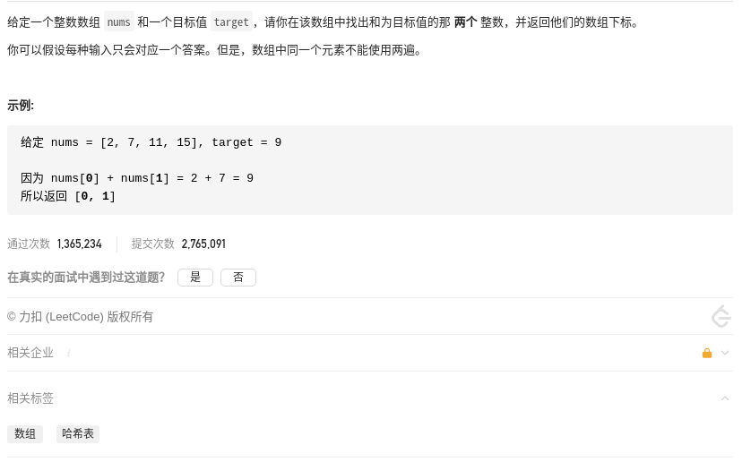
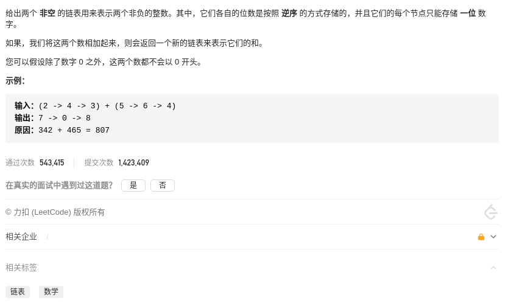
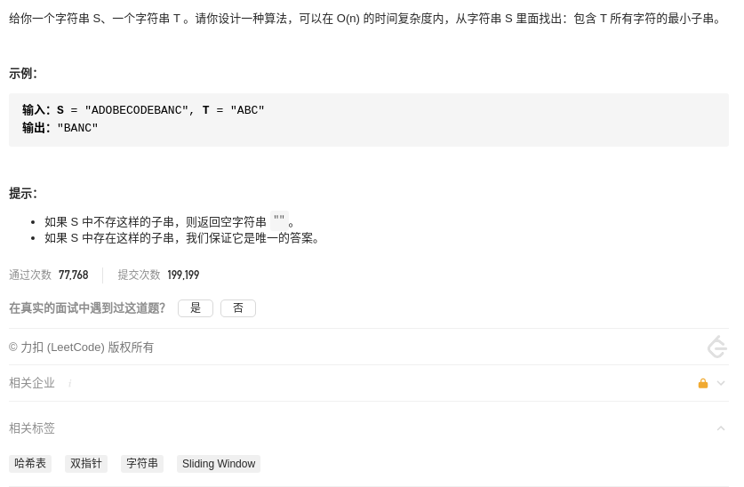
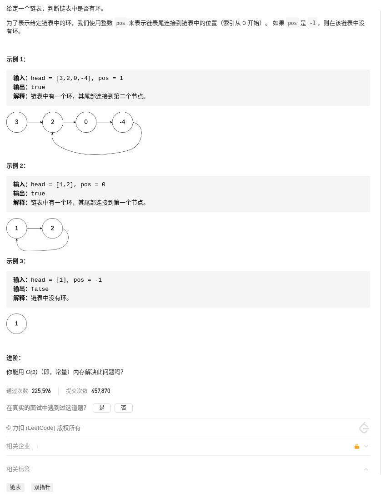
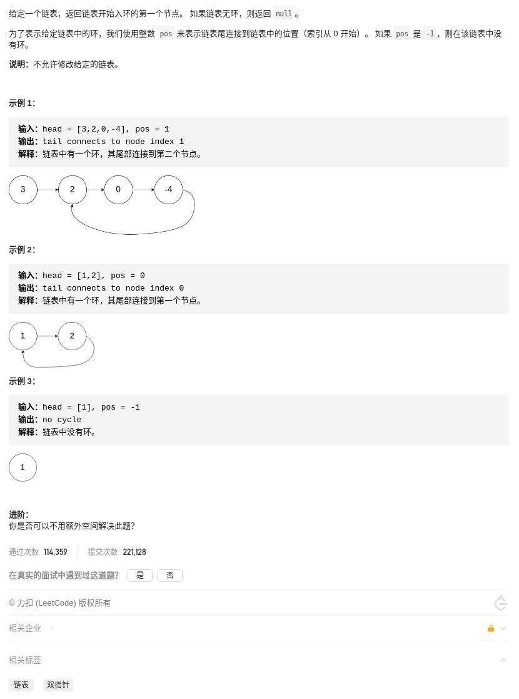
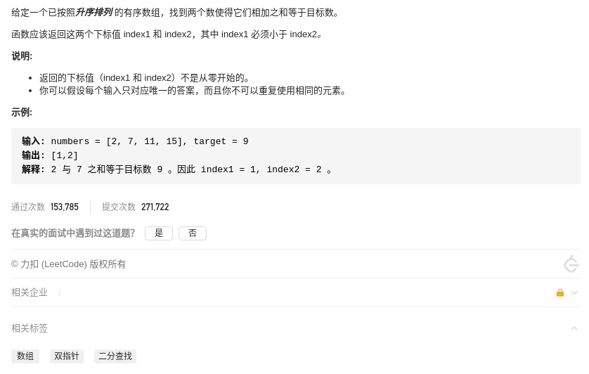

# LeetCode 精选 TOP 面试题

## 总览

* [x] [1.两数之和](#1.两数之和)
* [x] [2.两数相加](#2.两数相加)
* [x] [3.无重复字符的最长子串](#3.无重复字符的最长子串)
* [ ] [4.寻找两个正序数组的中位数](#4.寻找两个正序数组的中位数)
* [ ] [5.最长回文子串](#5.最长回文子串)
* [ ] [11.盛最多水的容器](#11.盛最多水的容器)
* [ ] [15.三数之和](#15.三数之和)
* [ ] [19.删除链表的倒数第N个节点](#19.删除链表的倒数第N个节点)
* [ ] [26.删除排序数组中的重复项](#26.删除排序数组中的重复项)
* [ ] [28.实现strStr()](#28.实现strStr())
* [ ] [42.接雨水](#42.接雨水)
* [ ] [75.颜色分类](#75.颜色分类)
* [x] [76.最小覆盖子串](#76.最小覆盖子串)
* [ ] [88.合并两个有序数组](#88.合并两个有序数组)
* [ ] [125.验证回文串](#125.验证回文串)
* [x] [141.环形链表](#141.环形链表)
* [x] [142.环形链表II](#142.环形链表II)
* [x] [167.两数之和II-输入有序数组](#167.两数之和II-输入有序数组)
* [ ] [234.回文链表](#234.回文链表)
* [ ] [239.滑动窗口最大值](#239.滑动窗口最大值)
* [ ] [283.移动零](#283.移动零)
* [ ] [287.寻找重复数](#387.寻找重复数)
* [ ] [344.反转字符串](#344.反转字符串)
* [ ] [350.两个数组的交集II](#350.两个数组的交集II)
* [ ] [438.找到字符串中所有字母异位词](#438.找到字符串中所有字母异位词)
* [ ] [567.字符串的排列](#567.字符串的排列)

## 归类

### 贪心

### 回溯

### 动态规划

### 双指针

* [3.无重复字符的最长子串](#3.无重复字符的最长子串)
* [11.盛最多水的容器](#11.盛最多水的容器)
* [15.三数之和](#15.三数之和)
* [19.删除链表的倒数第N个节点](#19.删除链表的倒数第N个节点)
* [26.删除排序数组中的重复项](#26.删除排序数组中的重复项)
* [28.实现strStr()](#28.实现strStr())
* [42.接雨水](#42.接雨水)
* [75.颜色分类](#75.颜色分类)
* [76.最小覆盖子串](#76.最小覆盖子串)
* [88.合并两个有序数组](#88.合并两个有序数组)
* [125.验证回文串](#125.验证回文串)
* [141.环形链表](#141环形链表)
* [142.环形链表II](#142.环形链表II)
* [167.两数之和II-输入有序数组](#167.两数之和II-输入有序数组)
* [234.回文链表](#234.回文链表)
* [283.移动零](#283.移动零)
* [287.寻找重复数](#387.寻找重复数)
* [344.反转字符串](#344.反转字符串)
* [350.两个数组的交集II](#350.两个数组的交集II)

### 滑动窗口

其实滑动窗口也是双指针的一种，是不过是最难的一种。

算法思想：就是维护一个窗口，不断滑动，然后更新结果。

应用场景：

算法实现：

```cpp
string need, window;
int left = 0, right = 0;

while (right < _len) {
    // 增大窗口
    window.add(x);  // 更新数据
    ++right;    // 窗口右端右移

    // 满足窗口缩小的条件
    while (condition) {
        // 缩小窗口
        window.remove(x);   // 更新数据
        ++left;     // 窗口左端右移
    }
}
```

需要思考：

* 当移动 right 扩大窗口时，应该更新哪些数据？
* 什么条件下，窗口应该暂停扩大，开始移动 left 缩小窗口？
* 当移动 left 缩小窗口时，应该更新哪些数据？
* 题目要求的结果应该在扩大窗口时还是缩小窗口时进行更新？

相关题目：

* [3.无重复字符的最长子串](#3.无重复字符的最长子串)
* [76.最小覆盖子串](#76.最小覆盖子串)
* [239.滑动窗口最大值](#239.滑动窗口最大值)
* [438.找到字符串中所有字母异位词](#438.找到字符串中所有字母异位词)
* [567.字符串的排列](#567.字符串的排列)

### 深度优先

### 广度优先

## 1.两数之和



### 解法一「无」暴力

直接遍历每个元素 x ，并查找是否存在一个值与 target - x 的值。

时间复杂度`O(n²)`，空间复杂度`O(1)`。

<!-- tabs:start -->

#### **Cpp**

```cpp
class Solution {
public:
    vector<int> twoSum(vector<int>& nums, int target) {
        vector<int> res;
        int len = nums.size();

        for(int i = 0; i < len; ++i) {
            for(int j = i + 1; j < len; ++j) {
                if(nums[i] + nums[j] == target) {
                    res.push_back(i);
                    res.push_back(j);

                    return res;
                }
            }
        }

        return res;
    }
};
```

#### **Python**

```python
class Solution:
    def twoSum(self, nums: List[int], target: int) -> List[int]:
        _len = len(nums)

        for i in range(_len):
            for j in range(i + 1, _len):
                if nums[i] + nums[j] == target:
                    return [i, j]
        return []
```

<!-- tabs:end -->

### 解法二「双指针」排序后双指针

双指针技巧再分为两类，一类是「快慢指针」，一类是「左右指针」。前者解决主要解决链表中的问题，比如典型的判定链表中是否包含环；后者主要解决数组（或者字符串）中的问题，比如二分查找，子串问题。

根据题意，每种输入只会对应一个答案。所以可以先排序，然后分别从前后遍历得到 x 和 y，如果两者之和大于 target，则尾指针向前走；如果两者之和大于 target，则头指针向后走；如果两者之和等于 target，则记录 i, j，然后在数组寻找元素的下标。

时间复杂度`O(nlogn)`，空间复杂度`O(n)`。

<!-- tabs:start -->

#### **Cpp**

```cpp
class Solution {
public:
    vector<int> twoSum(vector<int>& nums, int target) {
        vector<int> res;
        int len = nums.size();
        int i = 0, j = len - 1;
        vector<int> temp = nums;

        sort(temp.begin(), temp.end());

        while(i < j) {
            if(temp[i] + temp[j] > target) {
                --j;
            } else if (temp[i] + temp[j] < target) {
                ++i;
            } else {
                break;
            }
        }

        if(i < j) {
            for(int k = 0; k < len; ++k) {
                if(i < len && nums[k] == temp[i]) {
                    res.push_back(k);
                    i = len;
                } else if (j < len && nums[k] == temp[j]) {
                    res.push_back(k);
                    j = len;
                }

                if(i == j) {
                    return res;
                }
            }
        }

        return res;
    }
};
```

#### **Python**

```python
class Solution:
    def twoSum(self, nums: List[int], target: int) -> List[int]:
        i, j = 0, len(nums) - 1
        temp = nums.copy()

        temp.sort()

        while i < j:
            if (temp[i] + temp[j]) > target:
                j = j - 1
            elif (temp[i] + temp[j]) < target:
                i = i + 1
            else:
                break

        return [nums.index(temp[i]), nums.index(temp[j])]
```

<!-- tabs:end -->

### 解法三「数据结构」哈希

遍历得到 x 的同时判断哈希表中是否存在值 y，使得 x + y = target，如如果不存在则把 x 作为 key， x 的下标作为 value 存入哈希表。

时间复杂度`O(n)`，空间复杂度`O(n)`。

<!-- tabs:start -->

#### **Cpp**

```cpp
class Solution {
public:
    vector<int> twoSum(vector<int>& nums, int target) {
        unordered_map<int, int> um;
        vector<int> res;
        int len = nums.size();

        for(int i = 0; i < len; ++i) {
            if (um.count(target - nums[i]) > 0) {
                res.push_back(um[target-nums[i]]);
                res.push_back(i);
            }
            um[nums[i]] = i;
        }

        return res;
    }
};
```

#### **Python**

```python
class Solution:
    def twoSum(self, nums: List[int], target: int) -> List[int]:
        _hash = {}
        for i in range(len(nums)):
            j = _hash.get(target - nums[i])
            if j is not None:
                return [j, i]
            _hash[nums[i]] = i
        return []
```

<!-- tabs:end -->

## 2.两数相加



### 解法一「无」不对齐补零相加进位

注意到各自的位数是按照逆序的方式存储的，所以可以遍历两个链表直接相加，如果有进位的话，保留进位到下一次相加的结果。

<!-- tabs:start -->

#### **Cpp**

```cpp
/**
 * Definition for singly-linked list.
 * struct ListNode {
 *     int val;
 *     ListNode *next;
 *     ListNode(int x) : val(x), next(NULL) {}
 * };
 */
class Solution {
public:
    ListNode* addTwoNumbers(ListNode* l1, ListNode* l2) {
        ListNode* res = new ListNode(-1);   // 结果链表，最后返回其 next
        ListNode* op = res; // 操作链表
        int sum = 0;    // 相加结果
        bool carry = false; // 是否进位

        while(l1 != nullptr || l2 != nullptr) {
            sum = 0;
            if(l1 != nullptr) {
                sum += l1->val;
                l1 = l1->next;
            }
            if(l1 != nullptr) {
                sum += l2->val;
                l2 = l2->next;
            }
            if(carry) {
                ++sum;
            }
            op->next = new ListNode(sum % 10);
            op = op->next;
            carry = sum >= 10 ? true : false;
        }

        if(carry) {
            op->next = new ListNode(1);
        }

        return res->next;
    }
};
```

#### **Python**

```python
# Definition for singly-linked list.
# class ListNode:
#     def __init__(self, x):
#         self.val = x
#         self.next = None

class Solution:
    def addTwoNumbers(self, l1: ListNode, l2: ListNode) -> ListNode:
        res = ListNode(-1)
        op = res
        carry = False

        while l1 or l2:
            sum = 0
            if l1:
                sum = sum + l1.val
                l1 = l1.next
            if l2:
                sum = sum + l2.val
                l2 = l2.next
            if carry:
                sum = sum + 1

            op.next = ListNode(sum % 10)
            op = op.next
            carry = True if sum >= 10 else False

        if carry:
                op.next = ListNode(1)

        return res.next
```

<!-- tabs:end -->

## 3.无重复字符的最长子串


### 解法一「滑动窗口」字符移入移出

在 s 上滑动窗口，通过向右移动窗口的右端不断扩大窗口，当窗口内数据存在重复时，不满足条件，通过向右移动窗口的左端不断缩小窗口，然后更新结果。

<!-- tabs:start -->

#### **Cpp**

```cpp
class Solution {
public:
    int lengthOfLongestSubstring(string s) {
        unordered_map<char, int> window;
        int left = 0, right = 0;
        int s_len = s.size();
        int res = 0;    // 记录结果

        while (right < s_len) {
            char c = s[right];
            ++right;
            ++window[c];    // 字符串 c 移入窗口，对应的个数增加

            // 存在重复值，缩小窗口
            while (window[c] > 1) {
                char d = s[left];
                ++left;
                --window[d];    // 字符串 d 移出窗口，对应的个数减少
            }

            // 更新结果
            res = max(res, right - left);
        }

        return res;
    }
};
```

#### **Python**

```python
class Solution:
    def lengthOfLongestSubstring(self, s: str) -> int:
        window = collections.defaultdict(int)
        left, right, _len, res = 0, 0, len(s), 0

        while right < _len:
            c = s[right]
            right += 1
            window[c] += 1

            while window[c] > 1:
                d = s[left]
                left += 1
                window[d] -=1

            res = max(res, right - left)

        return res
```

<!-- tabs:end -->

## 76.最小覆盖子串



### 解法一「滑动窗口」增强减弱可行解性

在 s 上滑动窗口，通过向右移动窗口的右端不断扩大窗口，当窗口包含了 t 所需的所有字符后，即此时得到了一个可行解，然后通过向右移动窗口的左端不断缩小窗口，如果能缩小，就能得到了一个比可行解更好的解。

**如何判断当前的窗口包含所有 t 所需的字符呢？**

可以用一个哈希表的key代表字符，value 代表字符个数。如果窗口的哈希表的 key 包含所有 t 的哈希表的 key，并且窗口的哈希表的 value 不小于 t 的哈希表的 value，这时就认为窗口的内容是一个可行解。

<!-- tabs:start -->

#### **Cpp**

```cpp
class Solution {
public:
    string minWindow(string s, string t) {
        unordered_map<char, int> need, window;
        for (const char c : t) ++need[c];

        int s_len = s.size();
        int left = 0, right = 0;
        int key_cnt = 0;

        int start = 0, len = INT_MAX;   // 记录可行解的起始索引及长度

        while (right < s_len) {
            char c = s[right];
            ++right;    // 窗口右端右移

            // 更新窗口内的数据，窗口哈希表的键值更新，
            if (need.count(c)) {
                ++window[c];

                // 更新后的键值是否满足要求
                if (window[c] == need[c]) {
                    ++key_cnt;  // 字符 c 满足，增强可行解性
                }
            }

            // 是否有一个可行解
            while (key_cnt == need.size()) {
                // 更新记录可行解的数据
                if (right - left < len) {
                    start = left;
                    len = right - left;
                }

                char d = s[left];
                ++left;    // 窗口左端右移

                // 更新窗口内的数据，窗口哈希表的键值更新，
                if (need.count(d)) {
                    // 更新前的键值是否满足要求
                    if (window[d] == need[d]) {
                        --key_cnt;  // 字符 d 满足，减弱可行解性
                    }

                    --window[d];
                }
            }
        }

        return len == INT_MAX ? "" : s.substr(start, len);
    }
};
```

#### **Python**

```python
class Solution:
    def minWindow(self, s: str, t: str) -> str:
        # 字典的子类，提供了一个工厂函数，为字典查询提供一个默认值
        need = collections.defaultdict(int)
        window = collections.defaultdict(int)
        for c in t:
            need[c] += 1

        s_len = len(s)
        left, right, key_cnt = 0, 0, 0

        start, t_len = 0, float('inf')

        while right < s_len:
            c = s[right]
            right += 1

            if c in list(need.keys()):
                window[c] += 1

                if window[c] == need[c]:
                    key_cnt += 1

            while key_cnt == len(need):
                    if right - left < t_len:
                        start = left
                        t_len = right - left

                    d = s[left]
                    left += 1

                    if d in list(need.keys()):
                        if window[d] == need[d]:
                            key_cnt -= 1

                        window[d] -= 1

        return "" if t_len == float('inf') else s[start:start + t_len]
```

<!-- tabs:end -->

## 141.环形链表



### 解法一 [双指针] 快慢指针

双指针技巧再分为两类，一类是「**快慢指针**」，一类是「**左右指针**」。前者解决主要解决链表中的问题，比如判定链表中是否包含环并判断环的位置、寻找链表中点、寻找链表的倒数第 k 个元素等典型场景；后者主要解决数组（或者字符串）中的问题，比如二分查找，子串问题。

设定两个指针，一个跑得快，一个跑得慢。如果不含有环，跑得快的那个指针最终会遇到 null，说明链表不含环；如果含有环，快指针最终会超慢指针一圈，和慢指针相遇，说明链表含有环。需要注意的是，判断条件是快指针，因为它每次走的步数多。

<!-- tabs:start -->

#### **Cpp**

```cpp
/**
 * Definition for singly-linked list.
 * struct ListNode {
 *     int val;
 *     ListNode *next;
 *     ListNode(int x) : val(x), next(NULL) {}
 * };
 */
class Solution {
public:
    bool hasCycle(ListNode *head) {
        ListNode* slow = head;
        ListNode* fast = head;

        while(fast && fast->next) {
            slow = slow->next;
            fast = fast->next->next;

            if(slow == fast) {
                return true;
            }
        }

        return false;
    }
};
```

#### **Python**

```python
# Definition for singly-linked list.
# class ListNode:
#     def __init__(self, x):
#         self.val = x
#         self.next = None

class Solution:
    def hasCycle(self, head: ListNode) -> bool:
        slow = head
        fast = head

        while fast and fast.next:
            slow = slow.next
            fast = fast.next.next

            if slow == fast:
                return True

        return False
```

<!-- tabs:end -->

## 142.环形链表II



### 解法一「双指针」指针变换

双指针技巧再分为两类，一类是「快慢指针」，一类是「左右指针」。前者解决主要解决链表中的问题，比如判定链表中是否包含环并判断环的位置、寻找链表中点、寻找链表的倒数第 k 个元素等典型场景；后者主要解决数组（或者字符串）中的问题，比如二分查找，子串问题。

那么如何找到环的起点呢？

还是先判断有没有环，无环则返回 nullptr，有环则记住第一次快慢指针相遇的位置，然后进行指针变换，即将慢指针移动到链表头并把快指针变成慢指针，第二次“快”慢指针相遇的位置即为环的起点。

为什么呢？

因为第一次相遇时，慢指针走了 k 步，那么快指针一定走了 2k 步，那么多走的这 k 步即为环的长度。设定相遇点距离环的起点为 m，那么链表头距离环的起点为 k-m，同时快指针在走 k-m 也达到环的起点。

<!-- tabs:start -->

#### **Cpp**

```cpp
/**
 * Definition for singly-linked list.
 * struct ListNode {
 *     int val;
 *     ListNode *next;
 *     ListNode(int x) : val(x), next(NULL) {}
 * };
 */
class Solution {
public:
    ListNode *detectCycle(ListNode *head) {
        ListNode* slow = head;
        ListNode* fast = head;

        while(fast && fast->next) {
            slow = slow->next;
            fast = fast->next->next;

            if(slow == fast) {
                slow = head;
                while(slow != fast) {
                    slow = slow->next;
                    fast = fast->next;
                }

                return slow;
            }
        }

        return nullptr;
    }
};
```

#### **Python**

```python
# Definition for singly-linked list.
# class ListNode:
#     def __init__(self, x):
#         self.val = x
#         self.next = None

class Solution:
    def detectCycle(self, head: ListNode) -> ListNode:
        slow, fast = head, head

        while fast and fast.next:
            slow = slow.next
            fast = fast.next.next

            if slow == fast:
                slow = head
                while slow != fast:
                    slow = slow.next
                    fast = fast.next

                return slow

        return None
```

<!-- tabs:end -->

## 167.两数之和II-输入有序数组



### 解法一「双指针」直接双指针

双指针技巧再分为两类，一类是「快慢指针」，一类是「左右指针」。前者解决主要解决链表中的问题，比如判定链表中是否包含环并判断环的位置、寻找链表中点、寻找链表的倒数第 k 个元素等典型场景；后者主要解决数组（或者字符串）中的问题，比如二分查找，子串问题。

同 [1.两数之和](#1.两数之和) 解法二类似，连排序都不用自己排了。

<!-- tabs:start -->

#### **Cpp**

```cpp
class Solution {
public:
    vector<int> twoSum(vector<int>& numbers, int target) {
        int i = 0, j = numbers.size() - 1;

        while (i < j) {
            if(numbers[i] + numbers[j] < target) {
                ++i;
            } else if (numbers[i] + numbers[j] > target) {
                --j;
            } else {
                return vector<int> {i + 1, j + 1};
            }
        }

        return vector<int> {};
    }
};
```

#### **Python**

```python
class Solution:
    def twoSum(self, numbers: List[int], target: int) -> List[int]:
        i = 0
        j = len(numbers) - 1

        while i < j:
            if numbers[i] + numbers[j] < target:
                i = i + 1
            elif numbers[i] + numbers[j] > target:
                j = j -1
            else:
                return [i + 1, j + 1]

        return []
```

<!-- tabs:end -->

### 解法二：二分查找

直接二分查找硬找呗。

<!-- tabs:start -->

#### **Cpp**

```cpp
class Solution {
public:
    vector<int> twoSum(vector<int>& numbers, int target) {
        for (int i = 0; i < numbers.size(); ++i) {
            int low = i + 1, high = numbers.size() - 1;
            while (low <= high) {
                int mid = (high - low) / 2 + low;
                if (numbers[mid] == target - numbers[i]) {
                    return {i + 1, mid + 1};
                } else if (numbers[mid] > target - numbers[i]) {
                    high = mid - 1;
                } else {
                    low = mid + 1;
                }
            }
        }
        return {};
    }
};
```

#### **Python**

```python
class Solution:
    def twoSum(self, numbers: List[int], target: int) -> List[int]:
        n = len(numbers)
        for i in range(n):
            low, high = i + 1, n - 1
            while low <= high:
                mid = (low + high) // 2
                if numbers[mid] == target - numbers[i]:
                    return [i + 1, mid + 1]
                elif numbers[mid] > target - numbers[i]:
                    high = mid - 1
                else:
                    low = mid + 1

        return []
```

<!-- tabs:end -->
