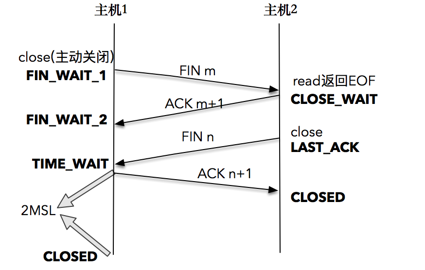
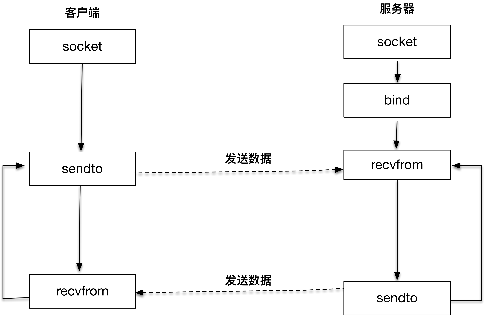
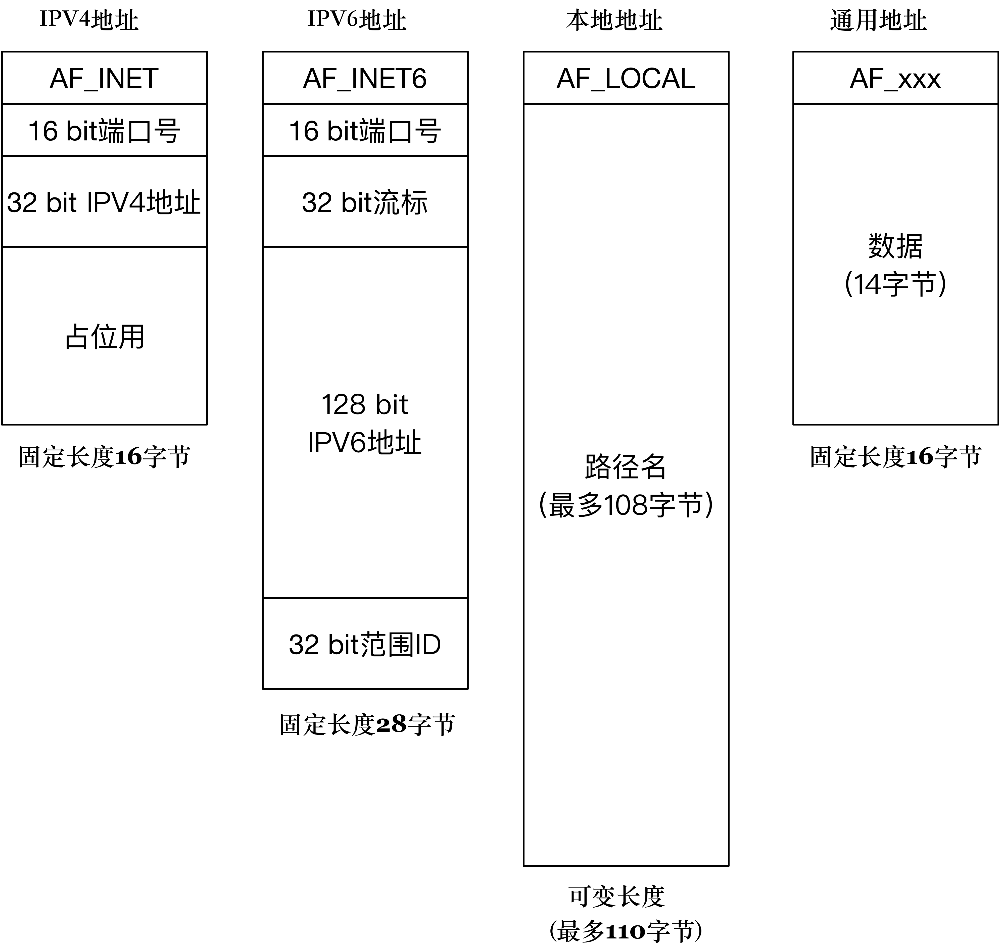

# 网络编程实战-基础篇

高性能网络编程，要掌握的两个核心要点：

* 理解网络协议，并在这个基础上和操作系统内核配合，感知各种网络 I/O 事件。
* 学会使用线程处理并发。

掌握网络编程，需要达到以下三个层次：

* 充分理解 TCP/IP 网络模型和协议。
* 结合对协议的理解，增强对各种异常情况的优雅处理能力。
* 写出可以支持大规模高并发的网络处理程序。

## TCP/IP 和 Linux

OSI 参考模型和 TCP_IP 协议栈：


操作系统对 TCP/IP 的支持：


## 客户端-服务器网络模型的基本概念

### 客户端-服务器网络编程模型

网络编程中的一个重要概念就是“客户端-服务器”。

拿我们常用的网络购物来说，我们在手机上的每次操作，都是作为客户端向服务器发送请求，并收到响应的例子。

具体过程为：


1. 当一个客户端需要服务时，比如网络购物下单，它会向服务器端发送一个请求。注意，这个请求是按照双方约定的格式来发送的，以便保证服务器端是可以理解的；
2. 服务器端收到这个请求后，会根据双方约定的格式解释它，并且以合适的方式进行操作，比如调用数据库操作来创建一个购物单；
3. 服务器端完成处理请求之后，会给客户端发送一个响应，比如向客户端发送购物单的实际付款额，然后等待客户端的下一步操作；
4. 客户端收到响应并进行处理，比如在手机终端上显示该购物单的实际付款额，并且让用户选择付款方式。

可以根据编程模型的不同，区分客户端和服务器端。

服务器端需要一开始就监听在一个众所周知的端口上，等待客户端的发生情况，一旦有客户端建立连接，服务器端就会消耗一定的计算器资源为它服务。由于服务器端需要同时为成千上万个客户端服务，所以如何服务器端在数据量巨大的客户端访问时依然能维持效率和稳定，这也是高性能网络编程的目的。

**值得注意的是，无论是客户端，还是服务器端，它们运行的单位都是进程（process），而不是机器。**

### IP 和端口

在 TCP/IP 协议栈中，IP 用来表示网络世界的地址。

拿住酒店举例子，酒店的地址是唯一的，每间房间的号码是不同的，类似的，计算机的 IP 地址是唯一的，每个连接的端口号是不同的。

端口号是一个 16 位的整数，最多为 65536。当一个客户端发起连接请求时，客户端的端口是由操作系统内核临时分配的，称为**临时端口**。

一个连接可以通过客户端 - 服务器端的 IP 和端口唯一确定，这叫做**套接字对**。表示如下：

```
（clientaddr:clientport, serveraddr: serverport)
```

一个客户端 - 服务器之间的连接为：


### 保留网段

IP 到底代表了什么呢？不同的组织使用同样的 IP 会不会导致冲突呢？

国际标准组织在 IPv4 地址空间里面，专门划出了一些网段，这些网段不会用做公网上的 IP，而是仅仅保留作内部使用，我们把这些地址称作**保留网段**。

下表是三个保留网段，其可以容纳的计算机主机个数分别是 16777216 个、1048576 个和 65536 个。


### 子网掩码

在网络 IP 划分的时候，需要区分的两个概念：

* 网络（network）：它表示的是这组 IP 共同的部分，比如在 192.168.1.1~192.168.1.255 这个区间里，它们共同的部分是 192.168.1.0。
* 主机（host）：它表示的是这组 IP 不同的部分，上面的例子中 1~255 就是不同的那些部分，表示有 255 个可用的不同 IP。

子网分类：

* “Class A”（A 类）网络：一个字节的网络，而另外三个字节是 host 地址。
* “Class B”（B 类）网络：两个字节的网络，而另外两个字节是 host 地址。
* “Class A”（C 类）网络：三个字节的网络，而另外一个字节是 host 地址。


网络地址位数由子网掩码（Netmask）决定，你可以将 IP 地址与子网掩码进行“**位与**”操作，就能得到网络的值。

### 全球域名系统

正如电话簿记录了好友和电话的对应关系一样，域名（DNS）也记录了网站和 IP 的对应关系。

全球域名按照从大到小的结构，形成了一棵树状结构。实际访问一个域名时，是从最底层开始写起。


### 数据报和字节流

在 TCP/IP 协议栈的传输层其实是有两种协议的，一种是大家广为熟悉的 TCP， 而另一种就是 UDP。

TCP（Transmission Control Protocol），即传输控制协议，又被成为字节流套接字（Stream Socket），它是可靠的、双向连接的通讯串流。比如以“1-2-3”的顺序将字节流输出到套接字上，它们在另一端一定会以“1-2-3”的顺序抵达，而且不会出错。那么这种高质量的通信是如何办到的呢？

因为 TCP 通过诸如**连接管理**，**拥塞控制**，**数据流与窗口管理**，**超时和重传**等一系列精巧而详细的设计，提供了高质量的端到端的通信方式。

UDP（User Datagram Protocol）,即用户数据报协议，又被成为数据报套接字（Datagram Socket），UDP 也可以做到更高的可靠性，只不过这种可靠性，需要应用程序进行设计处理，比如**对报文进行编号**，**设计 Request-Ack 机制**，再加上**重传**等，在一定程度上可以达到更为高可靠的 UDP 程序。

### 思考

**问题1：**

看到保留地址中第二行 172.16.0.0/12 描述为 16 个连续的 B 段，第三行 192.168.0.0/16 描述为 256 个连续的 C 段地址，怎么理解这种描述呢？

**解答：**

172.16.0.0 ~ 172.31.255.255，因为 B 类网络的 host 只占最后两个字节，172.16 ~ 172.31 就代表了 16 个连续的 B 类网络可用。

192.168.0.0 ~ 192.168.255.255，因为 C 类网络的 host 只占最后一个字节，192.168.0 ~ 192.168.255 就代表了 256 个连续的 C 类网络可用。

**问题2：**

服务端必须侦听在一个众所周知的端口上，这个端口怎么选择，又是如何让客户端知道的呢？

**解答：**

如果是一些默认的服务，服务器绑的也是默认的端口，那么客户端是可以知道的。比如 80 是给 http 服务，443 是给 https 服务，21 是给 ftp 服务，3306 默认是 MySQL 端口，6379默认是 Redis 端口等。否则的话，就需要服务器开发者告诉客户端应该连接哪个端口。

## 套接字和地址

套接字（Socket）这个英文单词的原意是“插口”、“插槽”， 在网络编程中，它的寓意是可以通过插口接入的方式，快速完成网络连接和数据收发。把它想象成现实世界的电源插口，所以它可以看做是对物理世界的直接映射。

### Socket 到底是什么

客户端和服务器工作的核心逻辑：


以上所有的操作，都是通过 socket 来完成的。无论是客户端的 connect，还是服务端的 accept，或者 read/write 操作等，**socket 是我们用来建立连接，传输数据的唯一途径**。

如何理解上面这张图？可以先从右侧的服务器端开始看，因为在客户端发起连接请求之前，服务器端必须初始化好。

首先初始化 socket，然后服务器端需要执行 bind 函数，将自己的服务能力绑定在一个众所周知的地址和端口上，再然后服务器端执行 listen 操作，将原先的 socket 转换为 服务器端的 socket，最后服务器端阻塞在 accept 上等待客户端请求的到来。

服务器端准备就绪之后，客户端首先初始化 socket，然后执行 connect 向预知的服务器端的地址和端口发起连接请求，这个过程就是著名的 **TCP 三次握手**。

一旦三次握手完成，客户端和服务器端建立连接，就进入了数据传输过程。具体来说，客户端进程向操作系统内核发起 write 字节流写操作，内核协议栈将字节流通过网络设备传输到服务器端，服务器端从内核得到信息，将字节流从内核读入到进程中，并开始业务逻辑的处理，完成之后，服务器端再将得到的结果以同样的方式写给客户端。可以看到，**一旦连接建立，数据的传输就不再是单向的，而是双向的，这也是 TCP 的一个显著特性**。

当客户端完成和服务器端的交互后，比如执行一次 HTTP 请求，需要和服务器断断开连接时，就会执行 clost 函数，操作系统内核此时会通过原先的连接链路向服务器端发送一个 FIN 包，服务器端收到之后执行被动关闭，这时候整个链路处于**半关闭状态**，此时发起 close 请求的一方在没有收到对方 FIN 包之前都认为连接是正常的。此后服务器端也会执行 close 函数，这时候整个链路处于**全关闭状态**，此时双方都感知连接已经关闭。

### 直观的理解 Socket

把客户端和服务器工作想象成打电话，socket 就好比是我们的手机， connect 就好比是拿着手机拨号，服务器端的 bind 就好比是去电信公司开户，将号码和绑定，这样别人就可以通过号码联系你，listen 就好比是让手机处于可接听的状态，accept 就好比是被叫的一方拿起手机进行应答。

然后对方拨通手机号建立通话（connect），拨打电话的人说（write）：你好，接听电话的人听到（write）：并回答（write）你好。这样，就等同进入了 read/write 的数据传输过程。

最后，拨打电话的人完成了此次交流，挂上电话，对应的操作可以理解为 close，接听电话的人知道对方已挂机，也挂上电话，也是一次 close。

在整个通话过程中，手机是我们可以和外面通信的设备，对应到网络编程的世界里，socket 也是我们可以和外界进行网络通信的途径。

### 套接字地址格式

需要**套接字的地址**建立连接，就像打电话时首先需要查找电话簿，找到你想要联系的那个人，你才可以建立连接，开始交流。

套接字的一个通用地址结构：

```c
/* POSIX.1g 规范规定了地址族为2字节的值. */
typedef unsigned short int sa_family_t;
/* 描述通用套接字地址 */
struct sockaddr{
    sa_family_t sa_family; /* 地址族. 16-bit*/
    char sa_data[14]; /* 具体的地址值 112-bit */
};
```

**地址族**表示什么样的方式对地址进行解释和保存，好比电话薄里的手机格式，或者固话格式，这两种格式的长度含义数是不同的。

地址族在 glibc 里的定义非常多，常用的有以下几种：

* AF_LOCAL：表示的是本地地址，对应的是 Unix 套接字，这种情况一般用于本地 socket 通信，很多情况下也可以写成 AF_UNIX、AF_FILE；
* AF_INET：因特网使用的 IPv4 地址；
* AF_INET6：因特网使用的 IPv6 地址。

这里的 AF_表示的含义是 `Address Family`，但是很多情况下，我们也会看到以 PF_ 表示的宏，比如 PF_INET、PF_INET6 等，实际上 PF_ 的意思是 `Protocol Family`，也就是协议族的意思。

用 AF_xxx 这样的值来初始化 socket 地址，用 PF_xxx 这样的值来初始化 socket。

sockaddr 是一个通用的地址结构，通用的意思是适用于多种地址族。

### 本地套接字地址格式

```c
struct sockaddr_un {
    unsigned short sun_family; /* 固定为 AF_LOCAL */
    char sun_path[108];   /* 路径名 */
};
```

一般用来作为本地进程间的通信。

### IPv4套接字地址格式

```c

/* IPV4套接字地址，32bit值.  */
typedef uint32_t in_addr_t;
struct in_addr
  {
    in_addr_t s_addr;
  };
  
/* 描述IPV4的套接字地址格式  */
struct sockaddr_in
  {
    sa_family_t sin_family; /* 16-bit */
    in_port_t sin_port;     /* 端口口  16-bit*/
    struct in_addr sin_addr;    /* Internet address. 32-bit */


    /* 这里仅仅用作占位符，不做实际用处  */
    unsigned char sin_zero[8];
  };
```

可以发现和 sockaddr 一样，都有一个 16-bit 的 sin_family 字段，对于 IPv4 来说这个值就是 AF_INET。实际的 IPv4 地址是一个 32-bit 的字段，可以想象最多支持的地址数就是 2 的 32 次方，大约是 42 亿。

### IPv6套接字地址格式

```c
struct sockaddr_in6
  {
    sa_family_t sin6_family; /* 16-bit */
    in_port_t sin6_port;  /* 传输端口号 # 16-bit */
    uint32_t sin6_flowinfo; /* IPv6流控信息 32-bit*/
    struct in6_addr sin6_addr;  /* IPv6地址128-bit */
    uint32_t sin6_scope_id; /* IPv6域ID 32-bit */
  };
```

这里的地址族显然应该是 AF_INET6，端口同 IPv4 地址一样，关键的地址从 32 位升级到 128 位，这样就完全解决了寻址数字不够的问题。

### 思考

**问题1：**

IPv4、IPv6、本地套接字格式以及通用地址套接字，它们有什么共性呢？如果你是 BSD 套接字的设计者，你为什么要这样设计呢？

**解答：**

通用网络地址结构是所有具体地址结构的抽象，有了统一可以操作的地址结构，那么就可以设计一套统一的接口，简化了接口设计。

**问题2：**

为什么本地套接字格式不需要端口号，而 IPv4 和 IPv6 套接字格式却需要端口号呢？

**解答：**

在 Unix 中，一切皆为文件。本地套接字本质上是在访问本地的文件系统，所以自然不需要端口。远程套接字是直接将一段字节流发送到远程计算机的一个进程，而远程计算机可能同时有多个进程在监听，所以用端口号确定要发给哪一个进程。

**问题3：**

WebSocket、Http 和 Socket 之间的联系吗?

**解答：**

Http 是应用层协议，是基于 TCP Socket 的实现，WebSocket 是 Http 的增强，利用了 TCP 双向的特性，增强了服务器端到客户端的传输能力。以前客户端是需要不断通过轮询来从服务端得到信息，使用 WebSocket 以后服务器端就可以直接推送信息到客户端了。

## TCP 三次握手

### 服务器端准备连接的过程

#### 1.create socket：获取一个手机

要创建一个可用的套接字，需要使用下面的函数：

```c
int socket(int domain, int type, int protocol)
```

* domain 就是指 PF_INET、PF_INET6 以及 PF_LOCAL 等，表示什么样的套接字。
* type 可用的值有：
  * SOCK_STREAM: 表示的是字节流，对应 TCP；
  * SOCK_DGRAM： 表示的是数据报，对应 UDP；
  * SOCK_RAW: 表示的是原始套接字。
* protocol 原本是用来指定通信协议的，但现在基本废弃，目前一般写成 0 即可。

#### 2.bind：设置手机号码

创建出来的套接字如果需要被别人使用，就需要调用 bind 函数把套接字和套接字地址绑定，就像去电信局登记我们的手机号码一样。需要使用下面的函数：

```c
int bind(int fd, sockadd* addr, socklen_t len)
```

* fd 接受一个 socket 。
* addr 是通用地址格式，虽然接收的是通用地址格式，实际上传入的参数可能是 IPv4、IPv6 或者本地套接字格式。bind 函数会根据 len 字段判断传入的参数 addr 该怎么解析，len 字段表示的就是传入的地址长度，它是一个可变值。
* len 字段表示的就是传入的地址长度，它是一个可变值。

对于使用者来说，每次需要将 IPv4、IPv6 或者本地套接字格式转化为通用套接字格式，就像下面的 IPv4 套接字地址格式的例子一样：

```c
struct sockaddr_in name;
bind (sock, (struct sockaddr *) &name, sizeof (name)
```

对于实现者来说，可根据该地址结构的前两个字节判断出是哪种地址。

**那么该如何设置通配地址呢？**
对于 IPv4 的地址来说，使用 INADDR_ANY 来完成通配地址的设置；对于 IPv6 的地址来说，使用 IN6ADDR_ANY 来完成通配地址的设置。一个例子为：

```c
// 设置通配地址
name.sin_family = AF_INET;  // 制定地址族
name.sin_port = htons(port);    // 指定端口
name.sin_addr.s_addr = htonl(INADDR_ANY);   // IPV4通配地址
```

如果把端口（port）设置成 0，就相当于把端口的选择权交给操作系统内核来处理，操作系统内核会根据一定的算法选择一个空闲的端口，完成套接字的绑定。这在服务器端不常使用，一般来说，服务器端的程序一定要绑定到一个众所周知的端口上。服务器端的 IP 地址和端口数据，相当于打电话拨号时需要知道的对方号码，如果没有电话号码，就没有办法和对方建立连接。

一个初始化 IPv4 TCP 套接字的例子:

```c
#include <cstdio>
#include <cstdlib>
#include <sys/socket.h>
#include <netinet/in.h>


// 初始化一个 IPv4 TCP 套接字
int make_socket(uint16_t port) {
    int sock;
    struct sockaddr_in name;

    // 创建字节流类型的 IPv4 socket
    sock = socket(PF_INET, SOCK_STREAM, 0);
    if (sock < 0) {
        perror("socket");
        exit (EXIT_FAILURE);
    }

    // 设置通配地址
    name.sin_family = AF_INET;  // 制定地址族
    name.sin_port = htons(port);    // 指定端口
    name.sin_addr.s_addr = htonl(INADDR_ANY);   // IPV4通配地址

    // 把 IPv4 地址转换成通用地址格式，同时传递长度
    if (bind(sock, (struct sockaddr *) &name, sizeof(name)) < 0) {
        perror("bind");
        exit (EXIT_FAILURE);
    }

    return sock;
}
```

#### 3.listen：让手机处于可接听的状态

bind 函数只是让我们的套接字和地址关联，如同登记了手机号码。如果要让别人打通电话，还需要我们把电话设备充值话费，让服务器真正处于可接听的状态，这个过程需要依赖 listen 函数。

初始化创建的套接字，可以认为是一个"**主动**"套接字，其目的是之后主动发起请求（通过调用 connect 函数）。通过 listen 函数，可以将原来的"主动"套接字转换为"**被动**"套接字，告诉操作系统内核：“**我这个套接字是用来等待用户请求的。**”当然，操作系统内核会为此做好接收用户请求的一切准备，比如完成连接队列。需要使用下面的函数：

```c
int listen (int fd, int backlog)
```

* fd 接受一个 socket。
* backlog 在 Linux 中表示已完成（ESTABLISHED）且未 accept 的队列大小，这个参数的大小决定了可以接收的并发数目。这个参数越大，并发数目理论上也会越大。但是参数过大也会占用过多的系统资源。

#### 4.accept：电话响起后接听手机

当客户端的连接请求到达时，服务器端应答成功，连接建立，这个时候操作系统内核需要把这个事件通知到应用程序，并让应用程序感知到这个连接。这个过程，就好比电信运营商完成了一次电话连接的建立, 应答方的电话铃声响起，通知有人拨打了号码，这个时候就需要拿起电话筒开始应答。

连接建立之后，可以把 accept 这个函数看成是操作系统内核和应用程序之间的桥梁。需要使用下面的函数：

```c
int accept (int fd, struct sockaddr * clientaddr, socklen_t * addr_len);
```

* fd 接受一个 socket，也即 listen socket。
* clientaddr 是返回的已连接套接字描述字，通过指针方式获取的客户端的地址。
* addrlen 告诉我们地址的大小。

函数的返回值有两个部分，第一个部分 cliadd 是通过指针方式获取的客户端的地址，addrlen 告诉我们地址的大小，这可以理解成当我们拿起电话机时，看到了来电显示，知道了对方的号码；另一个部分是函数的返回值，这个返回值是一个全新的描述字，代表了与客户端的连接。

**这里一定要注意有两个套接字描述字，第一个是监听套接字描述字 listensockfd，它是作为输入参数存在的；第二个是返回的已连接套接字描述字。**

为什么要把两个套接字分开呢？

因为监听套接字一直都存在，它是要为成千上万的客户来服务的，直到这个监听套接字关闭。而一旦一个客户和服务器连接成功，完成了 TCP 三次握手，操作系统内核就为这个客户生成一个**已连接套接字**，让应用服务器使用这个已连接套接字和客户进行通信处理。如果应用服务器完成了对这个客户的服务，那么关闭的就是已连接套接字，这样就完成了 TCP 连接的释放。**值得注意的是**，这个时候释放的只是这一个客户连接，其它被服务的客户连接可能还存在，并且监听套接字一直都处于“监听”状态，等待新的客户请求到达并服务。

### 客户端发起连接的过程

#### 1.create socket：获取一个手机

同服务器端一样。

#### 2.connect：拨打电话

客户端和服务器端的连接建立，是通过 connect 函数完成的。需要使用下面的函数：

```c
int connect(int sockfd, const struct sockaddr *serveraddr, socklen_t addrlen)
```

* sockfd 接受一个 socket。
* serveraddr 代表指向套接字地址结构的指针。
* addrlen 代表该结构的大小。

**客户在调用函数 connect 前不必非得调用 bind 函数，因为如果需要的话，内核会确定源 IP 地址，并按照一定的算法选择一个临时端口作为源端口。**

如果是 TCP 套接字，那么调用 connect 函数将激发 TCP 的三次握手过程，而且仅在连接建立成功或出错时才返回。其中出错返回可能有以下几种情况：

* 三次握手无法建立，客户端发出的 SYN 包没有任何响应，于是返回 TIMEOUT 错误。这种情况比较常见的原因是对应的服务端 IP 写错。
* 客户端收到了 RST（复位）回答，这时候客户端会立即返回拒绝连接（CONNECTION REFUSED）错误。这种情况比较常见的原因是客户端发送连接请求时的请求端口写错。因为 RST 是 TCP 在发生错误时发送的一种 TCP 分节。产生 RST 的三个条件是：
  * 目的地为某端口的 SYN 到达，然而该端口上没有正在监听的服务器。
  * TCP 想取消一个已有连接。
  * TCP 接收到一个根本不存在的连接上的分节。
* 客户发出的 SYN 包在网络上引起了 destination unreachable，即目的不可达的错误。这种情况比较常见的原因是客户端和服务器端路由不通。

### TCP 三次握手过程


**其中：**

* 确认ACK，仅当ACK=1时，确认号字段才有效。TCP规定，在连接建立后所有报文的传输都必须把ACK置1；
* 同步SYN，在连接建立时用来同步序号。当SYN=1，ACK=0，表明是连接请求报文，若同意连接，则响应报文中应该使SYN=1，ACK=1；
* 终止FIN，用来释放连接。当FIN=1，表明此报文的发送方的数据已经发送完毕，并且要求释放；
* 复位RST，当RST=1，表明TCP连接中出现严重差错，必须释放连接，然后再重新建立连接；

**解读：**

这里使用的网络编程模型都是阻塞式的。所谓阻塞式，就是调用发起后不会直接返回，由操作系统内核处理之后才会返回。相对的，还有一种叫做非阻塞式的。

最初的过程：服务器端通过 socket，bind 和 listen 完成了被动套接字的准备工作，被动的意思就是等着别人来连接，然后调用 accept，就会阻塞在这里，等待客户端的连接来临；客户端通过调用 socket 和 connect 函数之后，也会阻塞。接下来的事情是由操作系统内核完成的，更具体一点的说，是**操作系统内核的网络协议栈**在工作。

具体的过程：

1. 客户端的协议栈向服务器端发送一个值为 j 的 SYN 包，客户端进入 SYN_SENT 状态；
2. 服务器端的协议栈收到 SYN 包之后，服务器端发送一个值为 j + 1 的 ACK 应答包和 一个值为 k 的 SYN 包，服务器端进入 SYN_RCVD 状态；
3. 客户端的协议栈收到 ACK+SYN 包之后，使得应用程序从 connect 调用返回，表示客户端到服务器端的单向连接建立成功，客户端进入 ESTABLISHED 状态，同时客户端协议栈向服务器端发送一个值为 k + 1 的 ACK 应答包；
4. 服务器端的协议栈收到 ACK 应答包之后，使得 accept 阻塞调用返回，表示服务器端到客户端的单向连接也建立成功，服务器端进入 ESTABLISHED 状态。

形象的比喻：

1. A 先对 B 说：“喂，你在么？我在的，我的口令是 j。”
2. B 收到之后大声回答：“我收到你的口令 j 并准备好了，你准备好了吗？我的口令是 k。”
3. A 收到之后也大声回答：“我收到你的口令 k 并准备好了，我们开始吧。”

**为什么要需要进行三次握手，不是两次或者四次呢？**

是为了确定双方都具备接收发送能力，为后续可靠性传输做准备。

第一次握手，服务器端只能确定客户端的发送能力和服务器端的接收能力。

第二次握手，客户端可以确定客户端和服务器端具备接收发送能力。

第三次握手，服务器端就能确定客户端的接收能力和服务器端的发送能力。

### TCP 四次挥手过程



具体的过程：

1. TCP 连接终止时，主机1 发送值为 m 的 FIN 包，主机1 进入 FIN_WAIT_1（终止等待1） 状态。
2. 主机2 收到 FIN 包后，发送值为 m + 1 的 ACK 应答包，主机2 进入 CLOSE_WAIT（关闭等待）状态。**注意**，此时处于半关闭的状态，主机1 到主机2 的方向释放了，但是主机2 到主机1 的方向还正常，即主机2 依然能向主机1 发送数据且主机1 能接收。主机1 接收到 ACK 应答包后，主机1 进入 FIN_WAIT_2（终止等待2） 状态。
3. 主机2 准备好关闭连接时，发送值为 n 的 FIN 包，主机2 进入 LAST_ACK（最后确认）状态，等待主机1 的确认。
4. 主机1 收到 FIN 包后，发送值为 n + 1 的 ACK 应答包，主机1 进入 TIME_WAIT（时间等待） 状态。**注意**，此时 TCP 连接还没有释放，必须经过 2MSL（Maximum Segment Lifetime，最长报文段寿命）的时间后，才进入 CLOSED（关闭）状态。
5. 主机2 接收到 ACK 应答包后，进入 CLOSED（关闭）状态。

**为什么要需要进行四次挥手，不是两次或者三次呢？**

因为 TCP 连接是双向传输的对等模式，关闭连接时，当收到对方的 FIN 报文时，仅仅表示对方不再发送数据了但是还能接收数据，己方是否现在关闭发送数据通道，需要上层应用来决定，因此，己方 ACK 和 FIN 一般都会分开发送，这里就相对于三次握手多了一次。

### 思考

**问题1：**

如何使用非阻塞调用套接字呢？使用的场景又是哪里呢？

非阻塞调用的场景就是高性能服务器编程。所有的调用都不需要等待对方准备好了再返回，而是立即返回，那么怎么知道是否准备好了？就是把这些 fd 注册到类似 select 或者 epoll 这样的调用中，变多个 fd 阻塞为一个 fd 阻塞，只要有任何一个 fd 准备好了，select 或者 epoll 都会返回，然后再从中取出准备好了的 fd 进行各种操作。

**解答：**

**问题2：**

客户端发起 connect 调用之前，可以调用 bind 函数么？

**解答：**

客户端调用 bind 函数当然是可以的，但是因为连接请求往往是由客户端主动发起的，所以在客户端这样做显得不那么必要，还要承担端口冲突的风险。

**问题3：**

三次握手连接阶段，最后一次ACK包丢失会进入什么样的一个状态？

**解答：**

对于服务器端，此时的状态为 SYN_RECV，它会根据 TCP 的超时重传机制，会等待3秒、6秒、12秒后重新发送 SYN+ACK 包，以便让客户端重新发送ACK包。如果重发指定次数之后，仍然未收到客户端的应答，那么一段时间后，服务器端自动关闭这个连接。

对于客户端，此时的状态为 ESTABLISHED，如果客户端向服务器端发生数据，服务器端将以 RST 包响应，客户端感知到错误。

## 使用套接字进行读写

连接建立的根本目的是为了数据的收发。

### 发送数据

发送数据时常用的有三个函数，分别是 write、send 和 sendmsg。

```c
ssize_t write (int socketfd, const void *buffer, size_t size)

ssize_t send (int socketfd, const void *buffer, size_t size, int flags)

ssize_t sendmsg(int sockfd, const struct msghdr *msg, int flags)
```

第一个函数是常见的文件写函数，如果把 socketfd 换成文件描述符，就是普通的文件写入。

如果想指定选项，发送带外数据，就需要使用第二个带 flag 的函数。所谓带外数据，是一种基于 TCP 协议的紧急数据，用于客户端 - 服务器在特定场景下的紧急处理。

如果想指定多重缓冲区传输数据，就需要使用第三个函数，以结构体 msghdr 的方式发送数据。

**对于普通文件描述符而言**，一个文件描述符代表了打开的一个文件句柄，通过调用 write 函数，操作系统内核帮我们不断地往文件系统中写入字节流。注意，写入的字节流大小通常和输入参数 size 的值是相同的，否则表示出错。**对于套接字描述符而言**，它代表了一个双向连接，在套接字描述符上调用 write 写入的字节数有可能比请求的数量少，这在普通文件描述符情况下是不正常的。

产生这个现象的原因在于操作系统内核为读取和发送数据做了很多我们表面上看不到的工作。

### 发送缓冲区

**值得注意的是**，当 TCP 三次握手成功，TCP 连接成功建立后，操作系统内核会为每一个连接**创建配套的基础设施**，比如发送缓冲区。

发送缓冲区的大小可以通过套接字选项来改变，当我们的应用程序调用 write 函数时，实际所做的事情是**把数据从应用程序中拷贝到操作系统内核的发送缓冲区中，并不一定是把数据通过套接字写出去**。

这样的话，就分为几种情况：

1. 操作系统内核的发送缓冲区足够大，可以直接容纳这份数据，那么没有问题，我们的程序从 write 调用中退出，返回写入的字节数就是应用程序的数据大小。
2. 操作系统内核的发送缓冲区是够大了，不过还有数据没有发送完，或者数据发送完了，但是操作系统内核的发送缓冲区不足以容纳应用程序数据，在这种情况下，应用程序被阻塞，也就是说应用程序在 write 函数调用处停留，不直接返回。大部分 UNIX 系统的做法是一直等到可以把应用程序数据完全放到操作系统内核的发送缓冲区中，再从系统调用中返回。


### 读取数据

在 UNIX 的世界里万物都是文件，这就意味着可以将套接字描述符传递给那些原先为处理本地文件而设计的函数。

从最简单的 read 函数开始看起，需要使用下面的函数：

```c
ssize_t read (int socketfd, void *buffer, size_t size)
```

read 函数要求操作系统内核从套接字描述字 socketfd 读取最多 size 个字节，并将结果存储到 buffer 中。

返回值告诉我们实际读取的字节数目，也有一些特殊情况，如果返回值为 0，表示 EOF（end-of-file），表示对端发送了 FIN 包，要处理断连的情况；如果返回值为 -1，表示出错。

如果想让应用程序每次都读到 size 个字节，就需要编写下面的函数，不断地循环读取。

```c

/* 从socketfd描述字中读取"size"个字节. */
size_t readn(int fd, void *buffer, size_t size) {
    char *buffer_pointer = buffer;
    int length = size;

    while (length > 0) {
        int result = read(fd, buffer_pointer, length);

        if (result < 0) {
            if (errno == EINTR)
                continue;     /* 考虑非阻塞的情况，这里需要再次调用read */
            else
                return -1;
        } else if (result == 0)
            break;                /* EOF(End of File)表示套接字关闭 */

        length -= result;
        buffer_pointer += result;
    }
    return (size - length);        /* 返回的是实际读取的字节数*/
}
```

### 读取缓冲区

举一个例子，这个例子客户端不断地发送数据，服务器端每读取一段数据之后进行休眠，以模拟实际业务处理所需要的时间。

**服务器端读取数据程序：**

```c
// 服务器端读取数据程序
#include "common.h"

#define SERVER_PORT 12398

ssize_t readn(int fd, void *vptr, size_t size) {
    size_t nleft;
    ssize_t nread;
    char *ptr;

    ptr = vptr;
    nleft = size;

    while (nleft > 0) {
        if ((nread = read(fd, ptr, nleft)) < 0) {
            if (errno == EINTR)
                nread = 0;
            else
                return (-1);
        } else if (nread == 0) {
            break;
        }

        nleft -= nread;
        ptr += nread;
    }
    return size - nleft;
}

void read_data(int sockfd) {
    ssize_t n;
    char buf[1024];
    int time = 0;

    // 实际每次读取 1K 数据，之后休眠 1 秒，用来模拟服务器端处理时延。
    for (;;) {
        fprintf(stdout, "block in read\n");
        if ((n = readn(sockfd, buf, 1024)) == 0)
            return;

        time++;
        fprintf(stdout, "1K read for %d \n", time);
        sleep(1);
    }
}


int main(int argc, char **argv) {
    int listenfd, connfd;
    socklen_t clilen;
    struct sockaddr_in cliaddr, servaddr;

    listenfd = socket(AF_INET, SOCK_STREAM, 0);

    bzero(&servaddr, sizeof(servaddr));
    servaddr.sin_family = AF_INET;
    servaddr.sin_addr.s_addr = htonl(INADDR_ANY);
    servaddr.sin_port = htons(SERVER_PORT);

    /* bind到本地地址，端口为12398 */
    bind(listenfd, (struct sockaddr *) &servaddr, sizeof(servaddr));
    /* listen的backlog为1024 */
    listen(listenfd, 1024);

    /* 循环处理用户请求 */
    for (;;) {
        clilen = sizeof(cliaddr);
        connfd = accept(listenfd, (struct sockaddr *) &cliaddr, &clilen);
        read_data(connfd);   /* 读取数据 */
        close(connfd);          /* 关闭连接套接字，注意不是监听套接字*/
    }
}
```

**客户端发送数据程序：**

```c
// 客户端发送数据程序
#include <stdio.h>
#include <stdlib.h>
#include <string.h>
#include <strings.h>
#include <sys/socket.h>
#include <netinet/in.h>
#include <arpa/inet.h>


#define MESSAGE_SIZE 1024000
#define SERVER_PORT 12398
#define SERVER_ADDR "127.0.0.1"

void send_data(int sockfd) {
    // 初始化一个长度为 MESSAGE_SIZE 的字符串流
    char *query;
    query = malloc(MESSAGE_SIZE + 1);
    for (int i = 0; i < MESSAGE_SIZE; i++) {
        query[i] = 'a';
    }
    query[MESSAGE_SIZE] = '\0';

    const char *cp;
    cp = query;
    size_t remaining = strlen(query);

    // 调用 send 函数将 MESSAGE_SIZE 长度的字符串流发送出去
    while (remaining) {
        int n_written = send(sockfd, cp, remaining, 0);
        fprintf(stdout, "send into buffer %ld \n", n_written);
        if (n_written <= 0) {
            perror("send");
            return;
        }
        remaining -= n_written;
        cp += n_written;
    }

    return;
}

int main(int argc, char **argv) {
    int sockfd;
    struct sockaddr_in servaddr;

    // if (argc != 2)
    //     error(1, 0, "usage: tcpclient <IPaddress>");

    sockfd = socket(AF_INET, SOCK_STREAM, 0);

    bzero(&servaddr, sizeof(servaddr));
    servaddr.sin_family = AF_INET;
    // servaddr.sin_port = htons(12398);
    // inet_pton(AF_INET, argv[1], &servaddr.sin_addr);
    servaddr.sin_port = htons(SERVER_PORT);
    inet_pton(AF_INET, SERVER_ADDR, &servaddr.sin_addr);
    int connect_rt = connect(sockfd, (struct sockaddr *) &servaddr, sizeof(servaddr));
    if (connect_rt < 0) {
        perror("connect failed");
    }
    send_data(sockfd);
    exit(0);
}
```

发送成功仅仅表示的是数据被拷贝到了发送缓冲区中，并不意味着连接对端已经收到所有的数据。至于什么时候发送到对端的接收缓冲区，或者更进一步说，什么时候被对方应用程序缓冲所接收，对我们而言完全都是透明的。

### 思考

**问题1：**

既然缓冲区如此重要，我们可不可以把缓冲区弄大点，这样不就可以提高应用程序的吞吐量了么？

**解答：**

缓冲区弄大点，在一定程度上能够减少 write/send 等系统调用，减少用户空间和内核空间的切换。但是和吞吐量并没有直接关系，还可能导致数据都挤压到内核缓冲区得不到处理，造成内存消耗的问题。

**问题2：**

一段数据流从应用程序发送端，一直到应用程序接收端，总共经过了多少次拷贝？

**解答：**

发送方，用户空间-->内核缓冲区-->报文封装，三次拷贝。接收方，报文封装-->内核缓冲区-->用户空间。所以应该是六次。

## UDP

TCP 是一个面向连接的协议，TCP 在 IP 报文的基础上，增加了诸如重传、确认、有序传输、拥塞控制等能力，通信的双方是在一个确定的上下文中工作的。

而 UDP 则不同，UDP 没有这样一个确定的上下文，它是一个不可靠的通信协议，没有重传和确认，没有有序控制，也没有拥塞控制。我们可以简单地理解为，在 IP 报文的基础上，UDP 增加的能力有限。

UDP 不保证报文的有效传递，不保证报文的有序，也就是说使用 UDP 的时候，我们需要做好丢包、重传、报文组装等工作。

因为 UDP 比较简单，适合的场景还是比较多的，我们常见的 DNS 服务，SNMP 服务都是基于 UDP 协议的，这些场景对时延、丢包都不是特别敏感。另外多人通信的场景，如聊天室、多人游戏等，也都会使用到 UDP 协议。

UDP 程序设计时的主要过程：



可以看到服务器端创建 UDP 套接字之后，绑定到本地端口，调用 recvfrom 函数等待客户端的报文发送；客户端创建套接字之后，调用 sendto 函数往目标地址和端口发送 UDP 报文，然后客户端和服务器端进入互相应答过程。需要使用下面的函数：

```c
#include <sys/socket.h>

ssize_t recvfrom(int sockfd, void *buff, size_t nbytes, int flags, struct sockaddr *from, socklen_t *addrlen);
```

* sockfd 是本地创建的套接字描述符。
* buff 指向本地的缓存。
* nbytes 表示最大接收数据字节。
* flags 是和 I/O 相关的参数，暂时设置为 0。
* from 和 addrlen，实际上是返回对端发送方的地址和端口等信息，这和 TCP 非常不一样，TCP 是通过 accept 函数拿到的描述字信息来决定对端的信息。另外 UDP 报文每次接收都会获取对端的信息，也就是说报文和报文之间是没有上下文的。
* 函数的返回值告诉我们实际接收的字节数。

```c
#include <sys/socket.h>

ssize_t sendto(int sockfd, const void *buff, size_t nbytes, int flags, const struct sockaddr *to, socklen_t addrlen);
```

* sockfd 是本地创建的套接字描述符。
* buff 指向发送的缓存。
* nbytes 表示发送字节数。
* flags 是和 I/O 相关的参数，暂时设置为 0。
* to 和 addrlen，表示发送的对端地址和端口等信息。
* 函数的返回值告诉我们实际发送的字节数。

### UDP 服务端例子

```c
// UDP 服务端例子
#include "common.h"

static int count;

static void recvfrom_int(int signo) {
    printf("\nreceived %d datagrams\n", count);
    exit(0);
}


int main(int argc, char **argv) {
    // 创建一个 UDP 类型套接字 
    int socket_fd;
    socket_fd = socket(AF_INET, SOCK_DGRAM, 0);

    struct sockaddr_in server_addr;
    bzero(&server_addr, sizeof(server_addr));
    server_addr.sin_family = AF_INET;
    server_addr.sin_addr.s_addr = htonl(INADDR_ANY);
    server_addr.sin_port = htons(SERV_PORT);

    bind(socket_fd, (struct sockaddr *) &server_addr, sizeof(server_addr));

    socklen_t client_len;
    char message[MAXLINE];
    count = 0;

    // 创建一个信号处理函数，以便在响应“Ctrl+C”退出时，打印出收到的报文总数
    signal(SIGINT, recvfrom_int);

    struct sockaddr_in client_addr;
    client_len = sizeof(client_addr);

    // 通过调用 recvfrom 函数获取客户端发送的报文
    // 之后对收到的报文进行重新改造，加上“Hi”的前缀，再通过 sendto 函数发送给客户端对端
    for (;;) {
        int n = recvfrom(socket_fd, message, MAXLINE, 0, (struct sockaddr *) &client_addr, &client_len);
        message[n] = 0;
        printf("received %d bytes: %s\n", n, message);

        char send_line[MAXLINE];
        sprintf(send_line, "Hi, %s", message);

        sendto(socket_fd, send_line, strlen(send_line), 0, (struct sockaddr *) &client_addr, client_len);

        count++;
    }

}
```

### UDP 客户端例子

```c
// UDP 客户端例子
#include "common.h"

#define MAXLINE 4096


int main(int argc, char **argv) {
    if (argc != 2) {
        error(1, 0, "usage: udpclient <IPaddress>");
    }
    // 创建一个 UDP 类型套接字 
    int socket_fd;
    socket_fd = socket(AF_INET, SOCK_DGRAM, 0);

    struct sockaddr_in server_addr;
    bzero(&server_addr, sizeof(server_addr));
    server_addr.sin_family = AF_INET;
    server_addr.sin_port = htons(SERV_PORT);
    inet_pton(AF_INET, argv[1], &server_addr.sin_addr);

    socklen_t server_len = sizeof(server_addr);

    struct sockaddr *reply_addr;
    reply_addr = malloc(server_len);

    char send_line[MAXLINE], recv_line[MAXLINE + 1];
    socklen_t len;
    int n;

    // 从标准输入中读取的字符进行处理后，调用 sendto 函数发送给目标服务器端，
    // 然后再次调用 recvfrom 函数接收目标服务器发送过来的新报文，并将其打印到标准输出上。
    while (fgets(send_line, MAXLINE, stdin) != NULL) {
        int i = strlen(send_line);
        if (send_line[i - 1] == '\n') {
            send_line[i - 1] = 0;
        }

        printf("now sending %s\n", send_line);
        size_t rt = sendto(socket_fd, send_line, strlen(send_line), 0, (struct sockaddr *) &server_addr, server_len);
        if (rt < 0) {
            error(1, errno, "send failed ");
        }
        printf("send bytes: %zu \n", rt);

        len = 0;
        n = recvfrom(socket_fd, recv_line, MAXLINE, 0, reply_addr, &len);
        if (n < 0)
            error(1, errno, "recvfrom failed");
        recv_line[n] = 0;
        fputs(recv_line, stdout);
        fputs("\n", stdout);
    }

    exit(0);
}
```

### 思考

**问题1：**

在UDP 服务端例子中，recvfrom 一直处于阻塞状态中，这是非常不合理的，你觉得这种情形应该怎么处理呢？

**解答：**

可以添加超时时间做处理，当然也可以自己实现一个复杂的请求-确认模式，那这样就跟TCP类似了，HTTP/3就是这样做的。

**问题2：**

既然 UDP 是请求 - 应答模式的，那么请求中的 UDP 报文最大可以是多大呢？

**解答：**

用 sendto 函数最大能发送数据的长度为：`65535- IP头（20） - UDP头（8） ＝ 65507(Bytes)`。用 sendto 函数发送数据时，如果发送数据长度大于该值，则函数会返回错误。

由于 IP 有最大 MTU，因此：

UDP 包的大小应该是 `1500 - IP头(20) - UDP头(8) = 1472(Bytes)`
TCP 包的大小应该是 `1500 - IP头(20) - TCP头(20) = 1460 (Bytes)`

**问题3：**

UDP 被 IP 层分包发送后，对端如何保证 UDP 包整个组合的？比如用 UDP 发送 3000 字节，假设拆分 2 个 MTU 发送，后一个先到服务端，前一个后到服务端，那应用层接收的时候，UDP 怎么组装的？

**解答：**

1-1500 为一个 seq=1 的包，1501-3000 为 seq=2 的包，根据 sequence 组装就可以了。

## 本地套接字

实际上，本地套接字是 IPC，也就是本地进程间通信的一种实现方式。除了本地套接字以外，其它技术，诸如管道、共享消息队列等也是进程间通信的常用方法，但因为本地套接字开发便捷，接受度高，所以普遍适用于在同一台主机上进程间通信的各种场景。

### 概述

本地套接字一般也叫做 UNIX 域套接字，最新的规范已经改叫本地套接字。

本地套接字是一种特殊类型的套接字，和 TCP/UDP 套接字不同。TCP/UDP 即使在本地地址通信，也要走系统网络协议栈，而本地套接字，严格意义上说提供了一种单主机跨进程间调用的手段，减少了协议栈实现的复杂度，效率比 TCP/UDP 套接字都要高许多。

类似的 IPC 机制还有 UNIX 管道、共享内存和 RPC 调用等。

各类套接字地址：



### 本地字节流套接字

服务器程序打开本地套接字后，接收客户端发送来的字节流，并往客户端回送了新的字节流。

```c
// 本地套接字服务器端例子
#include  "common.h"

int main(int argc, char **argv) {
    if (argc != 2) {
        error(1, 0, "usage: unixstreamserver <local_path>");
    }

    int listenfd, connfd;
    socklen_t clilen;
    struct sockaddr_un cliaddr, servaddr;

    listenfd = socket(AF_LOCAL, SOCK_STREAM, 0);
    if (listenfd < 0) {
        error(1, errno, "socket create failed");
    }

    char *local_path = argv[1];
    unlink(local_path);
    bzero(&servaddr, sizeof(servaddr));
    servaddr.sun_family = AF_LOCAL;
    strcpy(servaddr.sun_path, local_path);

    if (bind(listenfd, (struct sockaddr *) &servaddr, sizeof(servaddr)) < 0) {
        error(1, errno, "bind failed");
    }

    if (listen(listenfd, LISTENQ) < 0) {
        error(1, errno, "listen failed");
    }

    clilen = sizeof(cliaddr);
    if ((connfd = accept(listenfd, (struct sockaddr *) &cliaddr, &clilen)) < 0) {
        if (errno == EINTR)
            error(1, errno, "accept failed");        /* back to for() */
        else
            error(1, errno, "accept failed");
    }

    char buf[BUFFER_SIZE];

    while (1) {
        bzero(buf, sizeof(buf));
        if (read(connfd, buf, BUFFER_SIZE) == 0) {
            printf("client quit");
            break;
        }
        printf("Receive: %s", buf);

        char send_line[MAXLINE];
        sprintf(send_line, "Hi, %s", buf);

        int nbytes = sizeof(send_line);

        if (write(connfd, send_line, nbytes) != nbytes)
            error(1, errno, "write error");
    }

    close(listenfd);
    close(connfd);

    exit(0);

}
```

```c
// 本地套接字客户端例子

#include "common.h"

int main(int argc, char **argv) {
    if (argc != 2) {
        error(1, 0, "usage: unixstreamclient <local_path>");
    }

    int sockfd;
    struct sockaddr_un servaddr;

    sockfd = socket(AF_LOCAL, SOCK_STREAM, 0);
    if (sockfd < 0) {
        error(1, errno, "create socket failed");
    }

    bzero(&servaddr, sizeof(servaddr));
    servaddr.sun_family = AF_LOCAL;
    strcpy(servaddr.sun_path, argv[1]);

    if (connect(sockfd, (struct sockaddr *) &servaddr, sizeof(servaddr)) < 0) {
        error(1, errno, "connect failed");
    }

    char send_line[MAXLINE];
    bzero(send_line, MAXLINE);
    char recv_line[MAXLINE];

    while (fgets(send_line, MAXLINE, stdin) != NULL) {

        int nbytes = sizeof(send_line);
        if (write(sockfd, send_line, nbytes) != nbytes)
            error(1, errno, "write error");

        if (read(sockfd, recv_line, MAXLINE) == 0)
            error(1, errno, "server terminated prematurely");

        fputs(recv_line, stdout);
    }

    exit(0);
}
```

### 本地数据报套接字

```c
// 本地数据报服务器端例子

#include  "common.h"

int main(int argc, char **argv) {
    if (argc != 2) {
        error(1, 0, "usage: unixdataserver <local_path>");
    }

    int socket_fd;
    socket_fd = socket(AF_LOCAL, SOCK_DGRAM, 0);
    if (socket_fd < 0) {
        error(1, errno, "socket create failed");
    }

    struct sockaddr_un servaddr;
    char *local_path = argv[1];
    unlink(local_path);
    bzero(&servaddr, sizeof(servaddr));
    servaddr.sun_family = AF_LOCAL;
    strcpy(servaddr.sun_path, local_path);

    if (bind(socket_fd, (struct sockaddr *) &servaddr, sizeof(servaddr)) < 0) {
        error(1, errno, "bind failed");
    }

    char buf[BUFFER_SIZE];
    struct sockaddr_un client_addr;
    socklen_t client_len = sizeof(client_addr);
    while (1) {
        bzero(buf, sizeof(buf));
        if (recvfrom(socket_fd, buf, BUFFER_SIZE, 0, (struct sockadd *) &client_addr, &client_len) == 0) {
            printf("client quit");
            break;
        }
        printf("Receive: %s \n", buf);

        char send_line[MAXLINE];
        bzero(send_line, MAXLINE);
        sprintf(send_line, "Hi, %s", buf);

        size_t nbytes = strlen(send_line);
        printf("now sending: %s \n", send_line);

        if (sendto(socket_fd, send_line, nbytes, 0, (struct sockadd *) &client_addr, client_len) != nbytes)
            error(1, errno, "sendto error");
    }

    close(socket_fd);

    exit(0);
}
```

```c
// 本地数据报客户端例子

#include "common.h"

int main(int argc, char **argv) {
    if (argc != 2) {
        error(1, 0, "usage: unixdataclient <local_path>");
    }

    int sockfd;
    struct sockaddr_un client_addr, server_addr;

    sockfd = socket(AF_LOCAL, SOCK_DGRAM, 0);
    if (sockfd < 0) {
        error(1, errno, "create socket failed");
    }

    bzero(&client_addr, sizeof(client_addr));        /* bind an address for us */
    client_addr.sun_family = AF_LOCAL;
    strcpy(client_addr.sun_path, tmpnam(NULL));

    if (bind(sockfd, (struct sockaddr *) &client_addr, sizeof(client_addr)) < 0) {
        error(1, errno, "bind failed");
    }

    bzero(&server_addr, sizeof(server_addr));
    server_addr.sun_family = AF_LOCAL;
    strcpy(server_addr.sun_path, argv[1]);

    char send_line[MAXLINE];
    bzero(send_line, MAXLINE);
    char recv_line[MAXLINE];

    while (fgets(send_line, MAXLINE, stdin) != NULL) {
        int i = strlen(send_line);
        if (send_line[i - 1] == '\n') {
            send_line[i - 1] = 0;
        }
        size_t nbytes = strlen(send_line);
        printf("now sending %s \n", send_line);

        if (sendto(sockfd, send_line, nbytes, 0, (struct sockaddr *) &server_addr, sizeof(server_addr)) != nbytes)
            error(1, errno, "sendto error");

        int n = recvfrom(sockfd, recv_line, MAXLINE, 0, NULL, NULL);
        recv_line[n] = 0;

        fputs(recv_line, stdout);
        fputs("\n", stdout);
    }

    exit(0);
}
```

### 思考

**问题1：**

如果本地套接字服务器端是 SOCK_DGRAM，客户端使用的是 SOCK_STREAM，路径和其他都是正确的，你觉得会发生什么呢？

**解答：**

客户端在连接时会报错，错误提示是`“Protocol wrong type for socket (91)”`

## 各种工具

ping 可以用来帮助我们进行网络连通性的探测。

ifconfig 用来显示当前系统中的所有网络设备。

netstat 和 lsof 可以查看活动的连接状况。

tcpdump 可以对各种奇怪的环境进行抓包，进而帮我们了解报文，排查问题。
