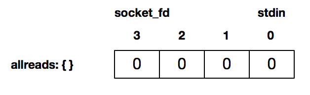
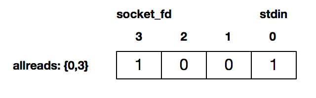
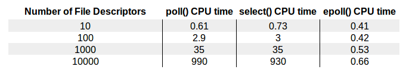

# 网络编程实战-性能篇

## I/O 多路复用：select

### 什么是 I/O 多路复用

可以把标准输入输出、套接字等都看做是 I/O 的一路，多路复用的意思就是在任何一路 I/O 有“事件”发生的情况下，通知应用程序去处理相应的 I/O 事件，这样我们的程序就变成了“多面手”，在同一时刻仿佛可以处理多个 I/O 事件。

使用 I/O 复用以后，如果标准输入有数据，立即从标准输入读入数据，通过套接字发送出去；如果套接字有数据可以读，立即可以读出数据。

其中，select 函数就是一种常见的 I/O 多路复用技术。使用 select 函数，通知内核挂起进程，当一个或多个 I/O 事件发生后，控制权返还给应用程序，由应用程序进行 I/O 事件的处理。

常见的 I/O 事件的类型：

* 标准输入文件描述符准备好可以读。
* 监听套接字准备好，新的连接已经建立成功。
* 已连接套接字准备好可以写。
* 如果一个 I/O 事件等待超过了 10 秒，发生了超时事件。

### select 函数的使用方法

select 函数的原型：

```c
int select(int maxfd, fd_set *readset, fd_set *writeset, fd_set *exceptset, const struct timeval *timeout);
```

* maxfd：表示的是待测试的描述符基数，它的值是待测试的最大描述符加 1
* readset：读描述符集合 、writeset：写描述符集合、exceptset：异常描述符集合，这三个描述符集合分别通知内核，在哪些描述符上检测数据可以读，可以写和有异常发生
* timeval：是一个结构体时间
* 返回值：若有就绪描述符则为其数目，若超时则为 0，若出错则为 -1

**理解 maxfd：**

比如现在的 select 待测试的描述符集合是 `{0,1,4}`，那么 maxfd 就是 5。

**理解 三个描述符集合：**

可以通过下面的宏设置这些描述符集合：

可以这样类比，用一个向量代表了一个描述符集合，其中，这个向量的每个元素都是二进制数中的 0 或者 1。其中 0 代表不需要处理，1 代表需要处理。

```c
a[maxfd-1], ..., a[1], a[0]

// 把这个向量的所有元素都设置成 0；
void FD_ZERO(fd_set *fdset);

// 把对应套接字 fd 的元素，a[fd]设置成 1；
void FD_SET(int fd, fd_set *fdset);

// 把对应套接字 fd 的元素，a[fd]设置成 0；
void FD_CLR(int fd, fd_set *fdset);

// 对这个向量进行检测，判断出对应套接字的元素 a[fd]是 0 还是 1；
int FD_ISSET(int fd, fd_set *fdset);
```

实际上，很多系统是用一个整型数组来表示一个描述字集合的，一个 32 位的整型数可以表示 32 个描述字。

**理解 timeval：**

```c
// 具体实现
struct timeval {
  long tv_sec; /* seconds */
  long tv_usec; /* microseconds */
};
```

不同的 timeval 会有不同的可能：

* 设置为 **NULL**，表示如果没有 I/O 事件发生，则 select 一直等待下去
* 设置为 **一个非零值**，表示等待固定的一段时间后从 select 阻塞调用中返回
* 设置为 **tv_sec 和 tv_usec 都等于 0**，表示根本不等待，检测完毕立即返回，这种情况使用得比较少。

**一个例子：**

```c

int main(int argc, char **argv) {
    if (argc != 2) {
        error(1, 0, "usage: select01 <IPaddress>");
    }
    int socket_fd = tcp_client(argv[1], SERV_PORT);

    char recv_line[MAXLINE], send_line[MAXLINE];
    int n;

    fd_set readmask;
    fd_set allreads;
    FD_ZERO(&allreads);     // 步骤1：初始化一个描述符集合，这个描述符读集合是空的
    // 步骤2：分别使用 FD_SET 将描述符 0，即标准输入，
    // 以及连接套接字描述符 3 设置为待检测
    FD_SET(0, &allreads);
    FD_SET(socket_fd, &allreads);

    // 循环测试
    for (;;) {
        // 每次测试完之后，重新设置待测试的描述符集合
        readmask = allreads;

        // 通过 select 来检测套接字描述字有数据可读，或者标准输入有数据可读
        int rc = select(socket_fd + 1, &readmask, NULL, NULL, NULL);

        if (rc <= 0) {
            error(1, errno, "select failed");
        }

        // 判断是套接字可读，使用 read 将套接字数据读出
        if (FD_ISSET(socket_fd, &readmask)) {
            // 将套接字数据读出
            n = read(socket_fd, recv_line, MAXLINE);
            if (n < 0) {
                error(1, errno, "read error");
            } else if (n == 0) {
                error(1, 0, "server terminated \n");
            }
            recv_line[n] = 0;
            fputs(recv_line, stdout);
            fputs("\n", stdout);
        }

        // 判断是标准输入可读，读入后发送给对端
        if (FD_ISSET(STDIN_FILENO, &readmask)) {
            // 读入数据
            if (fgets(send_line, MAXLINE, stdin) != NULL) {
                int i = strlen(send_line);
                if (send_line[i - 1] == '\n') {
                    send_line[i - 1] = 0;
                }

                printf("now sending %s\n", send_line);
                // 发送给对端
                sszie_t rt = write(socket_fd, send_line, strlen(send_line));
                if (rt < 0) {
                    error(1, errno, "write failed ");
                }
                printf("send bytes: %zu \n", rt);
            }
        }
    }

}
```

**步骤1**，描述符集合情况：

* 0 代表 描述符读集合
* 1 代表 描述符写集合
* 2 代表 描述符异常集合
* 3 代表 描述符套接字集合



**步骤2**，描述符集合情况：



### 套接字描述符就绪条件

select 测试返回，某个套接字准备好**可读**，表示什么样的事件发生呢？

* 情况1：套接字接收缓冲区有数据可以读，如果我们使用 read 函数去执行读操作，肯定不会被阻塞，而是会直接读到这部分数据。
* 情况2：对方发送了 FIN，使用 read 函数执行读操作，不会被阻塞，直接返回 0。
* 情况3：针对一个监听套接字而言的，有已经完成的连接建立，此时使用 accept 函数去执行不会阻塞，直接返回已经完成的连接。
* 情况4：套接字有错误待处理，使用 read 函数去执行读操作，不阻塞，且返回 -1。

总结就是**内核通知我们套接字有数据可以读了，使用 read 函数不会阻塞。**

select 测试返回，某个套接字准备好**可写**，表示什么样的事件发生呢？

* 情况1：套接字发送缓冲区足够大（实际上，只要有一个字节可以被写入，就是状态可写的），如果我们使用套接字进行 write 操作，将不会被阻塞，直接返回。
* 情况2：连接的写半边已经关闭，如果继续进行写操作将会产生 SIGPIPE 信号。
* 情况3：套接字上有错误待处理，使用 write 函数去执行写操作，不阻塞，且返回 -1。

总结就是**内核通知我们套接字可以往里写了，使用 write 函数就不会阻塞。**

**总结：**

### 思考

**问题1：**

select 可以对诸如 UNIX 管道（pipe）这样的描述字进行检测吗？如果可以，检测的就绪条件是什么呢？

**解答：**

管道也是文件，所以可以进行检测。往管道输入数据和输出数据对应可读可写的就绪条件。

**问题2：**

根据前面的知识，一个描述符集合哪些描述符被设置为 1，需要进行检测是完全可以知道的，select 函数里一定需要传入描述字基数这个值吗？这样设计的目的是什么？

**解答：**

可以把 fd_set 理解成数组，如果不传入描述字基数，无法得知 fd_set 的具体大小，就无法进行遍历操作。

**问题3：**

我们知道 select 函数的原型如下，为什么 maxfd 有 1024 的限制呢？

```c
int select(int maxfd, fd_set *readset, fd_set *writeset, fd_set *exceptset, const struct timeval *timeout);
```

**解答：**

因为 fd_set 是固定大小的缓冲区。fd 值为负或等于或大于 FD_SETSIZE 执行 FD_CLR（）或 FD_SET（）会导致不确定的行为。 而且，POSIX 要求 fd 是有效的文件描述符。其中，在进行位图运算的时候会受到 FD_SETSIZE 的影响。

```c
// sys/select.h头文件有如下定义：

#define FD_SETSIZE __FD_SETSIZE

// typesizes.h头文件有如下定义：
#define __FD_SETSIZE 1024
```

## I/O 多路复用：poll

select 方法是多个 UNIX 平台支持的非常常见的 I/O 多路复用技术，它通过**描述符集合**来表示检测的 I/O 对象，通过三个不同的描述符集合来描述 I/O 事件 ：可读、可写和异常。但是 select 有一个**缺点**，那就是所支持的文件描述符的个数是有限的，在 Linux 系统中，select 的默认最大值为 1024。

poll 可以突破文件描述符个数限制，并且它和内核交互的数据结构也有所变化。

### poll 函数的使用方法

poll 函数的原型：

```c
int poll(struct pollfd *fds, unsigned long nfds, int timeout);
```

* fds：是一个结构体，具体为：

    ```c
    struct pollfd {
        int fd; // 描述符
        short events;   // 描述符上待检测的事件类型
        short revents;  // 事件返回值
    };

    ```

    events 可以表示多个不同的事件，具体的实现可以通过使用二进制掩码位操作来完成，例如，POLLIN 和 POLLOUT 可以表示读和写事件。

    ```c
    // 可读事件，是系统内核通知应用程序有数据可以读，通过 read 函数执行操作不会被阻塞。
    #define POLLIN     0x0001    /* any readable data available */
    #define POLLPRI    0x0002    /* OOB/Urgent readable data */
    #define POLLRDNORM 0x0040    /* non-OOB/URG data available */
    #define POLLRDBAND 0x0080    /* OOB/Urgent readable data */

    // 可写事件，是系统内核通知套接字缓冲区已准备好，通过 write 函数执行写操作不会被阻塞。

    #define POLLOUT    0x0004    /* file descriptor is writeable */
    #define POLLWRNORM POLLOUT   /* no write type differentiation */
    #define POLLWRBAND 0x0100    /* OOB/Urgent data can be written */

    // 错误事件，它没有办法通过 poll 向系统内核递交检测请求，只能通过“returned events”来加以检测
    #define POLLERR    0x0008    /* 一些错误发送 */
    #define POLLHUP    0x0010    /* 描述符挂起*/
    #define POLLNVAL   0x0020    /* 请求的事件无效*/
    ```

    和 select 非常不同的地方在于，poll **每次检测之后的结果不会修改原来的传入值**，而是将结果保留在 revents 字段中，这样就不需要每次检测完都得重置待检测的描述字和感兴趣的事件。

* nfds：描述的是数组 fds 的大小，简单说，就是向 poll 申请的事件检测的个数
* timeout：描述了 poll 的行为，如果是一个 <0 的数，表示在有事件发生之前永远等待；如果是 0，表示不阻塞进程，立即返回；如果是一个 >0 的数，表示 poll 调用方等待指定的毫秒数后返回
* 返回值：若有就绪描述符则为其数目，若超时则为 0，若出错则为 -1

poll 函数有一点非常好，如果我们不想对某个 pollfd 结构进行事件检测，可以把它对应的 pollfd 结构的 fd 成员设置成一个负值。这样，poll 函数将忽略这样的 events 事件，检测完成以后，所对应的“returned events”的成员值也将设置为 0。

在 select 里面，文件描述符的个数已经随着 fd_set 的实现而固定，没有办法对此进行配置；而在 poll 函数里，可以控制 pollfd 结构的大小，这意味着可以突破原来select 最大描述符的限制，在这种情况下，应用程序调用者需要分配 pollfd 数组并通知 poll 函数该数组的大小。

### 基于 poll 的服务器程序

这个程序可以同时处理多个客户端连接，并且一旦有客户端数据接收后，同步地回显回去。这已经是一个颇具高并发处理的服务器原型了，再加上的非阻塞 I/O 和多线程等技术，基本上就是可使用的准生产级别了。

```c

#define INIT_SIZE 128

int main(int argc, char **argv) {
    int listen_fd, connected_fd;
    int ready_number;
    ssize_t n;
    char buf[MAXLINE];
    struct sockaddr_in client_addr;

    // 创建一个监听套接字，并绑定在本地的地址和端口上
    listen_fd = tcp_server_listen(SERV_PORT);

    //初始化pollfd数组，这个数组的第一个元素是listen_fd，其余的用来记录将要连接的connect_fd
    struct pollfd event_set[INIT_SIZE];
    event_set[0].fd = listen_fd;
    event_set[0].events = POLLRDNORM;

    // 用-1表示这个数组位置还没有被占用
    int i;
    for (i = 1; i < INIT_SIZE; i++) {
        event_set[i].fd = -1;
    }

    for (;;) {
        if ((ready_number = poll(event_set, INIT_SIZE, -1)) < 0) {
            error(1, errno, "poll failed ");
        }

        if (event_set[0].revents & POLLRDNORM) {
            socklen_t client_len = sizeof(client_addr);
            connected_fd = accept(listen_fd, (struct sockaddr *) &client_addr, &client_len);

            //找到一个可以记录该连接套接字的位置
            for (i = 1; i < INIT_SIZE; i++) {
                if (event_set[i].fd < 0) {
                    event_set[i].fd = connected_fd;
                    event_set[i].events = POLLRDNORM;
                    break;
                }
            }

            if (i == INIT_SIZE) {
                error(1, errno, "can not hold so many clients");
            }

            if (--ready_number <= 0)
                continue;
        }

        for (i = 1; i < INIT_SIZE; i++) {
            int socket_fd;
            if ((socket_fd = event_set[i].fd) < 0)
                continue;
            if (event_set[i].revents & (POLLRDNORM | POLLERR)) {
                if ((n = read(socket_fd, buf, MAXLINE)) > 0) {
                    if (write(socket_fd, buf, n) < 0) {
                        error(1, errno, "write error");
                    }
                } else if (n == 0 || errno == ECONNRESET) {
                    close(socket_fd);
                    event_set[i].fd = -1;
                } else {
                    error(1, errno, "read error");
                }

                if (--ready_number <= 0)
                    break;
            }
        }
    }
}
```

### 总结

poll 是另一种在各种 UNIX 系统上被广泛支持的 I/O 多路复用技术，虽然名声没有 select 那么响，能力一点不比 select 差，而且因为可以突破 select 文件描述符的个数限制，在高并发的场景下尤其占优势。

### 思考

**问题1：**

在上面的程序里 event_set 数组的大小固定为 INIT_SIZE，这在实际的生产环境肯定是需要改进的。如何改进呢？

**解答：**

采用动态内存分配的方式，如果内存不够，进行 realloc 或者申请一块更大的内存，然后把源数组拷贝过来。

## 非阻塞 I/O

### 一个通俗说法

当应用程序调用阻塞 I/O 完成某个操作时，应用程序会被挂起，等待内核完成操作，感觉上应用程序像是被“阻塞”了一样。实际上，内核所做的事情就是将 CPU 时间片给其他有需要的进程，网络应用程序在这种情况下就会得不到 CPU 时间片，从而不能做该做的事情。

对于非阻塞 I/O，当应用程序调用非阻塞 I/O 完成某个操作时，内核立即返回，不会把 CPU 时间切换给其他进程，应用程序在返回后，可以得到足够的 CPU 时间片继续完成其他的事情。

**一个书店买书的例子。**

**阻塞 I/O** 对应的场景：你去了书店，告诉老板（可以当作内核）你想要某本书，然后你就一直在哪里等着，老板一直翻箱倒柜或者联系其他书店帮你找书，这个过程中你一直滞留在书店等待老板的回复，好像在老板这里“阻塞”住了。

**非阻塞 I/O** 对应的场景：你去了书店，告诉老板（可以当作内核）你想要某本书，老板直接查了查电脑，告诉你没有，你就直接离开了。之后，你又来书店问老板，老板一查，告诉你有，于是你买到了书。**值得注意的是**，这个过程中你没有被阻塞，但是在不断轮询。

**I/O 多路复用**对应的场景：因为不断轮询的效率太低，于是你跟老板说：老板，到货给我打电话吧，我再来付钱取书。这就是前面的 select、poll 的 I/O 多路复用。

**异步 I/O** 对应的场景：你连去书店取书也想省了，直接让老板代劳，你留下地址，付了书费，让老板到货时寄给你，你直接在家里拿到就可以看了。

### 非阻塞 I/O

#### read 操作

如果套接字对应的接收缓冲区没有数据可读，在非阻塞情况下 read 调用会立即返回，一般返回 EWOULDBLOCK 或 EAGAIN 出错信息。在这种情况下，出错信息是需要小心处理，比如后面再次调用 read 操作，而不是直接作为错误直接返回。这就好像去书店买书没买到离开一样，需要不断进行又一次轮询处理。

#### write 操作

在阻塞 I/O 情况下，write 函数返回的字节数，和输入的参数总是一样的。如果返回值总是和输入的数据大小一样，write 等写入函数还需要定义返回值吗？

在非阻塞 I/O 情况下，如果套接字的发送缓冲区已经达到了极限，不能容纳更多的字节，那么操作系统内核会尽最大可能从应用程序拷贝数据到发送缓冲区中，并立即从 write 等函数调用中返回。

所以，在拷贝动作发生的瞬间，有可能一个字符也没拷贝，有可能所有请求字符都被拷贝完成，那么这个时候就需要返回一个数值，告诉应用程序到底有多少数据被成功拷贝到了发送缓冲区中，应用程序需要再次调用 write 函数，以输出未完成拷贝的字节。

可以看到，非阻塞 I/O 处理的方式是：拷贝 -> 返回 -> 再拷贝 -> 再返回

而阻塞 I/O 处理的方式是：拷贝 -> 知道所有数据拷贝至发送缓冲区完成 -> 返回

**read 和 write 在阻塞模式和非阻塞模式下的不同行为特性**：

| 操作 | 系统内核缓冲区状态 | 阻塞模式 | 非阻塞模式 |
| :--- | :--- | :--- | :--- |
| read() | 接收缓冲区有数据 | 立即返回 | 立即返回 |
| read() | 接收缓冲区没有数据 | 一直等待数据到来 | 立即返回 -1，带有 EWOULDBLOCK 或 EAGAIN 错误 |
| write() | 发送缓冲区空闲 | 全部数据都写入发送缓冲区才返回 | 能写入多少就写入多少，立即返回实际写入的字节数 |
| write() | 发送缓冲区不空闲 | 等待发送缓冲区空闲 | 立即返回 -1，带有 EWOULDBLOCK 或 EAGAIN 错误 |

#### accept 操作

将监听套接字设为非阻塞，某些极端情况不会发生。只不过对于 accept 的返回值，需要正确地处理各种看似异常的错误，例如忽略 EWOULDBLOCK、EAGAIN 等。

#### connect 操作

在非阻塞 TCP 套接字撒谎那个调用 connnect 函数，会立即返回一个 EINPROGRESS 错误。TCP 三次握手会正常进行，应用程序可以继续做其他初始化的事情。当该连接建立成功或者失败时，通过 I/O 多路复用 select、poll 等可以进行连接的状态检测。

### 非阻塞 I/O + select 多路复用

一个非阻塞 I/O 搭配 select 多路复用的例子。

服务器端：

```c
#include "common.h"

#define MAX_LINE 1024
#define FD_INIT_SIZE 128

char rot13_char(char c) {
    if ((c >= 'a' && c <= 'm') || (c >= 'A' && c <= 'M'))
        return c + 13;
    else if ((c >= 'n' && c <= 'z') || (c >= 'N' && c <= 'Z'))
        return c - 13;
    else
        return c;
}

//数据缓冲区
struct Buffer {
    int connect_fd;  //连接字
    char buffer[MAX_LINE];  //实际缓冲
    size_t writeIndex;      //缓冲写入位置
    size_t readIndex;       //缓冲读取位置
    int readable;           //是否可以读
};


//分配一个Buffer对象，初始化writeIdnex和readIndex等
struct Buffer *alloc_Buffer() {
    struct Buffer *buffer = malloc(sizeof(struct Buffer));
    if (!buffer)
        return NULL;
    buffer->connect_fd = 0;
    buffer->writeIndex = buffer->readIndex = buffer->readable = 0;
    return buffer;
}

//释放Buffer对象
void free_Buffer(struct Buffer *buffer) {
    free(buffer);
}

//这里从fd套接字读取数据，数据先读取到本地buf数组中，再逐个拷贝到buffer对象缓冲中
int onSocketRead(int fd, struct Buffer *buffer) {
    char buf[1024];
    int i;
    ssize_t result;
    while (1) {
        result = recv(fd, buf, sizeof(buf), 0);
        if (result <= 0)
            break;

        //按char对每个字节进行拷贝，每个字节都会先调用rot13_char来完成编码，之后拷贝到buffer对象的缓冲中，
        //其中writeIndex标志了缓冲中写的位置
        for (i = 0; i < result; ++i) {
            if (buffer->writeIndex < sizeof(buffer->buffer))
                buffer->buffer[buffer->writeIndex++] = rot13_char(buf[i]);
            //如果读取了回车符，则认为client端发送结束，此时可以把编码后的数据回送给客户端
            if (buf[i] == '\n') {
                buffer->readable = 1;  //缓冲区可以读
            }
        }
    }

    if (result == 0) {
        return 1;
    } else if (result < 0) {
        if (errno == EAGAIN)
            return 0;
        return -1;
    }

    return 0;
}

//从buffer对象的readIndex开始读，一直读到writeIndex的位置，这段区间是有效数据
int onSocketWrite(int fd, struct Buffer *buffer) {
    while (buffer->readIndex < buffer->writeIndex) {
        ssize_t result = send(fd, buffer->buffer + buffer->readIndex, buffer->writeIndex - buffer->readIndex, 0);
        if (result < 0) {
            if (errno == EAGAIN)
                return 0;
            return -1;
        }

        buffer->readIndex += result;
    }

    //readindex已经追上writeIndex，说明有效发送区间已经全部读完，将readIndex和writeIndex设置为0，复用这段缓冲
    if (buffer->readIndex == buffer->writeIndex)
        buffer->readIndex = buffer->writeIndex = 0;

    //缓冲数据已经全部读完，不需要再读
    buffer->readable = 0;

    return 0;
}


int main(int argc, char **argv) {
    int listen_fd;
    int i, maxfd;

    struct Buffer *buffer[FD_INIT_SIZE];
    for (i = 0; i < FD_INIT_SIZE; ++i) {
        buffer[i] = alloc_Buffer();
    }

    listen_fd = tcp_nonblocking_server_listen(SERV_PORT);

    fd_set readset, writeset, exset;
    FD_ZERO(&readset);
    FD_ZERO(&writeset);
    FD_ZERO(&exset);

    while (1) {
        maxfd = listen_fd;

        FD_ZERO(&readset);
        FD_ZERO(&writeset);
        FD_ZERO(&exset);

        // listener加入readset
        FD_SET(listen_fd, &readset);

        for (i = 0; i < FD_INIT_SIZE; ++i) {
            if (buffer[i]->connect_fd > 0) {
                if (buffer[i]->connect_fd > maxfd)
                    maxfd = buffer[i]->connect_fd;
                FD_SET(buffer[i]->connect_fd, &readset);
                if (buffer[i]->readable) {
                    FD_SET(buffer[i]->connect_fd, &writeset);
                }
            }
        }

        if (select(maxfd + 1, &readset, &writeset, &exset, NULL) < 0) {
            error(1, errno, "select error");
        }

        if (FD_ISSET(listen_fd, &readset)) {
            printf("listening socket readable\n");
            sleep(5);
            struct sockaddr_storage ss;
            socklen_t slen = sizeof(ss);
            int fd = accept(listen_fd, (struct sockaddr *) &ss, &slen);
            if (fd < 0) {
                error(1, errno, "accept failed");
            } else if (fd > FD_INIT_SIZE) {
                error(1, 0, "too many connections");
                close(fd);
            } else {
                make_nonblocking(fd);
                if (buffer[fd]->connect_fd == 0) {
                    buffer[fd]->connect_fd = fd;
                } else {
                    error(1, 0, "too many connections");
                }
            }
        }

        for (i = 0; i < maxfd + 1; ++i) {
            int r = 0;
            if (i == listen_fd)
                continue;

            if (FD_ISSET(i, &readset)) {
                r = onSocketRead(i, buffer[i]);
            }
            if (r == 0 && FD_ISSET(i, &writeset)) {
                r = onSocketWrite(i, buffer[i]);
            }
            if (r) {
                buffer[i]->connect_fd = 0;
                close(i);
            }
        }
    }
}
```

客户端：

```c
#include "common.h"

#define    MAXLINE     4096
#define    KEEP_ALIVE_TIME  10
#define    KEEP_ALIVE_INTERVAL  3
#define    KEEP_ALIVE_PROBETIMES  3


int main(int argc, char **argv) {
    if (argc != 2) {
        error(1, 0, "usage: nonblockingclient <IPaddress>");
    }

    int socket_fd;
    socket_fd = socket(AF_INET, SOCK_STREAM, 0);

    struct sockaddr_in server_addr;
    bzero(&server_addr, sizeof(server_addr));
    server_addr.sin_family = AF_INET;
    server_addr.sin_port = htons(SERV_PORT);
    inet_pton(AF_INET, argv[1], &server_addr.sin_addr);

    socklen_t server_len = sizeof(server_addr);
    int connect_rt = connect(socket_fd, (struct sockaddr *) &server_addr, server_len);
    if (connect_rt < 0) {
        error(1, errno, "connect failed ");
    }

    struct linger ling;
    ling.l_onoff = 1;
    ling.l_linger = 0;
    setsockopt(socket_fd, SOL_SOCKET, SO_LINGER, &ling, sizeof(ling));
    close(socket_fd);

    exit(0);
}
```

### 总结

非阻塞 I/O 可以使用在 read、write、accept、connect 等多种不同的场景，在非阻塞 I/O 下，使用轮询的方式引起 CPU 占用率过高，所以一般将非阻塞 I/O 和 I/O 多路服用技术 select、poll 等搭配使用，在非阻塞 I/O 事件发生时，再调用对应事件的处理函数。

## I/O 多路复用：epoll

下面这张图直观地为我们展示了 select、poll、epoll 几种不同的 I/O 复用技术在面对不同文件描述符大小时的表现差异：



可以看到，epoll 的性能是最好的，即使在多达 10000 个文件描述的情况下，其性能的下降和有 10 个文件描述符的情况相比的差别也不是很大。而随着文件描述符的增大，常规的 select 和 poll 方法性能逐渐变得很差。

### epoll 的用法

epoll 可以说是和 poll 非常相似的一种 I/O 多路复用技术。epoll 通过监控注册多个描述字，来进行 I/O 事件的分发处理。不同于 poll 的是，epoll 不仅提供了默认的 level-triggered（**条件触发**）机制，还提供了性能更加强劲的 edge-triggered（**边缘触发**）机制。

使用 epoll 进行网络程序的编写，需要三个步骤：epoll_create、epoll_ctl、epoll_wait。

**epoll_create：**

函数原型为：

```c
// 若成功则返回一个大于 0 的值，表示 epoll 实例；若出错则返回 -1
int epoll_create(int size);
int epoll_create1(int flags);
```

epoll_create() 方法创建了一个 epoll 实例，从 Linux 2.6.8 开始，参数 size 被自动忽略，但是该值仍然需要一个大于 0 的整数。这个 epoll 实例被用来调用 epoll_ctl 和 epoll_wait，如果这个 epoll 实例不再需要，比如服务器正常关机，需要调用 close() 方法释放 epoll 实例，这样系统内核可以回收 epoll 实例所分配使用的内核资源。

关于参数 size，在一个开始的 epoll_create 实现中，是用来告诉内核期望监控的文件描述符大小，然后内核使用这部分的信息来初始化内核数据结构，在新的实现中，这个参数不再被需要，因为内核可以动态分配需要的内核数据类型。

epoll_create1() 用法和 epoll_create() 基本一致，如果 epoll_create1() 的输入 flags 为 0，则和 epoll_create() 一样，内核自动忽略。

**epoll_ctl：**

函数原型为：

```c
// 若成功则返回 0；若出错则返回 -1
int epoll_ctl(int epfd, int op, int fd, struct epoll_event *event);
```

在创建完 epoll 实例之后，可以通过调用 epoll_ctl 往这个 epoll 实例增加或删除监控的事件。

* 参数 epfd：表示调用epoll_create 创建的 epoll 实例描述字，可以简单理解成是 epoll 句柄。
* 参数 op：表示增加一个还是删除一个监控事件，有三个选项：
  * EPOLL_CTL_ADD：向 epoll 实例注册文件描述符对应的事件；
  * EPOLL_CTL_DEL：向 epoll 实例删除文件描述符对应的事件；
  * EPOLL_CTL_MOD：修改文件描述符对应的事件。
* 参数 fd：表示注册的事件的文件描述符，比如一个监听套接字。
* 参数 event：表示注册的事件类型，并且可以在这个结构体里设置用户需要的数据，其中最为常见的是使用联合结构的 fd 字段，表示事件所对应的文件描述符。

    ```c
    typedef union epoll_data {
        void *ptr;
        int fd;
        uint32_t u32;
        uint64_t u64;
    } epoll_data_t;

    struct epoll_event {
        uint32_t events;    /* Epoll events */
        epoll_data_t data;  /* User data variable */
    }
    ```

    epoll 使用了跟 poll 相同的基于 mask 的事件类型：

    * EPOLLIN：表示对应的文件描述符可以读；
    * EPOLLOUT：表示对应的文件描述符可以写；
    * EPOLLRDHUP：表示套接字的一端已经关闭，或者半关闭；
    * EPOLLLHUP：表示对应的文件描述符被挂起；
    * EPOLLET：设置为 edge-triggered，默认为 level-triggered。

**epoll_wait：**

函数原型为：

```c
// 若成功则返回一个大于 0 的数，表示事件的个数；返回 0 表示超时时间到；若出错则返回 -1
int epoll_wait(int epfd, struct epoll_event *events, int maxevents, int timeout);
```

epoll_wait() 函数类似之前的 poll 和 select 函数，调用者进程被挂起，在等待内核 I/O 事件的分发。

* 参数 epfd：表示调用epoll_create 创建的 epoll 实例描述字，可以简单理解成是 epoll 句柄。
* 参数 events：返回给用户空间需要处理的 I/O 事件，这是一个数组，数组的大小由 epoll_wait 的返回值决定，这个数组的每个元素都是一个需要待处理的 I/O 事件，其中 events 表示具体的事件类型，事件类型取值和 epoll_ctl 可设置的值一样，这个 epoll_event 结构体里的 data 值就是在 epoll_ctl 那里设置的 data，也就是用户空间和内核空间调用时需要的数据。
* 参数 maxevents：是一个大于 0 的整数，表示 epoll_wait 可以返回的最大事件值。
* 参数 timeout：是 epoll_wait 阻塞调用的超时值，如果这个值设置为 -1，表示不超时；如果设置为 0 则立即返回，即使没有任何 I/O 事件发生。

### epoll 例子

```c
#include  <sys/epoll.h>
#include "common.h"

#define MAXEVENTS 128

char rot13_char(char c) {
    if ((c >= 'a' && c <= 'm') || (c >= 'A' && c <= 'M'))
        return c + 13;
    else if ((c >= 'n' && c <= 'z') || (c >= 'N' && c <= 'Z'))
        return c - 13;
    else
        return c;
}

int main(int argc, char **argv) {
    int listen_fd, socket_fd;
    int n, i;
    int efd;
    struct epoll_event event;
    struct epoll_event *events;

    listen_fd = tcp_nonblocking_server_listen(SERV_PORT);

    efd = epoll_create1(0);
    if (efd == -1) {
        error(1, errno, "epoll create failed");
    }

    event.data.fd = listen_fd;
    event.events = EPOLLIN | EPOLLET;
    if (epoll_ctl(efd, EPOLL_CTL_ADD, listen_fd, &event) == -1) {
        error(1, errno, "epoll_ctl add listen fd failed");
    }

    /* Buffer where events are returned */
    events = calloc(MAXEVENTS, sizeof(event));

    while (1) {
        n = epoll_wait(efd, events, MAXEVENTS, -1);
        printf("epoll_wait wakeup\n");
        for (i = 0; i < n; i++) {
            if ((events[i].events & EPOLLERR) ||
                (events[i].events & EPOLLHUP) ||
                (!(events[i].events & EPOLLIN))) {
                fprintf(stderr, "epoll error\n");
                close(events[i].data.fd);
                continue;
            } else if (listen_fd == events[i].data.fd) {
                struct sockaddr_storage ss;
                socklen_t slen = sizeof(ss);
                int fd = accept(listen_fd, (struct sockaddr *) &ss, &slen);
                if (fd < 0) {
                    error(1, errno, "accept failed");
                } else {
                    make_nonblocking(fd);
                    event.data.fd = fd;
                    event.events = EPOLLIN | EPOLLET; //edge-triggered
                    if (epoll_ctl(efd, EPOLL_CTL_ADD, fd, &event) == -1) {
                        error(1, errno, "epoll_ctl add connection fd failed");
                    }
                }
                continue;
            } else {
                socket_fd = events[i].data.fd;
                printf("get event on socket fd == %d \n", socket_fd);
                while (1) {
                    char buf[512];
                    if ((n = read(socket_fd, buf, sizeof(buf))) < 0) {
                        if (errno != EAGAIN) {
                            error(1, errno, "read error");
                            close(socket_fd);
                        }
                        break;
                    } else if (n == 0) {
                        close(socket_fd);
                        break;
                    } else {
                        for (i = 0; i < n; ++i) {
                            buf[i] = rot13_char(buf[i]);
                        }
                        if (write(socket_fd, buf, n) < 0) {
                            error(1, errno, "write error");
                        }
                    }
                }
            }
        }
    }

    free(events);
    close(listen_fd);
}

```

### 条件触发和边界触发

```c
// 边缘触发
// 开启这个服务器程序，用 telnet 连接上，输入一些字符，服务器端只从 epoll_wait 中苏醒过一次，就是第一次有数据可读的时候。

#include  <sys/epoll.h>
#include "common.h"

#define MAXEVENTS 128

int main(int argc, char **argv) {
    int listen_fd, socket_fd;
    int n, i;
    int efd;
    struct epoll_event event;
    struct epoll_event *events;

    listen_fd = tcp_nonblocking_server_listen(SERV_PORT);

    efd = epoll_create1(0);
    if (efd == -1) {
        error(1, errno, "epoll create failed");
    }

    event.data.fd = listen_fd;
    event.events = EPOLLIN | EPOLLET;
    if (epoll_ctl(efd, EPOLL_CTL_ADD, listen_fd, &event) == -1) {
        error(1, errno, "epoll_ctl add listen fd failed");
    }

    /* Buffer where events are returned */
    events = calloc(MAXEVENTS, sizeof(event));

    while (1) {
        n = epoll_wait(efd, events, MAXEVENTS, -1);
        printf("epoll_wait wakeup\n");
        for (i = 0; i < n; i++) {
            if ((events[i].events & EPOLLERR) ||
                (events[i].events & EPOLLHUP) ||
                (!(events[i].events & EPOLLIN))) {
                fprintf(stderr, "epoll error\n");
                close(events[i].data.fd);
                continue;
            } else if (listen_fd == events[i].data.fd) {
                struct sockaddr_storage ss;
                socklen_t slen = sizeof(ss);
                int fd = accept(listen_fd, (struct sockaddr *) &ss, &slen);
                if (fd < 0) {
                    error(1, errno, "accept failed");
                } else {
                    make_nonblocking(fd);
                    event.data.fd = fd;
                    event.events = EPOLLIN | EPOLLET; //edge-triggered
                    if (epoll_ctl(efd, EPOLL_CTL_ADD, fd, &event) == -1) {
                        error(1, errno, "epoll_ctl add connection fd failed");
                    }
                }
                continue;
            } else {
                socket_fd = events[i].data.fd;
                printf("get event on socket fd == %d \n", socket_fd);
            }
        }
    }

    free(events);
    close(listen_fd);

}

```

```c
// 条件触发
// 开启这个服务器程序，用 telnet 连接上，输入一些字符，服服务器端不断地从 epoll_wait 中苏醒，告诉我们有数据需要读取。

#include  <sys/epoll.h>
#include "common.h"

#define MAXEVENTS 128


int main(int argc, char **argv) {
    int listen_fd, socket_fd;
    int n, i;
    int efd;
    struct epoll_event event;
    struct epoll_event *events;

    listen_fd = tcp_nonblocking_server_listen(SERV_PORT);

    efd = epoll_create1(0);
    if (efd == -1) {
        error(1, errno, "epoll create failed");
    }

    event.data.fd = listen_fd;
    event.events = EPOLLIN | EPOLLET;
    if (epoll_ctl(efd, EPOLL_CTL_ADD, listen_fd, &event) == -1) {
        error(1, errno, "epoll_ctl add listen fd failed");
    }

    /* Buffer where events are returned */
    events = calloc(MAXEVENTS, sizeof(event));

    while (1) {
        n = epoll_wait(efd, events, MAXEVENTS, -1);
        printf("epoll_wait wakeup\n");
        for (i = 0; i < n; i++) {
            if ((events[i].events & EPOLLERR) ||
                (events[i].events & EPOLLHUP) ||
                (!(events[i].events & EPOLLIN))) {
                fprintf(stderr, "epoll error\n");
                close(events[i].data.fd);
                continue;
            } else if (listen_fd == events[i].data.fd) {
                struct sockaddr_storage ss;
                socklen_t slen = sizeof(ss);
                int fd = accept(listen_fd, (struct sockaddr *) &ss, &slen);
                if (fd < 0) {
                    error(1, errno, "accept failed");
                } else {
                    make_nonblocking(fd);
                    event.data.fd = fd;
                    event.events = EPOLLIN;  //level-triggered
                    if (epoll_ctl(efd, EPOLL_CTL_ADD, fd, &event) == -1) {
                        error(1, errno, "epoll_ctl add connection fd failed");
                    }
                }
                continue;
            } else {
                socket_fd = events[i].data.fd;
                printf("get event on socket fd == %d \n", socket_fd);
            }
        }
    }

    free(events);
    close(listen_fd);

}
```

条件触发的意思是只要满足事件的条件，比如有数据需要读，就一直不断得把这个事件传递给用户；而边缘触发的意思是只有第一次满足条件的时候才触发，之后就不会再传递同样的事件了。

一般认为，边缘触发的效率比条件触发的效率要高，这也是 epoll 的杀手锏之一。

### epoll 历史

在最初的设计里，Linus 等于把 keque 里面的 kevent 函数拆分了两个部分，一部分负责事件绑定，通过 bind_event 函数来实现；另一部分负责事件等待，通过 get_events 来实现。

```c
struct event {
     unsigned long id; /* file descriptor ID the event is on */
     unsigned long event; /* bitmask of active events */
};

int bind_event(int fd, struct event *event);
int get_events(struct event * event_array, int maxnr, struct timeval *tmout);
```

和最终的 epoll 实现相比，前者类似 epoll_ctl，后者类似 epoll_wait，不过原始的设计里没有考虑到创建 epoll 句柄，在最终的实现里增加了 epoll_create，支持了 epoll 句柄的创建。

2002 年，epoll 最终在 Linux 2.5.44 中首次出现，在 2.6 中趋于稳定，为 Linux 的高性能网络 I/O 画上了一段句号。

### 总结

epoll 通过改进的接口设计，**避免了用户态-核心态频繁的数据拷贝，大大提高了系统性能。**

在使用 epoll 的时候，有条件触发和边缘触发两种模式。条件触发的意思是只要满足事件的条件，比如有数据可以读，就一直不断地把这个事件传递给用户；而边缘触发的意思是只有第一次满足条件的时候才触发，之后就不会再传递相同的事件了。

### 思考

**问题1：**

select 是边缘触发的，还是条件触发的呢？

**解答：**

select 是条件触发。

**问题2：**

poll 是边缘触发的，还是条件触发的呢？

**解答：**

poll 是条件触发。

**问题3：**

为什么说 epoll 的性能比 select 和 poll 好呢？

**解答：**

1. epoll 避免了用户态-核心态频繁的数据拷贝；
2. 边缘触发比条件触发的性能更好，而 select 和 poll 都是条件触发；
3. epoll 返回的是有事件发生的数组，而 select 和 poll 返回的是事件就绪的个数，每次返回都需要遍历注册的文件描述符的结果数组，尤其数据量越大遍历次数就越多。

## C10K 问题

借助 C10K 问题能系统地梳理一下高性能网络编程的方法论。

问题描述：C 表示并发（Concurrty），10K 等于 10000。如今，可以使用 Java Netty、Libevent 等框架或库就可以轻轻松松写出并发超过 10000 的服务器端程序，甚至于经过优化之后可以达到十万，乃至百万的并发。

### 操作系统层面

C10K 问题本质是一个操作系统问题，要在一台主机上同时支持 1 万个连接，意味这什么呢？需要考虑那些方向？

**文件句柄：**

因为每个客户连接都代表一个文件描述符，一旦文件描述符不够用了，新的连接就会被放弃，产生下面的错误：

```c
Socket/File:Can't open so many files
```

在 Linux 下，单个进程打开的文件句柄是有限制的，没有经过修改的值一般都是 1024。

```c
$ ulimit -n
1024
```

我们知道 select 函数的原型如下，为什么 maxfd 有 1024 的限制呢？

```c
int select(int maxfd, fd_set *readset, fd_set *writeset, fd_set *exceptset, const struct timeval *timeout);
```

因为 fd_set 是固定大小的缓冲区。fd 值为负或等于或大于 FD_SETSIZE 执行 FD_CLR（）或 FD_SET（）会导致不确定的行为。 而且，POSIX 要求 fd 是有效的文件描述符。其中，在进行位图运算的时候会受到 FD_SETSIZE 的影响。

```c
// sys/select.h头文件有如下定义：

#define FD_SETSIZE __FD_SETSIZE

// typesizes.h头文件有如下定义：
#define __FD_SETSIZE 1024
```

这意味着最多可以服务的连接数上限只能是 1024 。不过，**可以对这个值进行修改**，比如用 root 权限修改 /etc/sysctl.conf 文件，使得系统可以支持 10000 个描述符上限。

```c
fs.file-max = 10000
net.ipv4.ip_conntrack_max = 10000
net.ipv4.netfilter.ip_conntrack_max = 10000
```

**系统内存：**

每个 TCP 连接占用的资源可不止一个连接套接字这么简单，每个 TCP 连接都需要占用一定的发送缓冲区和接收缓冲区。

```shell
// 发送缓冲区
$ cat /proc/sys/net/ipv4/tcp_wmem
4096	16384	4194304

// 接收缓冲区
$ cat /proc/sys/net/ipv4/tcp_rmem
4096	131072	6291456
```

这三个值分别表示了最小分配值、默认分配值和最大分配值。按照默认分配值计算，一万个连接需要的内存消耗为：

发送缓冲区： `16384*10000 = 160M bytes`

接收缓冲区： `87380*10000 = 880M bytes`

显然，应用程序本身也需要一定的缓冲区来进行数据的收发，为了方便，假设每个连接需要 128K 的缓冲区，那么 1 万个链接就需要大约 1.2G 的应用层缓冲。

所以，为了支持 1 万个并发连接，内存并不是一个巨大的瓶颈。

**网络带宽：**

假设 1 万个连接，每个连接每秒传输大约 1KB 的数据，那么带宽需要 10000 x 1KB/s x8 = 80Mbps。这在如今简直小菜一碟。

### 解决方法

通过前面对操作系统层面的资源分析，可以得出一个结论，在系统资源层面，C10K 问题是可以解决的。

但是，能解决并不意味着可以很好地解决。在网络编程中，涉及到频繁的用户态-内核态数据拷贝，设计不够好的程序可能在低并发的情况下工作良好，一旦到了高并发情形，其性能可能呈现指数级别的损失。

例如，如果没考虑到 C10K 问题，一个基于 select 的经典程序可能在一台服务器上可以很好地处理 1000 的并发用户，但是在性能 2 倍的服务器上，却往往并不能很好地处理 2000 的并发用户。

要想解决 C10K 问题，需要从两个层面进行综合考虑：

* 应用程序如何和操作系统配合，感知 I/O 事件发生，并调度处理在上万个套接字上的 I/O 操作？前面的阻塞 I/O、非阻塞 I/O 讨论的就是这方面的问题。
* 应用程序如何分配进程、线程资源来服务上万个连接？

主要有以下几种解决方案：

**阻塞 I/O + 进程：**

这种方式最为简单直接，每个连接通过 fork 派生一个子进程进行处理，因为一个独立的子进程负责处理了该连接所有的 I/O，所以即便是阻塞 I/O，多个连接之间也不会互相影响。

这个方法虽然简单，但是效率不高，扩展性差，资源占用率高。

下面的伪代码描述了使用阻塞 I/O，为每个连接 fork 一个进程的做法：

```c
do{
   accept connections
   fork for conneced connection fd
   process_run(fd)
}
```

这个方式比较传统， 但是可以很好地帮我们理解父子进程、僵尸进程等。

**阻塞 I/O + 线程：**

进程模型占用的资源太大，还有一种轻量级的资源模型，这就是线程。

通过为每个连接调用 pthread_create 创建一个单独的线程，也可以达到上面使用进程的效果。

```c
do{
   accept connections
   pthread_create for conneced connection fd
   thread_run(fd)
}while(true)
```

因为线程的创建是比较消耗资源的，况且不是每个连接在每个时刻都需要服务，因此，可以预先通过创建一个线程池，并在多个连接中复用线程池来获得某种效率上的提升：

```c
create thread pool
do{
   accept connections
   get connection fd
   push_queue(fd)
}while(true)
```

**非阻塞 I/O + 准备通知 + 单线程：**

应用程序其实可以采取轮询的方式来对保存的套接字集合进行挨个询问，从而找出需要进行 I/O 处理的套接字，像给出的伪码一样，其中 is_readble 和 is_writeable 可以通过对套接字调用 read 或 write 操作来判断。

```c
for fd in fdset{
   if(is_readable(fd) == true){
     handle_read(fd)
   }else if(is_writeable(fd)==true){
     handle_write(fd)
   }
}
```

但是，这个方法有一个问题，如果这个 fdset 有一万个之多，每次循环判断都会消耗大量的 CPU 时间，而且极有可能在一个循环之内，没有任何一个套接字准备好可读，或者可写。

既然这样，CPU 的消耗太大，那么干脆让操作系统来告诉我们哪个套接字可以读，哪个套接字可以写。在这个结果发生之前，我们把 CPU 的控制权交出去，让操作系统来把宝贵的 CPU 时间调度给那些需要的进程，这就是 select、poll 这样的 I/O 分发技术。

```c
do {
    poller.dispatch()
    for fd in registered_fdset{
         if(is_readable(fd) == true){
           handle_read(fd)
         }else if(is_writeable(fd)==true){
           handle_write(fd)
     }
}while(ture)
```

但是，这样的方法需要每次 dispatch 之后，对所有注册的套接字进行逐个排查，效率并不是最高的。如果 dispatch 调用返回之后只提供有 I/O 事件或者 I/O 变化的套接字，这样排查的效率就会高很多，这就是 epoll 这样的 I/O 分发技术。

```c
do {
    poller.dispatch()
    for fd_event in active_event_set{
         if(is_readable_event(fd_event) == true){
           handle_read(fd_event)
         }else if(is_writeable_event(fd_event)==true){
           handle_write(fd_event)
     }
}while(ture)
```

Linux 中，epoll 也就成为了解决 C10K 问题的钥匙。FreeBSD 上的 kqueue，Windows 上的 IOCP，Solaris 上的 /dev/poll，这些不同的操作系统提供的功能都是为了解决 C10K 问题。

**非阻塞 I/O + 准备通知 + 多线程：**

可以利用现代 CPU 多核的能力，让每个核都可以作为一个 I/O 分发器进行 I/O 事件的分发。

这就是所谓的**主从 reactor 模式**。基于 epoll/poll/select 的 I/O 事件分发器可以叫做 reactor，也可以叫做事件驱动，或者事件轮询（eventloop）。

**异步 I/O + 多线程：**

异步非阻塞 I/O 模型是一种更为高效的方式，当调用结束之后，请求立即返回，由操作系统后台完成对应的操作，当最终操作完成，就会产生一个信号，或者执行一个回调函数来完成 I/O 处理。

### 总结

支持单机 1 万并发的问题被称为 C10K 问题，为了解决 C10K 问题，需要重点考虑两个方面的问题：

* 如何和操作系统配合，感知 I/O 事件的发生？
* 如何分配和使用进程、线程资源来服务上万个连接？

基于这些组合，产生了一些通用的解决方法，在 Linux 下，解决高性能问题的利器是非阻塞 I/O 加上 epoll 机制，再利用多线程能力。

### 思考

**问题1：**

著名的 Netty 网络编程库，用的是哪一种 C10K 解决方法呢？

**解答：**

涉及 Netty 的三种模型，常用的是 主从 reacter 模型，分别由 eventloopgroup 线程池来处理连接和 IO 事件，底层就是 epoll。它默认有 2 组 eventloop 线程，一组是用来监听事件，叫 主 eventloop，监听完以后将事件发给另外一组 eventloop 线程，这组线程叫 工作 eventloop。

**问题2：**

更有挑战性的 C10M 问题，即单机处理千万级并发，能实现吗？挑战和瓶颈又在哪里呢？

**解答：**

要实现 C10M ，就不只是增加物理资源，或者优化内核和应用程序可以解决的问题了。这时候，就需要用 XDP 的方式，在内核协议栈之前处理网络包；或者用 DPDK 直接跳过网络协议栈，在用户空间通过轮询的方式直接处理网络包。总结就是，需要软硬结合，绕过协议栈等等。
