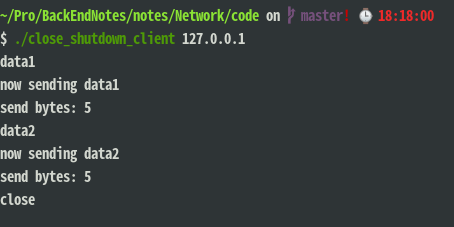
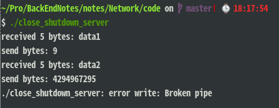
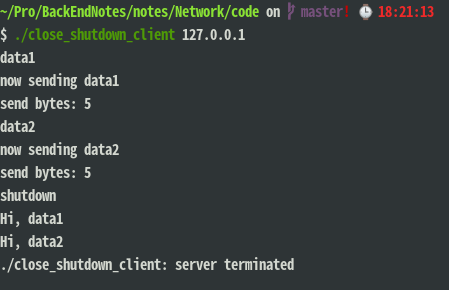
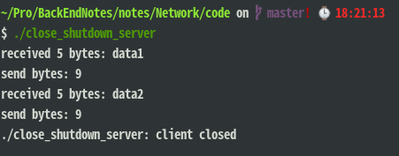
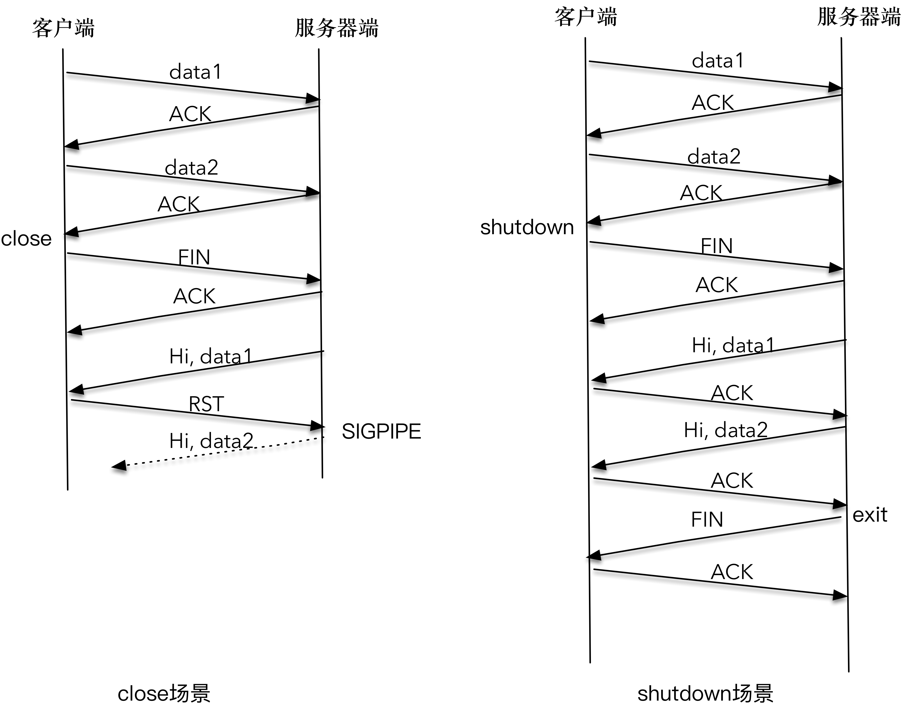
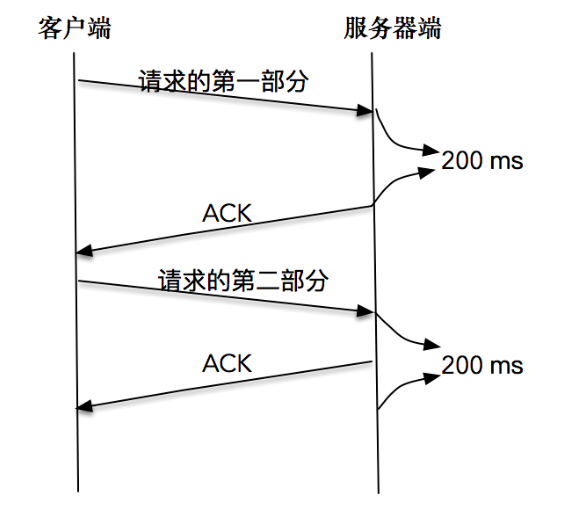

# 网络编程实战-进阶篇

## TIME_WAIT

### TIME_WAIT 发生的场景

由于每个连接会占用一个本地端口，当在高并发的情况下，TIME_WAIT 状态的连接过多，多到把本机可用的端口耗尽，应用服务对外表现的症状，就是不能正常工作了。当过了一段时间之后，处于 TIME_WAIT 的连接被系统回收并关闭后，释放出本地端口可供使用，应用服务对外表现为，可以正常工作。


具体的过程：

1. TCP 连接终止时，主机1 发送值为 m 的 FIN 包，主机1 进入 FIN_WAIT_1（终止等待1） 状态。
2. 主机2 收到 FIN 包后，发送值为 m + 1 的 ACK 应答包，主机2 进入 CLOSE_WAIT（关闭等待）状态。**注意**，此时处于半关闭的状态，主机1 到主机2 的方向释放了，但是主机2 到主机1 的方向还正常，即主机2 依然能向主机1 发送数据且主机1 能接收。主机1 接收到 ACK 应答包后，主机1 进入 FIN_WAIT_2（终止等待2） 状态。
3. 主机2 准备好关闭连接时，发送值为 n 的 FIN 包，主机2 进入 LAST_ACK（最后确认）状态，等待主机1 的确认。
4. 主机1 收到 FIN 包后，发送值为 n + 1 的 ACK 应答包，主机1 进入 TIME_WAIT（时间等待） 状态。**注意**，此时 TCP 连接还没有释放，必须经过 2MSL（Maximum Segment Lifetime，最长报文段寿命）的时间后，才进入 CLOSED（关闭）状态。
5. 主机2 接收到 ACK 应答包后，进入 CLOSED（关闭）状态。

一般情况下，Linux 系统停留在 TIME_WAIT 的时间为固定的 60 秒。

**值得注意的是，只有发起连接终止的一方会进入 TIME_WAIT 状态。**

### TIME_WAIT 的作用

为什么不直接进入 CLOSED 状态，而要停留在 TIME_WAIT 这个状态？

主要有两个作用：

* 因为最后的 ACK 报文可能丢失，为了确保最后的 ACK 能让被动关闭方接收，从而帮助其正常关闭。
  * 在这里，如果图中主机 1 的 ACK 报文没有传输成功，那么主机 2 就会重新发送 FIN 报文。
  * 如果主机 1 没有维护 TIME_WAIT 状态，而直接进入 CLOSED 状态，它就失去了当前状态的上下文，只能回复一个 RST 操作，从而导致被动关闭方出现错误。
  * 现在主机 1 知道自己处于 TIME_WAIT 的状态，就可以在接收到 FIN 报文之后，重新发出一个 ACK 报文，使得主机 2 可以进入正常的 CLOSED 状态。
* 为了让旧连接的所有报文都能自然消亡。

**注意**，2MSL 的时间是从 主机1 接收到 FIN 后发送 ACK 开始计时的；如果在 TIME_WAIT 时间内，因为 主机1 的 ACK 没有传输到 主机2，主机1 又接收到了 主机2 重发的 FIN 报文，那么 2MSL 时间将重新计时。因为 2MSL 的时间，目的是为了让旧连接的所有报文都能自然消亡，以便防止这个 ACK 报文对新可能的连接化身造成干扰。

### TIME_WAIT 的危害

主要有两个危害：

* 内存资源占用，这个目前看来不是太严重，基本可以忽略。
* 对端口资源的占用，一个 TCP 连接至少消耗一个本地端口。要知道，端口资源也是有限的，一般可以开启的端口为 `32768～61000` ，也可以通过 `net.ipv4.ip_local_port_range` 指定，如果 TIME_WAIT 状态过多，会导致无法创建新连接。

### 如何优化 TIME_WAIT

#### 设置套接字选项

可以通过设置套接字选项，来设置调用 close 或者 shutdown 关闭连接时的行为。需要用到下面的函数：

```c
int setsocket(int sockfd, int level, int optname, const void *optval, socklen_t optlen)


struct linger {
　int　 l_onoff;　　　　/* 0=off, nonzero=on */
　int　 l_linger;　　　　/* linger time, POSIX specifies units as seconds */
}
```

设置 linger 参数有几种可能：

* 如果 l_onoff 为 0，那么关闭本选项。l_linger 的值被忽略，这对应了默认行为，close 或 shutdown 立即返回。如果在套接字发送缓冲区中有数据残留，系统会将试着把这些数据发送出去。
* 如果 l_onoff 为非 0， 且 l_linger 的值也非 0，那么调用 close 后，调用 close 的线程就将阻塞，直到数据被发送出去，或者设置的 l_linger 计时时间到。
* 如果 l_onoff 为非 0， 且 l_linger 值为 0，那么调用 close 后，会立该发送一个 RST 标志给对端，该 TCP 连接将跳过四次挥手，也就跳过了 TIME_WAIT 状态，直接关闭。这种关闭的方式称为“**强行关闭**”。 在这种情况下，排队数据不会被发送，被动关闭方也不知道对端已经彻底断开。只有当被动关闭方正阻塞在 `recv()` 调用上时，接受到 RST 时，会立刻得到一个“`connet reset by peer`”的异常。

```c
// 这种方法可能为跨越 TIME_WAIT 状态提供了一个可能，
// 不过是一个非常危险的行为，不值得提倡。
struct linger so_linger;
so_linger.l_onoff = 1;
so_linger.l_linger = 0;
setsockopt(s, SOL_SOCKET, SO_LINGER, &so_linger, sizeof(so_linger));
```

#### 设置 net.ipv4.tcp_tw_reuse 选项

Linux 系统对于 net.ipv4.tcp_tw_reuse 的解释如下为 **从协议角度理解如果是安全可控的，可以复用处于 TIME_WAIT 的套接字为新的连接所用**。

协议角度理解的可控主要有两点：

* 只适用于连接发起方（C/S 模型中的客户端）；
* 对应的 TIME_WAIT 状态的连接创建时间超过 1 秒才可以被复用。

使用这个选项，还有一个前提，需要打开对 TCP 时间戳的支持，即 net.ipv4.tcp_timestamps=1（默认即为 1）。

值得注意的是，TCP 协议也在与时俱进，**RFC 1323（1992年5月提出）中实现了 TCP 拓展规范，以便保证 TCP 的高可用，并引入了新的 TCP 选项，它定义了 两个 4 字节的时间戳字段，用于记录 TCP 发送方的当前时间戳和从对端接收到的最新时间戳。** 由于引入了时间戳，我们在前面提到的 2MSL 问题就不复存在了，因为重复的数据包会因为时间戳过期被自然丢弃。

RFC 7323（2014年9月提出）中实现了 TCP 拓展规范，以便保证 TCP 的高可用，它定义了 TCP Window Scale（WS）选项和 TCP Timestamps（TS）选项及其语义，“**窗口比例**”选项用于支持更大的接收窗口，而“**时间戳**”选项可用于至少两种不同的机制，即保护序列保护（PAWS）和往返行程时间测量（RTTM）。

### 思考

**问题1：**

MSL 是 TCP 分组在网络中存活的最长时间，你知道这个最长时间是如何达成的？换句话说，是怎么样的机制，可以保证在 MSL 达到之后，报文就自然消亡了呢？

**解答：**

MSL（Maximum Segment Lifetime，最长报文段寿命），IP头部中有个TTL字段意思是生存时间。TTL每经过一个路由器就减1，到0就会被丢弃。MSL内部应该就是一个普通的定时器实现的。

**问题2：**

RFC 1323 引入了 TCP 时间戳，那么这需要在发送方和接收方之间定义一个统一的时钟吗？

**解答：**

不需要统一时钟，可以在第一次交换双方的时钟，之后用相对时间就可以了。

## 如何关闭廉洁

因为 TCP 是双向的，这里说的方向，指的是数据流的写入 - 读出的方向。

比如客户端到服务器端的方向，指的是客户端通过套接字接口，向服务器端发送 TCP 报文；而服务器端到客户端方向则是另一个传输方向。在绝大数情况下，TCP 连接都是先关闭一个方向，此时另外一个方向还是可以正常进行数据传输。

### close 函数

会用到下面的函数：

```c
int close(int sockfd)
```

* 对已连接的套接字执行 close 操作就可以，若成功则为 0，若出错则为 -1。

**这个函数会对套接字引用计数减一，一旦发现套接字引用计数到 0，就会对套接字进行彻底释放，并且会关闭 TCP 两个方向的数据流。**

因为套接字可以被多个进程共享，你可以理解为我们给每个套接字都设置了一个积分，如果我们通过 fork 的方式产生子进程，套接字就会积分 +1， 如果我们调用一次 close 函数，套接字积分就会 -1。这就是套接字引用计数的含义。

close 如何具体关闭两个方向的数据流：

* 在输入方向，系统内核会将该套接字**设置为不可读**，任何读操作都会返回异常。
* 在输出方向，系统内核尝试将发送缓冲区的数据发送给对端，并最后向对端发送一个 FIN 报文，接下来如果再对该套接字进行写操作会返回异常。

可以发现，close 函数并不能帮助我们关闭连接的一个方向。

### shutdown 函数

会用到下面的函数：

```c
int shutdown(int sockfd, int howto)
```

* 对已连接的套接字执行 shutdown 操作，若成功则为 0，若出错则为 -1。
* howto 是这个函数的设置选项，它的设置有三个主要选项：
  * `SHUT_RD(0)`：关闭连接的“读”这个方向，对该套接字进行读操作直接返回 EOF。
  * `SHUT_WR(1)`：关闭连接的“写”这个方向，这就是常被称为”半关闭“的连接。此时，不管套接字引用计数的值是多少，都会直接关闭连接的写方向。
  * `SHUT_RDWR(2)`：相当于 SHUT_RD 和 SHUT_WR 操作各一次，关闭套接字的读和写两个方向。

**都是关闭读写两个方向，shutdown 的 `SHUT_RDWR(2)` 选项  和 close 有什么区别呢？**

主要区别在于：

* close 会关闭连接，并释放所有连接对应的资源，而 shutdown 并不会释放掉套接字和所有的资源。
* close 存在引用计数的概念，并不一定导致该套接字不可用；shutdown 则不管引用计数，直接使得该套接字不可用，如果有别的进程企图使用该套接字，将会受到影响。
* close 的引用计数导致不一定会发出 FIN 结束报文，而 shutdown 则总是会发出 FIN 结束报文，这在我们打算关闭连接通知对端的时候，是非常重要的。

### 体会差别

通过构建一组客户端和服务器程序，来进行 close 和 shutdown 的实验。

客户端程序，从标准输入不断接收用户输入，把输入的字符串通过套接字发送给服务器端，同时，将服务器端的应答显示到标准输出上。

如果用户输入了“close”，则会调用 close 函数关闭连接，休眠一段时间，等待服务器端处理后退出；如果用户输入了“shutdown”，调用 shutdown 函数关闭连接的写方向，注意我们不会直接退出，而是会继续等待服务器端的应答，直到服务器端完成自己的操作，在另一个方向上完成关闭。

会使用到 select 多路复用，目前只需要知道使用 select 使得我们可以同时完成对连接套接字和标准输入两个 I/O 对象的处理。

```c
// close 和 shutdown 差别 服务器端
#include "common.h"

static int count;

static void sig_int(int signo) {
    printf("\nreceived %d datagrams\n", count);
    exit(0);
}

int main(int argc, char **argv) {
    // 创建了一个 TCP 套接字
    int listenfd;
    listenfd = socket(AF_INET, SOCK_STREAM, 0);

    // 设置了本地服务器 IPv4 地址，绑定到了 ANY 地址和指定的端口
    struct sockaddr_in server_addr;
    bzero(&server_addr, sizeof(server_addr));
    server_addr.sin_family = AF_INET;
    server_addr.sin_addr.s_addr = htonl(INADDR_ANY);
    server_addr.sin_port = htons(SERV_PORT);

    // 使用创建的套接字，以此执行 bind、listen 和 accept 操作，完成连接建立
    int rt1 = bind(listenfd, (struct sockaddr *) &server_addr, sizeof(server_addr));
    if (rt1 < 0) {
        error(1, errno, "bind failed ");
    }

    int rt2 = listen(listenfd, LISTENQ);
    if (rt2 < 0) {
        error(1, errno, "listen failed ");
    }

    signal(SIGINT, sig_int);
    // signal(SIGPIPE, SIG_IGN);    // 忽略处理
    signal(SIGPIPE, SIG_DFL);   // 默认处理

    int connfd;
    struct sockaddr_in client_addr;
    socklen_t client_len = sizeof(client_addr);

    if ((connfd = accept(listenfd, (struct sockaddr *) &client_addr, &client_len)) < 0) {
        error(1, errno, "bind failed ");
    }

    char message[MAXLINE];
    count = 0;

    // 通过 read 函数获取客户端传送来的数据流，并回送给客户端
    for (;;) {
        int n = read(connfd, message, MAXLINE);
        if (n < 0) {
            error(1, errno, "error read");
        } else if (n == 0) {
            error(1, 0, "client closed \n");
        }
        message[n] = 0;
        printf("received %d bytes: %s\n", n, message);
        count++;

        char send_line[MAXLINE];
        sprintf(send_line, "Hi, %s", message);  // 对原字符串进行重新格式化，之后调用 send 函数将数据发送给客户端

        // 让服务器端程序休眠了 5 秒，以模拟服务器端处理的时间
        sleep(5);

        int write_nc = send(connfd, send_line, strlen(send_line), 0);
        printf("send bytes: %zu \n", write_nc);
        if (write_nc < 0) {
            error(1, errno, "error write");
        }
    }
}
```

```c
// close 和 shutdown 差别 客户端
#include "common.h"
#define MAXLINE 4096

int main(int argc, char **argv) {
    if (argc != 2) {
        error(1, 0, "usage: graceclient <IPaddress>");
    }

    // 创建了一个 TCP 套接字
    int socket_fd;
    socket_fd = socket(AF_INET, SOCK_STREAM, 0);

    // 设置了连接的目标服务器 IPv4 地址，绑定到了指定的 IP 和端口
    struct sockaddr_in server_addr;
    bzero(&server_addr, sizeof(server_addr));
    server_addr.sin_family = AF_INET;
    server_addr.sin_port = htons(SERV_PORT);
    inet_pton(AF_INET, argv[1], &server_addr.sin_addr);

    // 使用创建的套接字，向目标 IPv4 地址发起连接请求
    socklen_t server_len = sizeof(server_addr);
    int connect_rt = connect(socket_fd, (struct sockaddr *) &server_addr, server_len);
    if (connect_rt < 0) {
        error(1, errno, "connect failed ");
    }

    char send_line[MAXLINE], recv_line[MAXLINE + 1];
    int n;

    fd_set readmask;
    fd_set allreads;

    // 使用 select 做准备，初始化描述字集合
    FD_ZERO(&allreads);
    FD_SET(0, &allreads);
    FD_SET(socket_fd, &allreads);

    // 使用 select 多路复用观测在连接套接字和标准输入上的 I/O 事件
    // 当连接套接字上有数据可读，将数据读入到程序缓冲区中
    for (;;) {
        readmask = allreads;
        int rc = select(socket_fd + 1, &readmask, NULL, NULL, NULL);
        if (rc <= 0)
            error(1, errno, "select failed");
        if (FD_ISSET(socket_fd, &readmask)) {
            n = read(socket_fd, recv_line, MAXLINE);
            if (n < 0) {
                error(1, errno, "read error");
            } else if (n == 0) {
                error(1, 0, "server terminated \n");
            }
            recv_line[n] = 0;
            fputs(recv_line, stdout);
            fputs("\n", stdout);
        }

        // 当标准输入上有数据可读，读入后进行判断。
        // 如果输入的是“shutdown”，则关闭标准输入的 I/O 事件感知，并调用 shutdown 函数关闭写方向；
        // 如果输入的是”close“，则调用 close 函数关闭连接；
        // 否则，将回车符截掉，调用 write 函数，通过套接字将数据发送给服务器端。
        if (FD_ISSET(0, &readmask)) {
            if (fgets(send_line, MAXLINE, stdin) != NULL) {
                if (strncmp(send_line, "shutdown", 8) == 0) {
                    FD_CLR(0, &allreads);
                    if (shutdown(socket_fd, 1)) {
                        error(1, errno, "shutdown failed");
                    }
                } else if (strncmp(send_line, "close", 5) == 0) {
                    FD_CLR(0, &allreads);
                    if (close(socket_fd)) {
                        error(1, errno, "close failed");
                    }
                    sleep(6);
                    exit(0);
                } else {
                    int i = strlen(send_line);
                    if (send_line[i - 1] == '\n') {
                        send_line[i - 1] = 0;
                    }

                    printf("now sending %s\n", send_line);
                    size_t rt = write(socket_fd, send_line, strlen(send_line));
                    if (rt < 0) {
                        error(1, errno, "write failed ");
                    }
                    printf("send bytes: %zu \n", rt);
                }

            }
        }

    }

}
```

**运行结果及分析：**

**启动服务器，再启动客户端，依次在标准输入上输入 data1、data2 和 close 函数**，观察到：





可以看到，客户端依次发送了 data1 和 data2，服务器端也正常接收到 data1 和 data2。在客户端 close 掉整个连接之后，服务器端接收到 SIGPIPE 信号，直接退出。**客户端并没有收到服务器端的应答数据**，过了一段时间后才退出。

这是因为，因为客户端调用 close 函数关闭了整个连接，当服务器端发送的“Hi, data1”分组到达时，客户端给回送一个 RST 分组；服务器端再次尝试发送“Hi, data2”第二个应答分组时，系统内核通知 SIGPIPE 信号。这是因为，在 RST 的套接字进行写操作，会直接触发 SIGPIPE 信号，执行 `exit()` 。

**再次启动服务器，再启动客户端，依次在标准输入上输入 data1、data2 和 shutdown 函数**，观察到：





可以看到，服务器端输出了 data1、data2；客户端也输出了“Hi,data1”和“Hi,data2”，客户端和服务器端各自完成了自己的工作后，正常退出。

这是因为客户端调用 shutdown 函数只是关闭连接的一个方向，服务器端到客户端的这个方向还可以继续进行数据的发送和接收，所以“Hi,data1”和“Hi,data2”都可以正常传送；当服务器端读到 EOF 时，立即向客户端发送了 FIN 报文，客户端在 read 函数中感知了 EOF，也进行了正常退出。

close 和 shutdown 场景：



总结：如果想彻底关闭双向连接的时候用 close，只关闭自己这端到对端的连接时用 shutdown 。

### 思考

**问题1：**

在上面的服务器端程序例子中，直接调用 `exit(0)` 完成了 FIN 报文的发送，这是为什么呢？为什么不调用 close 函数或 shutdown 函数呢？

**解答：**

因为调用 exit 之后进程会退出，而进程相关的所有的资源，文件，内存，信号等内核分配的资源都会被释放。

在 linux 中，一切皆文件，socket 本身就是一种文件类型，内核会为每一个打开的文件创建 file 结构并维护指向改结构的引用计数，每一个进程结构中都会维护本进程打开的文件数组，数组下标就是 fd，内容就指向上面的 file 结构。

close 本身就可以用来操作所有的文件，做的事就是，删除本进程打开的文件数组中指定的 fd 项，并把指向的 file 结构中的引用计数减 1，等引用计数为 0 的时候，就会调用内部包含的文件操作 close，针对于 socket，它内部的实现应该就是调用 shutdown ，只是参数是**关闭读写端**（ `SHUT_RDWR(2)` ），从而比较粗暴的关闭连接。

**问题2：**

在上面的服务器端程序例子中，使用的是 SIG_IGN 默认处理，你知道默认处理和自定义函数处理的区别吗？

**解答：**

信号的处理有三种，默认处理，忽略处理，自定义处理。默认处理就是采用系统自定义的操作，大部分信号的默认处理都是杀死进程，忽略处理就是当做什么都没有发生。

## Keep-Alive 和 心跳

在很多情况下，连接的一端需要一直感知（检测）连接的状态，如果连接无效了，应用程序可能需要报错，或者重新发起连接等。

保持对连接有效性的检测，是在实际开发中必须注意的一个点。

### TCP Keep-Alive 机制

在没有数据读写的“静默”的连接上，是没有办法发现 TCP 连接是有效还是无效的。比如客户端突然崩溃，服务器端可能在几天内都维护着一个无用的 TCP 连接。

TCP 有一个保持活跃的机制叫做 Keep-Alive。

这个机制的原理是：定义一个时间段，在这个时间段内，如果没有任何连接相关的活动，TCP 保活机制就会开始作用，每隔一个时间间隔，发送一个探测报文，该探测报文的数据非常少，如果连续几个探测报文都没有得到响应，则认为当前的 TCP 连接已经死亡，系统内核将错误信息通知给上层应用程序。

上述的可定义变量，分别被称为保活时间、保活时间间隔和保活探测次数。在 Linux 系统中，这些变量分别对应 sysctl 变量 **net.ipv4.tcp_keepalive_time**、**net.ipv4.tcp_keepalive_intvl**、 **net.ipv4.tcp_keepalve_probes**，默认设置是 7200 秒（2 小时）、75 秒和 9 次探测。

如果开启了 TCP 保活，需要考虑以下几种情况：

* 对端程序正常工作。当 TCP 保活的探测报文发送给对端, 对端会正常响应，这样 TCP 保活时间会被重置，等待下一个 TCP 保活时间的到来。
* 对端程序崩溃并重启。当 TCP 保活的探测报文发送给对端后，对端是可以响应的，但由于没有该连接的有效信息，会产生一个 RST 报文，这样很快就会发现 TCP 连接已经被重置。
* 对端程序崩溃，或对端由于其他原因导致报文不可达。当 TCP 保活的探测报文发送给对端后，石沉大海，没有响应，连续几次，达到保活探测次数后，TCP 会报告该 TCP 连接已经死亡。

TCP 保活机制默认是关闭的，当我们选择打开时，可以分别在连接的两个方向上开启，也可以单独在一个方向上开启。

* 如果开启服务器端到客户端的检测，就可以在客户端非正常断连的情况下清除在服务器端保留的“脏数据”；
* 如果开启客户端到服务器端的检测，就可以在服务器无响应的情况下，重新发起连接。

### 应用层探活

如果使用 TCP 自身的 keep-Alive 机制，在 Linux 系统中，最少需要经过 2 小时 11 分 15 秒（2h + 75 × 9s）才可以发现一个“死亡”连接。实际上，对很多对时延要求敏感的系统中，这个时间间隔是不可接受的。

**可以通过在应用程序中模拟 TCP Keep-Alive 机制，来完成在应用层的连接探活。**

可以设计一个 PING-PONG 的机制，需要保活的一方，比如客户端，在保活时间达到后，发起对连接的 PING 操作，如果服务器端对 PING 操作有回应，则重新设置保活时间，否则对探测次数进行计数，如果最终探测次数达到了保活探测次数预先设置的值之后，则认为连接已经无效。这个设计有两个比较关键的点：

* 需要使用定时器，这可以通过使用 I/O 复用自身的机制来实现；
* 需要设计一个 PING-PONG 的协议。

```c
// 协议（消息格式）

typedef struct {
    u_int32_t type;
    char data[1024];
} messageObject;

#define MSG_PING 1
#define MSG_PONG 2
#define MSG_TYPE1 11
#define MSG_TYPE2 21
```

### 客户端程序设计

客户端完全模拟 TCP Keep-Alive 的机制，在保活时间达到后，探活次数增加 1，同时向服务器端发送 PING 格式的消息，此后以预设的保活时间间隔，不断地向服务器端发送 PING 格式的消息。如果能收到服务器端的应答，则结束保活，将保活时间置为 0。

这里使用使用 select I/O 复用函数自带的定时器。

```c
// PING-PONG 机制 客户端程序
#include "common.h"
#include "message_object.h"

#define MAXLINE 4096
#define KEEP_ALIVE_TIME 10
#define KEEP_ALIVE_INTERVAL 3
#define KEEP_ALIVE_PROBETIMES 3


int main(int argc, char **argv) {
    if (argc != 2) {
        error(1, 0, "usage: tcpclient <IPaddress>");
    }

    // 创建 TCP 套接字
    int socket_fd;
    socket_fd = socket(AF_INET, SOCK_STREAM, 0);

    // 创建 IPv4 目标地址
    struct sockaddr_in server_addr;
    bzero(&server_addr, sizeof(server_addr));
    server_addr.sin_family = AF_INET;
    server_addr.sin_port = htons(SERV_PORT);
    inet_pton(AF_INET, argv[1], &server_addr.sin_addr);

    // 向服务器端发起连接
    socklen_t server_len = sizeof(server_addr);
    int connect_rt = connect(socket_fd, (struct sockaddr *) &server_addr, server_len);
    if (connect_rt < 0) {
        error(1, errno, "connect failed ");
    }

    char recv_line[MAXLINE + 1];
    int n;

    fd_set readmask;
    fd_set allreads;

    struct timeval tv;
    int heartbeats = 0;

    // 设置超时时间为 KEEP_ALIVE_TIME，这相当于保活时间
    tv.tv_sec = KEEP_ALIVE_TIME;
    tv.tv_usec = 0;

    messageObject messageObject;
    // 初始化 select 函数的套接字
    FD_ZERO(&allreads);
    FD_SET(socket_fd, &allreads);

    for (;;) {
        readmask = allreads;
        int rc = select(socket_fd + 1, &readmask, NULL, NULL, &tv); // 调用 select 函数，感知 I/O 事件
        if (rc < 0) {
            error(1, errno, "select failed");
        }

        // 客户端已经在 KEEP_ALIVE_TIME 这段时间内没有收到任何对当前连接的反馈，于是发起 PING 消息
        // 通过传送一个类型为 MSG_PING 的消息对象来完成 PING 操作，之后在服务器端程序响应这个 PING 操作
        if (rc == 0) {
            if (++heartbeats > KEEP_ALIVE_PROBETIMES) {
                error(1, 0, "connection dead\n");
            }
            printf("sending heartbeat #%d\n", heartbeats);
            messageObject.type = htonl(MSG_PING);
            rc = send(socket_fd, (char *) &messageObject, sizeof(messageObject), 0);
            if (rc < 0) {
                error(1, errno, "send failure");
            }
            tv.tv_sec = KEEP_ALIVE_INTERVAL;
            continue;
        }

        // 客户端在接收到服务器端程序之后的处理
        if (FD_ISSET(socket_fd, &readmask)) {
            n = read(socket_fd, recv_line, MAXLINE);
            if (n < 0) {
                error(1, errno, "read error");
            } else if (n == 0) {
                error(1, 0, "server terminated \n");
            }
            printf("received heartbeat, make heartbeats to 0 \n");
            heartbeats = 0;
            tv.tv_sec = KEEP_ALIVE_TIME;
        }
    }
}
```

### 服务器端程序设计

服务器端的程序接受一个参数，这个参数设置的比较大，可以模拟连接没有响应的情况。

```c
// PING-PONG 机制 服务器端程序
#include "common.h"
#include "message_object.h"

static int count;

int main(int argc, char **argv) {
    if (argc != 2) {
        error(1, 0, "usage: tcpsever <sleepingtime>");
    }

    int sleepingTime = atoi(argv[1]);

    int listenfd;
    listenfd = socket(AF_INET, SOCK_STREAM, 0);

    struct sockaddr_in server_addr;
    bzero(&server_addr, sizeof(server_addr));
    server_addr.sin_family = AF_INET;
    server_addr.sin_addr.s_addr = htonl(INADDR_ANY);
    server_addr.sin_port = htons(SERV_PORT);

    int rt1 = bind(listenfd, (struct sockaddr *) &server_addr, sizeof(server_addr));
    if (rt1 < 0) {
        error(1, errno, "bind failed ");
    }

    int rt2 = listen(listenfd, LISTENQ);
    if (rt2 < 0) {
        error(1, errno, "listen failed ");
    }

    int connfd;
    struct sockaddr_in client_addr;
    socklen_t client_len = sizeof(client_addr);

    if ((connfd = accept(listenfd, (struct sockaddr *) &client_addr, &client_len)) < 0) {
        error(1, errno, "bind failed ");
    }

    messageObject message;
    count = 0;

    // 建立的连接套接字上读取数据，解析报文，根据消息类型进行不同的处理
    for (;;) {
        int n = read(connfd, (char *) &message, sizeof(messageObject));
        if (n < 0) {
            error(1, errno, "error read");
        } else if (n == 0) {
            error(1, 0, "client closed \n");
        }

        printf("received %d bytes\n", n);
        count++;

        switch (ntohl(message.type)) {
            // 处理 MSG_TYPE1 的消息
            case MSG_TYPE1 :
                printf("process  MSG_TYPE1 \n");
                break;

            // 处理 MSG_TYPE2 的消息
            case MSG_TYPE2 :
                printf("process  MSG_TYPE2 \n");
                break;

            // 处理 MSG_PING 类型的消息
            // 通过休眠来模拟响应是否及时，然后调用 send 函数发送一个 PONG 报文
            case MSG_PING: {
                messageObject pong_message;
                pong_message.type = MSG_PONG;
                sleep(sleepingTime);
                ssize_t rc = send(connfd, (char *) &pong_message, sizeof(pong_message), 0);
                if (rc < 0)
                    error(1, errno, "send failure");
                break;
            }

            // 异常处理，消息格式不认识，程序出错退出
            default :
                error(1, 0, "unknown message type (%d)\n", ntohl(message.type));
        }

    }

}
```

### 运行观察

首先服务器端休眠时间为 60 秒。观察到：

```c
// 客户端
$ ./ping_pong_client 127.0.0.1
sending heartbeat #1
sending heartbeat #2
sending heartbeat #3
./ping_pong_client: connection dead
```

```c
// 服务端
$ ./ping_pong_server 60
received 1028 bytes
received 1028 bytes
```

可以发现，客户端在发送了三次心跳检测报文 PING 报文后，判断出连接无效，直接退出了。这是因为在这段时间内没有接收到来自服务器端的任何 PONG 报文。

然后服务器端休眠时间为 5 秒。观察到：

```c
// 客户端
$ ./ping_pong_client 127.0.0.1
sending heartbeat #1
sending heartbeat #2
received heartbeat, make heartbeats to 0
received heartbeat, make heartbeats to 0
sending heartbeat #1
sending heartbeat #2
received heartbeat, make heartbeats to 0
received heartbeat, make heartbeats to 0
sending heartbeat #1
sending heartbeat #2
received heartbeat, make heartbeats to 0
received heartbeat, make heartbeats to 0
```

```c
// 服务端
$ ./ping_pong_server 5
received 1028 bytes
received 1028 bytes
received 1028 bytes
received 1028 bytes
received 1028 bytes
received 1028 bytes
```

可以发现，由于这一次服务器端在心跳检测过程中，及时地进行了响应，客户端一直都会认为连接是正常的。

总结：虽然 TCP 没有提供系统的保活能力，让应用程序可以方便地感知连接的存活，但是，我们可以在应用程序里灵活地建立这种机制。一般来说，这种机制的建立依赖于系统定时器，以及恰当的应用层报文协议。比如，使用心跳包就是这样一种保持 Keep Alive 的机制。

### 思考

**问题1：**

上面的方法主要是针对 TCP 的探活，那么你觉得这样的方法是否同样适用于 UDP 呢？

**解答：**

UDP面向无连接，没有为了判断连接是否可行而用数据包探活的必要。

**问题2：**

如何看待额外的探活报文占用了有限的带宽这种说法？而且，为什么需要多次探活才能决定一个 TCP 连接是否已经死亡呢？

**解答：**

额外的探活报文是会占用一些带宽资源，可根据实际业务场景，适当增加保活时间，降低探活频率，简化 ping-pong 协议。多次探活是为了防止误伤，避免 ping 包在网络中丢失掉了，而误认为对端死亡。

## 数据传输

通过前面的知识，我们知道，**发送数据并不意味着数据被真正发送到网络上，其实，这些数据只是从应用程序中被拷贝到了系统内核的套接字缓冲区中，或者说是发送缓冲区中，等待协议栈的处理。** 至于这些数据是什么时候被发送出去的，对应用程序来说，是无法预知的。对这件事情真正负责的，是运行于操作系统内核的 TCP 协议栈实现模块。

### 流量控制

可以把理想中的 TCP 协议可以想象成一队运输货物的货车，运送的货物就是 TCP 数据包，这些货车将数据包从发送端运送到接收端，就这样不断周而复始。

对比一下，货物达到接收端之后，是需要卸货处理、登记入库的，接收端限于自己的处理能力和仓库规模，是不可能让这队货车以不可控的速度发货的。接收端肯定会和发送端不断地进行信息同步。这就是**发送窗口**和**接收窗口**的本质，可以称之为**生产者-消费者模型**。

通俗的讲，作为 TCP 的发送端，即生产者，不能忽略 TCP 的接收端，即消费者的实际情况。如果无节制发送数据包，消费者来不及消费，必然会丢弃，而丢弃又使得生产者重传，发送越来越多的数据包，最后导致网络崩溃。

### 拥塞控制

TCP 的生产者 - 消费者模型，只是在考虑单个连接的数据传递，但是， TCP 数据包是需要经过网卡、交换机、核心路由器等一系列的网络设备的，网络设备本身的能力也是有限的，当多个连接的数据包同时在网络上传送时，势必会发生带宽争抢、数据丢失等。

TCP 必须考虑多个连接共享在有限的带宽上，兼顾效率和公平性的控制，这就是**拥塞控制**的本质。

通俗的讲，有一个货车行驶再半夜三更的公路上，这样自然不需要拥塞控制，但是行驶在上班早高峰的公路上，这时就显得熙熙攘攘了，就需要拥塞控制的介入。

在 TCP 协议中，拥塞控制是通过**拥塞窗口**来完成的，拥塞窗口的大小会随着网络状况实时调整。

拥塞控制常用的算法有“**慢启动**”，它通过一定的规则，慢慢地将网络发送数据的速率增加到一个阈值。超过这个阈值之后，慢启动就结束了。之后，另一个叫做“**拥塞避免**”的算法登场，在这个阶段，TCP 会不断地探测网络状况，并随之不断调整拥塞窗口的大小。

可以发现，在任何一个时刻，TCP 发送缓冲区的数据是否能真正发送出去，至少取决于两个因素，一个是**当前的发送窗口大小**，另一个是**拥塞窗口大小**，而 TCP 协议中总是取两者中最小值作为判断依据。比如当前发送的字节为 100，发送窗口的大小是 200，拥塞窗口的大小是 80，那么取 200 和 80 中的最小值，就是 80，当前发送的字节数显然是大于拥塞窗口的，结论就是不能发送出去。

发送窗口和拥塞窗口的区别：

* 发送窗口反应了作为**单 TCP 连接、点对点之间的流量控制模型**，它是需要和接收端（接收窗口）一起共同协调来调整大小；
* 拥塞窗口反应了作为**多个 TCP 连接共享带宽的拥塞控制模型**，它是发送端独立地根据网络状况来动态调整。

### 一些场景

在任何一个时刻，TCP 发送缓冲区的数据是否能真正发送出去，至少取决于两个因素，一个是**当前的发送窗口大小**，另一个是**拥塞窗口大小**，除了这个之外还有其他什么因素吗？

考虑以下几个场景：

* 场景一：接收端处理得急不可待，比如刚刚读入了 100 个字节，就告诉发送端：“喂，我已经读走 100 个字节了，你继续发”。在这种情形下，你觉得合理的做法是什么？
* 场景二：每次发送端都发送非常少的数据到发送端，形象的说，每次叫了一个大货车，但是只送一个小苹果。在这种情形下，你觉得合理的做法是什么？
* 场景三：我们知道，接收端需要对每个接收到的 TCP 分组进行确认，也就是发送 ACK 报文，但是 ACK 报文本身是不带数据的分段，如果一直这样发送大量的 ACK 报文，就会消耗大量的带宽。之所以会这样，是因为 TCP 报文、IP 报文固有的消息头是不可或缺的，比如两端的地址、端口号、时间戳、序列号等信息。在这种情形下，你觉得合理的做法是什么？

常见解决方案：

* 场景一需要在接收端进行优化。这也被叫做糊涂窗口综合症，也就是说，接收端不能在接收缓冲区空出一个很小的部分之后，就急忙地向发送端发送窗口更新通知，而是需要在自己的缓冲区大到一个合理的值之后，再向发送端发送窗口更新通知。这个合理的值，由对应的 RFC 规范定义。
* 场景二需要在发送端进行优化。这个优化的算法叫做 **Nagle 算法**，Nagle 算法的本质其实就是限制大批量的小数据包同时发送，为此，它提出，**在任何一个时刻，未被确认的小数据包不能超过一个**。这里的小数据包，指的是长度小于最大报文段长度 MSS 的 TCP 分组。这样，发送端就可以把接下来连续的几个小数据包存储起来，等待接收到前一个小数据包的 ACK 分组之后，再将数据一次性发送出去。
* 场景三需要在发送端进行优化。这个优化的算法叫做 **延时 ACK 算法**。延时 ACK 算法在收到数据后并不马上回复，而是累计需要发送的 ACK 报文，等到有数据需要发送给对端时，将累计的 ACK 一并发送出去。当然，延时 ACK 机制，不能无限地延时下去，否则发送端误认为数据包没有发送成功，引起重传，反而会占用额外的网络带宽。

### 禁用 Nagle 算法

当上面的场景二和场景三同时发生会怎么样？

比如，客户端分两次将一个请求发送出去，由于请求的第一部分的报文未被确认，Nagle 算法开始起作用；同时 延时 ACK 算法 在服务器端起作用，假设延时时间为 200ms，服务器等待 200ms 后，对请求的第一部分进行确认；接下来客户端收到了确认后，Nagle 算法 解除请求第二部分的阻止，让第二部分得以发送出去，服务器端在收到之后，进行处理应答，同时将第二部分的确认捎带发送出去。



可以发现，Nagle 算法 和 延时 ACK 算法 一起作用时，反而增大了处理时延，实际上，两个优化彼此在阻止对方。

所以，在有些情况下 Nagle 算法并不适用， 比如对时延敏感的应用。

可以通过对套接字的修改来关闭 Nagle 算法，需要使用下面的函数：

```c
int on = 1;
setsockopt(sock, IPPROTO_TCP, TCP_NODELAY, (void *)&on, sizeof(on));
```

**值得注意的是**，除非我们对此有十足的把握，否则不要轻易改变默认的 TCP Nagle 算法。因为在现代操作系统中，针对 Nagle 算法和延时 ACK 的优化已经非常成熟了，有可能在禁用 Nagle 算法之后，性能问题反而更加严重。

### 合并写操作

其实前面的例子里，如果我们能将一个请求一次性发送过去，而不是分开两部分独立发送，结果会好很多。所以，在写数据之前，将数据合并到缓冲区，批量发送出去，这是一个比较好的做法。不过，有时候数据会存储在两个不同的缓存中，对此，我们可以使用如下的方法来进行数据的读写操作，从而避免 Nagle 算法引发的副作用。

```c
ssize_t writev(int filedes, const struct iovec *iov, int iovcnt)
ssize_t readv(int filedes, const struct iovec *iov, int iovcnt);
```

这两个函数的第二个参数都是指向某个 iovec 结构数组的一个指针，其中 iovec 结构定义如下：

```c
struct iovec {
void *iov_base; /* starting address of buffer */
size_t　iov_len; /* size of buffer */
};
```

writev 是为了减少 write 的使用次数，但是一次 writev 中的数据也有可能分多个包发出去，同理 readv。

### 思考

**问题1：**

TCP 拥塞控制算法是一个非常重要的研究领域，这方面最近有什么好的算法？

**解答：**

最新的有 BBR 算法，这个算法在网络包填满路由器缓冲区之前就触发流量控制，而不在丢包后才触发，有效的降低了延迟。

## ”有连接“的 UDP

**问题1：**

是否可以对一个 UDP 套接字进行多次 connect 的操作？

**解答：**

对于 TCP 套接字，connect 只能调用一次。但是，对一个 UDP 套接字来说，进行多次 connect 操作是被允许的，这样主要有两个作用：

* 可以重新指定新的 IP 地址和端口号。
* 可以断开一个已连接的套接字。为了断开一个已连接的 UDP 套接字，第二次调用 connect 时，调用方需要把套接字地址结构的地址族成员设置为 AF_UNSPEC。

**问题2：**

UDP 如何实现可靠性？

**解答：**

UDP 可以增加消息编号；对每个消息编号提供 ACK，在 UDP 应用层增加应答机制；没有应答的增加重传机制；增加缓存，ACK 完的才从缓存中清除。

