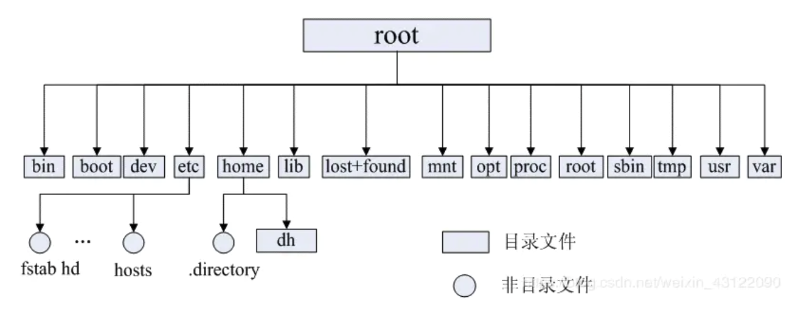

# 高频面试题：磁盘、目录和文件

## 简述 Linux 文件系统

在 Linux 中，所有被操作系统管理的资源都被看作是一个文件。

* 一个重要的概念是**一切皆文件**。
* Linux 支持 5 种文件类型：
  * 普通文件：用来在辅助存储设备（如磁盘）上存储信息和数据。例如源代码、可执行程序、图片、视频等；
  * 目录文件：用来表示和管理系统中的文件，目录文件中包含一些文件名和子目录名。
  * 链接文件：用来不用目录下文件的共享。当创建一个已存在文件的符号链接时，西餐系统就创建一个链接文件，这个链接文件指向已存在的文件；
  * 设备文件：用来访问硬件设备。包括键盘、硬盘、光盘等；
  * 命名管道（FIFO）：是一种特殊类型的文件，Linux 系统下，进程之间通信可以通过该文件完成。

## Linux 的目录结构是怎样的

* /bin  存放二进制可执行文件（ls、cat、mkdir等），常用命令一般在这里；
* /boot 存放用于系统引导时使用的各种文件；
* /dev  存放设备文件；
* /etc  存放系统管理和配置文件；
* /home 存放所有用户文件的根目录，是用户主目录的基点；
* /lib  存放和系统允许相关的库文件；
* /lost+found 存放系统非正常关机而留下的“无家可归”的文件
* /mnt  存放系统管理员安装临时文件系统的安装点，系统提供这个目录是让用户临时挂载其他的文件系统；
* /opt  存放额外安装的可选应用程序；
* /proc 存放虚拟文件，是系统内存的映射。可直接访问这个目录来获取系统信息；
* /root 系统管理员的主目录；
* /sbin 存放系统管理员级别的二进制可执行文件（ifconfig等）；
* /tmp  存放各种临时文件，是公用的临时文件存储点；
* /usr  存放系统应用程序；
* /var  存放运行时需要改变数据的文件，也是某些大文件的溢出区，比如各种服务的日志文件（系统启动日志）。

## 什么是 inode

## 什么是硬链接和软链接

## RAID 是什么